# 2021 

Kysymyksiin ei pääsääntöisesti ole merkattu vaihtoehtoja. Koita vastata kysymyksiin ilman vinkkejä. Vastausten alle olen yrittänyt avata aihetta.

## Mihin tarkoitukseen käytetään rokuronia? Miten kumoat sen vaikutuksen? 

  <button class="solution-button" data-label="Vastaus" data-hide-label="Piilota vastaus">
    Vastaus
  </button>
  

     Lihasrelaksaatioon; sugammadeksiinillä (Bridion)
     
Rokuroni on yleisimmin käytössä oleva lihasrelaksantti. Toiminnaltaan se on non-depolarisoiva eli se on asetyylikoliinireseptorin (nikotiinireseptorien) antagonisti -> estää lihaksen depolarisaation ja siten aiheuttaa lihasrelaksaatiota. Vaikutukseltaan rokuroni on ns. keskipitkävaikutteinen (ainoastaan mivakuuri on lyhytvaikutteinen ja esim. pankuroni on pitkävaikutteinen). 

Vrt. depolarisoiviin lihasrelaksantteihin (pääasiassa vain suksametoni), jotka ovat asetyylikoliinireseptorien agonisteja. Toimivat samalla tavalla kuin asetyylikoliini, mutta pysyvät hermo-lihasliitoksessa selvästi pidemmän aikaa kuin asetyylikoliini -> jatkuva depolarisaatio ja lihaksen repolarisaatio estyy -> lihasrelaksaatio. 

Hermo-lihasliitoksen salpauksen antagonisoinnilla pyritään turvaamaan riittävä lihasvoima nondepolarisoivien lihasrelaksanttien annostelun loputtua. Leikkaustoiminnan sujuvuuden kannalta on antagonisointi useimmiten perusteltua, mikäli yleisanestesiassa on käytetty lihasrelaksantteja. Perinteisesti antagonisoinnissa on käytetty asetyylikoliiniesteraasin (AKE) estäjiä, kuten neostigmiinia. 

Sugammadeksi on rokuronin ja vekuronin antagonisointiin valmistettu kumoaja, se ei vaikuta muihin lihasrelaksantteihin. Se muodostaa steroidirunkoisten lihasrelaksanttien kanssa inaktiivin kompleksin, minkä seurauksena vapaan lihasrelaksantin plasmapitoisuus pienenee jyrkästi. Hermo-lihasliitoksessa oleva relaksantti siirtyy konsentraatiogradientin vuoksi plasmaan ja samalla lihasrelaksaatio kumoutuu. Lihasrelaksantin ja sugammadeksin muodostama kompleksi poistuu elimistöstä erittymällä virtsaan.

Sugammadeksi antagonisoi voimakkaankin salpauksen erittäin nopeasti, toisin kuin AKE:n estäjät. Sillä ei ole myöskään niiden haitallisia muskariinivaikutuksia.
  

## Millä yksiköllä lihasrelaksaatiota monitoroidaan?

  <button class="solution-button" data-label="Vastaus" data-hide-label="Piilota vastaus">
    Vastaus
  </button>
  

     TR tai TOF%
     
Lihasrelaksaatiota seurataan useimmiten TOF-stimulaatiolla (train of four). Lihasrelaksaatiomittari stimuloi perifeeristä hermoa (nervus ulnaris) sähköisesti, jolloin peukalon lähentäjälihas supistuu. Neljän sarja -stimulaatio tapahtuu antamalla neljä samansuuruista (2Hz) supramaksimaalista sähköärsykettä 0,5 sekunnin välein. Lihasrelaksaatiota arvioidaan lihas vasteiden häviämisen perusteella (non-depolarisoivia lihasrelaksantteja käytettäessä tapahtuu ns fade-ilmiö, jossa stimulaation vasteet heikkenevät vaiheittain ja lopulta signaaleja alkaa häviämään täysin). 

TOF-mittari mittaa T1 ja T4 vasteen suhdetta. TOF-suhde eli TR on T1/T4. Kun potilas siiretään heräämöön, niin suhteen tulisi olla 0.9 (TR) eli >90% (TOF%), jotta voidaan olettaa hengityslihasten ja hengitysteiden suojaheijasteiden palanneen turvalliselle tasolle jäännösrelaksaation poissulkemiseksi.

Leikkauksen aikana viimeiset TOF-vasteet ovat tyypillisesti poistettu lihasrelaksaatiolla, mutta se ei tyypillisesti ole tavoitteellista, että kaikki signaalit hävitettäisiin (leikkauksen vaatimuksesta riippuen tyypillisesti 1-2 ensimmäistä signaalia vielä todettavissa). Kun lihasrelaksaatiota aletaan kumoamaan sugammadeksillä, niin ei tarvitse huolehtia siitä, onko lihasrelaksaatio kuinka syvä, vaan voi annostella syvästäkin relaksaatiosta lähtien (neostigmiiniä käytettäessä vähintään kahden ensimmäisen TOF-vasteen tulee olla näkyvissä vasta-aineen antohetkellä).
  

## Mihin tarkoitukseen käytetään sevofluraania?

Sevofluraani on yleisimmin käytetty inhalaatioanesteetti ja sitä käytetään yleisanestesian ylläpitokaasuna (lapsilla voidaan käyttää myös induktioon).

  <button class="solution-button" data-label="Vastaus" data-hide-label="Piilota vastaus">
    Vastaus
  </button>
  

     Yleisanestesian ylläpito
     
Sevofluraani on yleisimmin käytetty inhalaatioanesteetti ja sitä käytetään yleisanestesian ylläpitokaasuna (lapsilla voidaan käyttää myös induktioon).
  

## Miten seuraat yleisanestesian hypnoottisen osan syvyyttä?

  <button class="solution-button" data-label="Vastaus" data-hide-label="Piilota vastaus">
    Vastaus
  </button>
  

    EEG
     
Yleisimmin BIS (bispektri-indeksi) tai entropia. Auttavat titraamaan sopivan (ylläpito)anesteettiannoksen. 

BIS 100 = täysi tajuisuus, 40-65 = kliininen anestesia, 0 = erittäin syvä anestesia (ei tähdätä 0:aan, vaan tyypillisesti n. 40-50 tasolle). 

Inhalaatioanesteetteja käytettäessä MAC-arvon usein uskotaan toimivan yleisanestesian syvyyden mittarina (esim. wikissä näin vastauksessa), mutta näin ei ole. MAC-arvo 1 tarkoittaa sitä alveolaarista inhalaatioanesteetin pitoisuutta, jolla 50% potilaista ei reagoi ihoviiltoon (käytännössä siis lääkkeen EC50; taas jos 1.3 MAC niin 99% ei reagoi). MACia voidaan käyttää kun vertaillaan eri inhalaatioanesteetteja toisiinsa, mutta sillä ei voi luotettavasti arvioida, onko yksittäisen potilaan yleisanestesia riittävän syvä. MAC on populaatiosuure eikä siis sellaisenaan sovellu anestesian riittävyyden arvioimiseen, mutta kertoo, että kuinka suurelle osalle populaatiosta kyseinen alveolikonsentraatio riittäisi.
  

## Mihin tarkoitukseen käytetään ondansetronia? 

  <button class="solution-button" data-label="Vastaus" data-hide-label="Piilota vastaus">
    Vastaus
  </button>
  

    Pahoinvoinnin hoitoon ja ehkäisyyn

Setronit (esim. ondansetroni ja granisetroni) ovat 5-HT3-antagonisteja. Ovat yleisimmin käytettyjä kemiallisen pahoinvoinnin lääkkeitä ja ovat leikkauksen jälkeisen pahoinvoinnin ja oksentelun eston ja hoidon perusta. Annostellaan tyypillisesti leikkauksen loputtua (vrt. esim. betametasoni pahoinvoinnin ehkäisyyn ennen viiltoa).  
  

## Mikä altistaa post-op pahoinvoinnille ja oksentelulle (PONV)?

Ei vaihtoehtoja, listaa ne mitä muistat

  <button class="solution-button" data-label="Vastaus" data-hide-label="Piilota vastaus">
    Vastaus
  </button>
  

    Monet asiat

Naissukupuoli

Aikaisempi pahoinvointi post op

Opioidien tarve post op

Nuori ikä (! huom ei siis vanha ikä)

Tupakoimattomuus (! huom ei siis tupakointi; tupakointi itse asiassa suojaa PONV:lta)

Tietyt leikkaustyypit kuten KNK-leikkaukset 
  

## Millä luokituksella kuvataan monielinvauriota?

  <button class="solution-button" data-label="Vastaus" data-hide-label="Piilota vastaus">
    Vastaus
  </button>
  

    SOFA
    
Sequential Organ Failure Assessment on tehohoidon pisteytysjärjestelmä, jonka tarkoitus on kuvata monielinvaurion vaikeusastetta

SOFA-pisteiden määrittäminen vaatii useita laboratoriotestejä ja niitä ei ehkä ole saatavilla ajoissa. 

Mahdollistaakseen sepsispotilaiden ja siten elinhäiriöpotilaiden yksinkertaisen
tunnistamisen sairaalan ulkopuolella ja bedsidella, on kehitetty lyhennetty versio SOFAsta eli ns q-SOFA, jonka avulla voidaan tunnistaa mahdollinen elinhäiriö ja sitä kautta sepsis (2 kolmesta kriteeristä -> elinhäiriö; jos samalla epäilty infektio -> sepsis). 

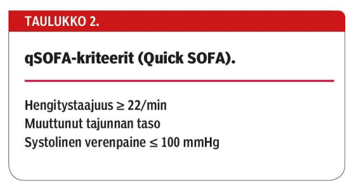
  

## Potilaalla insuliinihoitoinen diabetes ja verenpainetauti. Mikä ASA-luokka?

  <button class="solution-button" data-label="Vastaus" data-hide-label="Piilota vastaus">
    Vastaus
  </button>
  

    ASA 2

Jos diabetes hyvässä hoitotasapainossa -> ASA 2 

Jos huonossa hoitotasapainossa -> ASA 3 (samoin esim. hypertension kanssa eli 2 jos hyvässä hoitotasapainossa ja 3 huonossa)

ASA-luokitusta käytetään arvioidessa anestesiakelpoisuuden riskiluokkaa (1-6). Arvioidaan kliinisen yleiskunnon ja pitkäaikaissairauksien perusteella. 

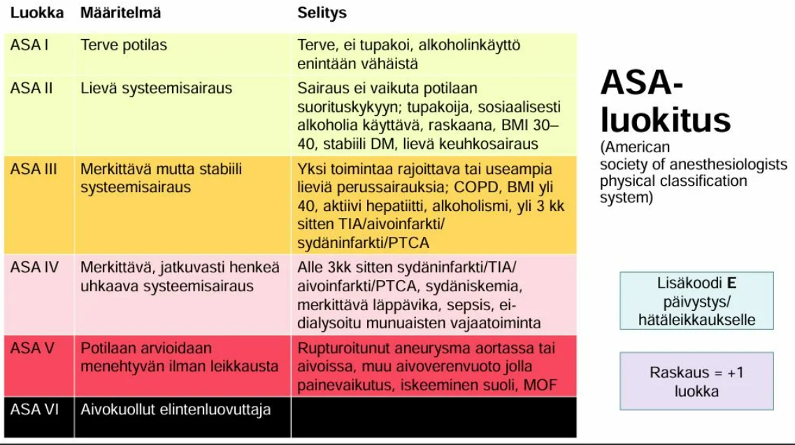
  

## Potilas ei avaa silmiään kivulle, ei ääntele, ei liikevastetta kivulle, paljonko GCS?

  <button class="solution-button" data-label="Vastaus" data-hide-label="Piilota vastaus">
    Vastaus
  </button>
  

    3

GCS eli Glascow Coma Scale arvioidaan välillä 3-15p. SiPuLi-muistisäännöstä arvioiden:

Silmien avaaminen 1-4p (spontaanisti, puheelle, kivulle, ei avaa silmiä kivulle)

Puhevaste 1-5p (orientoitunut, sekava, irrallisia sanoja, ääntelyä, ei ääntele)

Liikevaste 1-6p (noudattaa kehotuksia, paikallistaa kivun, väistää kipua, fleksio kivulle, ekstensio kivulle, ei vastetta)

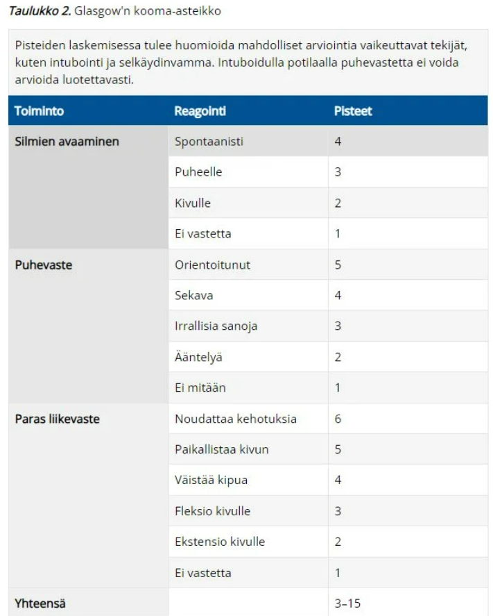
  

## Potilas elvytetty VF:stä, saatu elpymään 6 deffauksen jälkeen, paljonko elvytyslääkkeitä on kulunut?

  <button class="solution-button" data-label="Vastaus" data-hide-label="Piilota vastaus">
    Vastaus
  </button>
  

    Adrenaliini 2 mg, amiodaroni 450 mg

Elvytyslääkkeiden annosteluskeemat eroavat sen mukaan, onko kyseessä iskettävä vai ei-iskettävä rytmi 

Iskettävä rytmi (VF tai VT) : 3. iskun jälkeen adrenaliini 1mg + amiodaroni 300mg iv tai io. 5. iskun jälkeen adrenaliini 1mg + amiodaroni 150mg iv tai io. 7. iskun ja tämän jälkeen joka toisen painelusyklin (yksi sykli kestää 2min, jonka jälkeen rytmintarkastus ja tarvittaessa isku) jälkeen adrenaliini 1mg. 

Ei-iskettävä rytmi (PEA tai asystole): Adrenaliinia 1mg i.v. tai i.o. annetaan heti, kun se on mahdollista (myös niissä tilanteissa, joissa rytmi on edeltävästi ollut iskettävä). Jatkossa elvytyksen aikana adrenaliinia annetaan 3–5 minuutin välein . Ei-iskettävässä rytmissä ei anneta amiodaronia. 

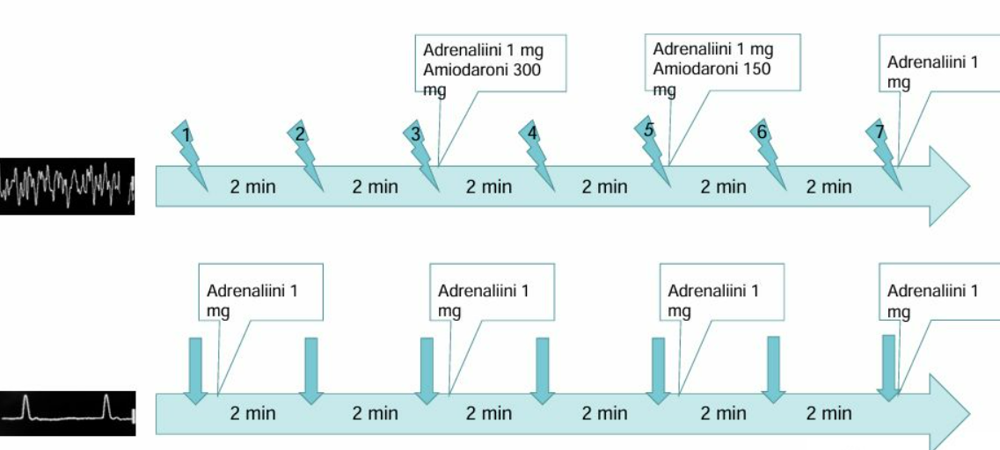
  

## Kun potilaalle on saatu laitettua elvytyksessä larynxmaski, mikä on puhallusten ja painallusten suhde?

  <button class="solution-button" data-label="Vastaus" data-hide-label="Piilota vastaus">
    Vastaus
  </button>
  

    Ei sinänsä ole suhdetta
    
Supraglottisen hengitystievälineen asentamisen jälkeen jatka ventilaatiota 10 kertaa minuutissa painelua keskeyttämättä 

Jos supraglottista hengitystievälinettä käytettäessä esiintyy ilmavuotoa, keskeytä painelu ventilaation ajaksi ja jatka painelu-ventilaatiosuhdetta 30:2 (wikissä tämä suhde laitettu vastaukseksi; vastauksena siis 30:2 ilman taukoja, mutta larynxmaskin kanssa ventiloidaan oikeasti 10 kertaa minuutissa, jos tämä on vain mahdollista)
  

## Mitä nestettä ei käytetä korvaukseen?

Ei vaihtoehtoja, mutta tässä korvausnesteistä tärkeimmät: 

- Korvaukseen käytetään yleensä balansoituja kristalloideja 

- Ei glukoosipitoisia ylläpitonesteitä

## Paljonko on 70kg:sen perusnestetarve päivässä?

  <button class="solution-button" data-label="Vastaus" data-hide-label="Piilota vastaus">
    Vastaus
  </button>
  

    N. 2100ml
    
Normaali nesteen tarve on 30ml/kg/vrk
  

## Potilas tulee akuutin eteisvärinän takia ensiapuun, syönyt viimeksi klo 17, milloin voidaan suorittaa rytminsiirto?

  <button class="solution-button" data-label="Vastaus" data-hide-label="Piilota vastaus">
    Vastaus
  </button>
  

    Klo 21-23 
    
Ennen kardioversiota on oltava 4-6h syömättä ja juomatta

Aamulääkkeet voi ottaa n. 2 t ennen toimenpidettä pienen nestemäärän kera. Erityisen tärkeää on, että antikoagulaatiohoidossa ei ole katkoksia.
  

## Paljonko on ekstrasellulaaritilan volyymi?

  <button class="solution-button" data-label="Vastaus" data-hide-label="Piilota vastaus">
    Vastaus
  </button>
  

    20%  
    
Esim. 70kg painoisella 14kg -> 14 litraa

Intrasellulaaritila taas 40% (noin 28 litraa). 

Voi siis muistaa nestetilat näin: 60% kehonpainosta on nestettä. 2/3 intrasellulaarista ja 1/3 ekstrasellulaarista. 75% ekstrasellulaarinesteestä on interstitiaalista nestettä ja 25% plasmassa. 

  

## Mikä on anafylaktisen reaktion ensihoito ja millä annoksella?

  <button class="solution-button" data-label="Vastaus" data-hide-label="Piilota vastaus">
    Vastaus
  </button>
  

    Adrenaliinia 
    
Ensisijainen lääke on adrenaliini 0.3-0.5mg i.m. tai 0.05-0,1mg i.v. vaikeusasteesta riippuen. Lapsille im-annostelu on 0,01 mg/kg. 

IM-annostelulla bronkusobstruktio laukeaa yleensä 5–10 minuutissa, iv hieman nopeammin. Annos voidaan uusia (im-annostelussa 5–15 minuutin kuluttua ja iv:sti muutaman minuutin välein). 

Sokkitilanteessa annetaan iv-reittiä, mutta lievissä reaktioissa im on ensisijainen, koska iv-annostelun riski on suurempi kuin hyöty. 

Ihon alle annetusta annoksesta adrenaliinin imeytyminen voi olla liian hidasta -> i.m. tai i.v. annostelu anafylaksiassa

  

## Potilaalle tehty sappirakonpoistoleikkaus, potilaalla kotilääkkeinä sydänlääkkeitä, varfariini… Mitä kipulääkkeitä postop. määräät?

Valitse yksi

- a. parasetamoli
- b. parasetamoli, nsaid, opioidi... 
- c. parasetamoli + oxynorm

  <button class="solution-button" data-label="Vastaus" data-hide-label="Piilota vastaus">
    Vastaus
  </button>
  

    c
    
a: Parasetamoli ei oikein ritä yksin kivunlievitykseksi välittömästi leikkauksen jälkeen 

b: NSAID ei tulisi käyttää varfariinin kanssa vuotoriskin takia
  

## Potilaalle tehty lannepisto, jonka jälkeen päänsärkyä, mikä on kyseessä?

  <button class="solution-button" data-label="Vastaus" data-hide-label="Piilota vastaus">
    Vastaus
  </button>
  

    Postspinaalipäänsärky
    
Kovakalvoon tehdyn reiän mahdollinen komplikaatio on ns. kovakalvon piston jälkeinen päänsärky (postspinaalipäänsärky). 

Kehittyy usein spinaalipuudutuksen tai likvorinäytteenoton jälkeen, kun kovakalvoon tehdystä reiästä tihkuu aivo-selkäydinnestettä ja se aiheuttaa alipaineen aivokalvoissa, mikä aistitaan pystyasennossa päänsärkynä. 

Voi myös kehittyä epiduraalipuudutuksen yhteydessä tapahtuneen tahattoman kovakalvon läpäisyn jälkeen (epiduraalipuudutuksessa ei siis ole tarkoitusta punktoida duraa). 

Päänsärkyyn saattaa joskus liittyä myös kuulo- tai näköhäiriöitä. Tyypillistä on se, että päänsärky helpottaa makuulla. 

Hoito on ensisijaisesti runsas nesteytys, vuodelepo ja tulehduskipulääkkeet ja tarvittaessa kofeiinia. Kofeiinitableteista tai laskimonsisäisesti annetusta kofeiinista on todettu olevan apua. 

Jos päänsärky ei näillä toimenpiteillä lievity vaan jatkuu, on syytä harkita epiduraalista veripaikkaa eli potilaan oman veren steriiliä ruiskuttamista epiduraalitilaan tukkimaan vuoto ja normalisoimaan likvoritilan paine.
  

## Mikä seuraavista ei altista neuropaattiselle kivulle?

Valitse yksi

- a. MS-tauti
- b. Selkärangansairaus
- c. Diabetes
- d. Menieren tauti
- e. AVH

  <button class="solution-button" data-label="Vastaus" data-hide-label="Piilota vastaus">
    Vastaus
  </button>
  

    Menieren tauti

MS-tauti, selkärangan sairaudet, diabetes ja aivoverenkiertohäiriöt voivat kaikki vaurioittaa hermoja → neuropaattisen kivun riski kasvaa. Ménièren tauti taas on sisäkorvan tasapainoelinongelma eikä aiheuta neuropaattista kipua. 
  

## Opioidien sivuvaikutukset

Ei vaihtoehtoja, koita listata muistamasi. 

  <button class="solution-button" data-label="Vastaus" data-hide-label="Piilota vastaus">
    Vastaus
  </button>
  

    Paljon sivuvaikutuksia

Usein jaetaan pitkän ajan sivuvaikutuksiin ja lyhyen käytön sivuvaikutuksiin 

Yleisimpiä opioidien käytön akuutteja haittoja ovat terapeuttisillakin annoksilla: Pahoinvointi ja oksentelu, ruokahaluttomuus, sedaatio, mioosi, dysforia, hallusinaatiot, histamiinin vapautuminen ja sen ongelmat (esim. kutiaminen, urtikaria, keuhkoputkien supistuminen, hypotensio), suun kuivuminen, hikoilu

Kroonisia haittoja ovat mm. ummetus ja mioosi (näille ei kehity toleranssia), mahdollinen virtsaretentio (supistaa virtsateiden sileää lihasta), masennuksen paheneminen tai jopa alkaminen, hormonaaliset muutokset (esim. testosteronin lasku) , immuunijärjestelmän heikkeneminen, mahdollisesti kehittyvä opioidihyperalgesia

Sivuvaikutukset ovat annosriippuvaisia ja moniin niihin kehittyy toleranssi (paitsi ummetukseen ja mioosiin). 
  

## Minkä CYP-entsyymin kautta opioidit metaboloituvat?

Varmaan vähän vajavaisesti muistettu wikissä kysymys, mutta tässä tärkeimmät opioidien metaboliasta: 

Heikot opioidit (näiden metabolia on tärkein muistaa ja todennäköisesti ollut kysymyksen tarkempana aiheenakin)

- Tramadoli ja kodeiini metaboloituvat pääasiassa CYP2D6:n kautta ja ne metaboloituvat aktiivisiksi yhdisteiksi, jotka välittävät näiden lääkeaineiden opioidivaikutukset (kodeiini metaboloituu morfiiniksi ja tramadoli metaboloituu ODT:ksi).
- CYP2D6:n suhteen hitaat metaboloijat saavat normaalia vähäisemmän vaikutuksen näistä lääkkeistä (ja ultranopeat metaboloijat taas suuren vaikutuksen)

Keskivahvat opioidit (buprenorfiini) 

- Buprenorfiini metaboloituu CYP3A4:n toimesta, mikä altistaa hoidon yhteisvaikutuksille

Vahvat opioidit (pääasiassa morfiini, oksikodoni, fentanyyli) 

- Morfiini metaboloituu pääosin glukuronisoitumalla. Tärkeimmät metaboliitit ovat analgeettisesti inaktiivinen morfiini-3-glukuronidi ja farmakologisesti aktiivinen morfiini-6-glukuronidi, jonka vaikutukset ovat samanlaiset kuin morfiinin. Glukuronisaatiota tapahtuu ekstrahepaattisesti, eikä maksakirroosi vaikuta merkittävästi puhdistumaan. 
- Oksikodonin pääasiallinen metabolia tapahtuu CYP3A4:n kautta, pienempi osa metaboloituu CYP2D6:n välityksellä. Jälkimmäisen metabolian tuotteena syntyy pieni määrä oksimorfonia, joka on hyvin tehokas opioidi.
- Fentanyyli metaboloituu CYP3A4:n välityksellä lähes täydellisesti maksassa, joten sitä ei voi antaa suun kautta

## Mitä PEEP tarkoittaa?

  <button class="solution-button" data-label="Vastaus" data-hide-label="Piilota vastaus">
    Vastaus
  </button>
  

     Positive-end expiratory pressure
     
Tarkoittaa siis alveolipainetta uloshengityksen loppuvaiheessa. Tämä pidetään positiivisena esim. antamalla CPAP-laitteella jatkuvasti ilmavirtaa paineella keuhkoihin, joka pitää alveolit auki. 
  

## Distributiivisen shokin aiheuttamat muutokset

Ei vaihtoehtoja wikissä, tässä tärkeimmät aiheesta:

Distributiivinen sokki on yksi sokkityypeistä 

- Verenkierto on jakautunut poikkeavasti eikä sen autoregulaatio toimi

- Potilailla havaitaan kapasitanssisuonten ja arteriolien poikkeava vasodilataatio, jolloin alkuvaiheessa voidaan havaita ns. "lämmin sokki" (raajat lämpimät ja kapillaaritäyttö normaali)  

- Sydämen toiminta tyyppitilanteessa on normaalia tai hyperdynaamista, joskin inflammaatio voi aiheuttaa myös sydämen toiminnan lamaa. Kiertävä veritilavuus on alkuvaiheessa normaali, mutta vasodilataation ja myös verisuonten läpäisevyyden lisääntymisen myötä potilaille kehittyy third-spacingin kautta efektiivinen hypovolemia ja hypovoleemisen sokin taudinkuva.

- Taustalla voi mm. olla sepsis (septinen sokki on yleisin distributiivinen sokki), trauma (selkäydinvamma -> neurogeeninen sokki; ns. spinaalisokki), tai muu voimakkaan inflammatorisen vasteen aiheuttava tila (esim. vaikea pankreatiitti), allergeenit (anafylaktinen sokki) tai toksiinit (esim. tietyt käärmeenpuremat). 

## Sepsiksen ensihoito

Ei vaihtoehtoja wikissä, mutta äärettömän tärkeä aihe osata ilman vinkkejäkin 

  <button class="solution-button" data-label="Vastaus" data-hide-label="Piilota vastaus">
    Vastaus
  </button>
  

    BUFALO

Ennustetta parantavat ja toimintaa ohjaavat tekijät sepsiksen yhteydessä eli "sepsis 6"-toimintamali voidaan muistaa muistisäännöstä BUFALO

B = Blood cultures (veriviljelyt 2-4x)

U = Urine output (virtsamäärien seuranta (ja virtsaviljelyt))

F = Fluids (nestetäyttö; esim. 500ml boluksina vastetta seuraten. Jos nesteytys ei korjaa sepsiksessä hypotensiota (MAP <65), kutsutaan tilannetta septiseksi sokiksi, ja tarvitaan noradrenaliinia nostamaan verenpainetta. Jos vasoaktiivilääkityskään ei auta, niin suositellaan hydrokortisonin käyttöä 50mg x4 iv) 

A = Antibiootit (iv kefuroksiimi 1,5g 3-4x on yleisin; riippuu tietysti tilanteesta)

L = Laktaattiseuranta 

O = Oxygen (happeutumisen seuranta ja lisähappi tarpeen mukaan) 
  

## Leikkaukseen / potilaaseen liittyvät riskitekijät

Wikissä vain listattu riskitekijöitä näin:

- Leikkauksen riskitekijät: kirurgian tai anestesiologian komplikaatiot, esim. infektio, verenvuoto, tromboosi (kir) tai hemodynamiikan romahtaminen, allergia, pahoinvointi, aspiraatio (ane)

- Potilaan riskitekijät: raskaus, tupakka, alkoholismi, AK-hoito, korkea BMI, stabiili systeemisairaus kuten hyvän hoitotasapainon DM, vaikea systeemisairaus kuten äskettäinen sydäninfarkti

## Mitä leikkauksen esilääkitykseen voi kuulua?

Koita vastata ilman vaihtoehtoja

  <button class="solution-button" data-label="Vastaus" data-hide-label="Piilota vastaus">
    Vastaus
  </button>
  

    Monia eri lääkkeitä

Esim. kipulääke (paracetamol, NSAID, opioidit), pahoinvointia ehkäisevä lääke (ondansetron (yleensä leikkauksen loputtua), betametasoni (yleensä ennen leikkausta)), antibioottiprofylaksia (metronidatsoli esim), kortikosteroidi tarpeen mukaan (betametasoni, pahoinvoinnin estoon myös), puudutukset (esim. bupivakaiini spinaalipuudutteena), rauhoittavat lääkkeet (esim. midatsolaami) 
  

## Miten leikkauspotilaan/akuutisti sairaan potilaan pahoinvointia tulisi hoitaa?

Ei vaihtoehtoja wikissä, mutta tässä tärkeimmät aiheesta: 

_ PONV on lyhenne, joka tarkoittaa leikkauksen jälkeistä pahoinvointia ja oksentelua; 20–30 % leikkauspotilaista kärsii oireista
- Ehkäisy parasta hoitoa: Ennen leikkausta mm. betametasoni ehkäisemään pahoinvointia ja nopeasti leikkauksen jälkeen esim. ondansetronia. Nestetasapaino, suolentoiminta ja kipu kuntoon myös. Mahdollisuuksien mukaan tulee myös valita potilaalle parhaiten sopiva anestesiamuoto (esim. propofoli parempi kuin inhalaatioanestetiikka, jos taustalla jo aikaisempaa PONV) 
- Itse pahoinvoinnin hoidossa ondansetroni (tai granisetroni) ja DHBP (droperidoli, ei parkinsonpotilaile) parhaita, muista QT-aikaa pidentävä vaikutus setroneilla (hidastaa myös paksusuolen vetoa); kortikosteroideilla ei ole vaikutusta jo kehittyneeseen pahoinvointiin (toimivat vain estävinä lääkkeinä)
- Vaikeissa tapauksissa neurokinaasi-1-salpaajat (aprepitantti ja fosaprepitantti) mahdollisia vaihtoehtoja 
- Metoklopramidia käytetään nykyään vain vähän (huono teho ja ekstrapyramidaalivaikutukset -> ei etenkään parkinsonpotilaille)

## Mitä haasteita pulssioksimetrissä on?

Ei vaihtoehtoja wikissä, mutta tässä tärkeimmät huomioitavat asiat: 

- Huono perifeerinen perfuusio (esim. potilaan jäähtyminen) aiheuttaa epäluotettavia tuloksia 
- Alle 80% saturaatiolla arvot epäluotettavia
- Methemoglobiini- ja häkämyrkytyksessä valheellisen korkeita tuloksia (tavalliset saturaatiomittarit eivät erota normaalista happihemoglobiinista)
- Kynsilakka tai muu aine sormissa voi häiritä mittausta (jos halutaan tarkempaa tietoa happisaturaatiosta, tulee kynsilakka poistaa -> usein poistoainetta on päivystyksessä saatavilla)
- Tummaihoisilla tyypillisesti liian korkeat arvot (oksimetri toimii kahden eri valon aallonpituuden (useimmiten punainen ja infrapuna) absorboitumisen tutkimisella; melaniini voi absorboida tätä valoa -> korkea melaniini antaa väärän arvon)

## Puudutuksen/nukutukuksen hyödyt ja haitat?

Ei vaihtoehtoja wikissä, mutta tässä tärkeimmät wikin mukaan

- Nukutus: (-) konehengitys altistaa atelektaaseille, (-) tarvitaan enemmän kipulääkkeitä (heräämöön), (+) parempi ko-operoimattomille potilaille, (-) kognitio voi heikentyä, (+) voidaan suoraan varmistaa hengitystie intubaatiolla, jos koetaan että puudutus ja sedaatio ovat riskialttiita 
- Puudutus: (+) parempi kivunlievitys jopa heräämöön asti, (+) ei vaikuta kognitioon, (-) aktiivinen AK-hoito vasta-aihe spinaali- ja epiduraalipuudutuksessa
- Voidaan myös tehdä puudutus ja nukuttaa sama potilas; eivät ole toisiaan poissulkevia

## Yleisanestesia vs sedaatio?

Ei vaihtoehtoja, mutta tässä wikin mukaan tärkeimmät:

- Ei voida suoraan sanoa, että sedaatio olisi yleisanestesiaa turvallisempaa; riippuu tilanteesta
- Sedaation aikana aspiraatioriski koska hengitysteitä ei yleensä varmisteta
- Yleisanestesiassa enemmän hemodynaamisia ongelmia (isommat annokset lääkkeitä)

## Mitä analgeetteja yleisanestesiassa voidaan käyttää?

Listaa muistamiasi:

  <button class="solution-button" data-label="Vastaus" data-hide-label="Piilota vastaus">
    Vastaus
  </button>
  

    Fentanyyli tärkein yleensä

Tärkeimpiä ovat fentanyyli ja sen johdannaiset, muut opioidit, parasetamoli, NSAID, ketamiini, myös deksmedetomidiinilla on analgeettisia vaikutuksia. Puudutuksista apua myös.

Hypnooteista sevofluraanilla ajatellaan olevan analgeettisia vaikutuksia, toisin kuin propofolilla.
  

## Mitä yleisanesteetteja käytetään?

Mikä on yleisin kombinaatio hypnoottien suhteen?

  <button class="solution-button" data-label="Vastaus" data-hide-label="Piilota vastaus">
    Vastaus
  </button>
  

    Propofoli + sevofluraani

Induktio propofolilla, ylläpito sevofluraanilla 

Propoa voi myös käyttää ylläpitoon, ja näin monesti toimitaan PONV-alttiiden kanssa (propofolilla pienempi riski leikkauksen jälkeiselle pahoinvoinnille kuin inhalaatioanesteeteilla). Propofolin ongelmana hypotensio sekä opioidin kanssa hengityslamariski.

Sevofluraania voidaan käyttää lapsilla myös induktioon. 
  

## Inhalaatioanesteetin edut/haitat?

Listaa muistamiasi

  <button class="solution-button" data-label="Vastaus" data-hide-label="Piilota vastaus">
    Vastaus
  </button>
  

    Alla

Hyödyt: Helppo mitata, annostella ja säätää, ei oikein ole allergioita näitä lääkkeitä vastaan, ei tarvetta vastalääkkeelle (inhalaatio riippuu vain ventilaatiosta), ei polyfarmasiaa, halpa (hieman halvempaa kuin propofoli)

Haitat: Pahoinvointia (PONV) yleisemmin (kustannustasot propofolin kanssa tasoittuvat PONV:n kulujen takia), malignin hypertermian riski, epämiellyttävä haju, saaste
 
  

## Spinaalipuudutuksen haitat ja riskit?

Tässä tärkeimmät wikin mukaan: 

- Postspinaalipäänsärky (likvoria valuu pistoreiästä ja paineolosuhteet muuttuu) hoitona NSAID, lepo, nesteytys
- Selkäsärky, jalkasärky; hermovauriot, esim. tuntopuutos (parestesia pistäessä ennustaa)
- Riskit: epiduraalihematooma, epiduraaliabskessi, ”totaalispinaali” jossa hengitys lamautuu, kouristuksia ja tajuttomuutta

## Selitä nosiseptiivinen kipu, neuropaattinen kipu, viskeraalinen kipu?

- Nosiseptiivinen kipu = Kudosvauriokipu (kipureseptorin ärsytys)
- Neuropaattinen kipu = Kipua välittävän hermojärjestelmän vauriosta tai sairaudesta aiheutuva kipu
- Viskeraalinen kipu = Sisäelinperäinen kipu, jota on usein vaikea paikantaa ja johon voi liittyä heijastekipua

## Mitä tarkoittaa multimodaalinen analgesia?

Ei vaihtoehtoja, vastaa ilman vinkkejä.

  <button class="solution-button" data-label="Vastaus" data-hide-label="Piilota vastaus">
    Vastaus
  </button>
  

    Kivun lievitysmodaliteettien sekoittamista

Kombinoimalla useita kivun hoitokeinoja ja kipulääkkeitä saadaan parempi teho, pidempi vaikutus ja  pienemmät haitat

Esim. parasetamoli + NSAID + opioidi + puudutus tms.
  

## Defibrilloitavat ja ei-defibrilloitavat rytmit?

Ei vaihtoehtoja, mutta tulisi osata vastata ilman vinkkejä.

  <button class="solution-button" data-label="Vastaus" data-hide-label="Piilota vastaus">
    Vastaus
  </button>
  

    VF/VT (def), PEA/ASY (ei-def)

Hoitoelvytyskaavio eroaa sen suhteen, onko kyseessä defibrilloitava vai ei-defibrilloitava rytmi. 

Defibrilloitava rytmi tarkoittaa, että potilaan rytmi voidaan yrittää iskeä takaisin normaaliksi defibrillaattoria käyttäen. Defibrilloitavat rytmit ovat kammiovärinä (VF) ja pulssiton kammiotakykardia (VT). Näiden hoitoelvytyksessä voidaan myös annostella rytmihäiriölääkkeitä (ensisijaisesti amiodaronia), toisin kuin ei-defibrilloitavissa rytmeissä.

Ei-defibrilloitavia rytmejä ovat pääasiassa pulseless electrical activity (PEA, sykkeetön rytmi) ja asystole (ASY); lapsilla näihin voidaan myös laskea merkittävä bradykardia, koska nuorilla lapsilla elvytys voi olla aiheellista, vaikka pulssi olisikin tunnettavissa, jos bradykardia on seurausta hypoksiasta tai sydänlihasiskemiasta. 

*PEA = Jokin rytmi, joka näyttää siltä, että se voisi kuljettaa verta järkevästi ja tuottaa pulssin, mutta pulssia tunnusteltaessa sitä ei voida tuntea. 
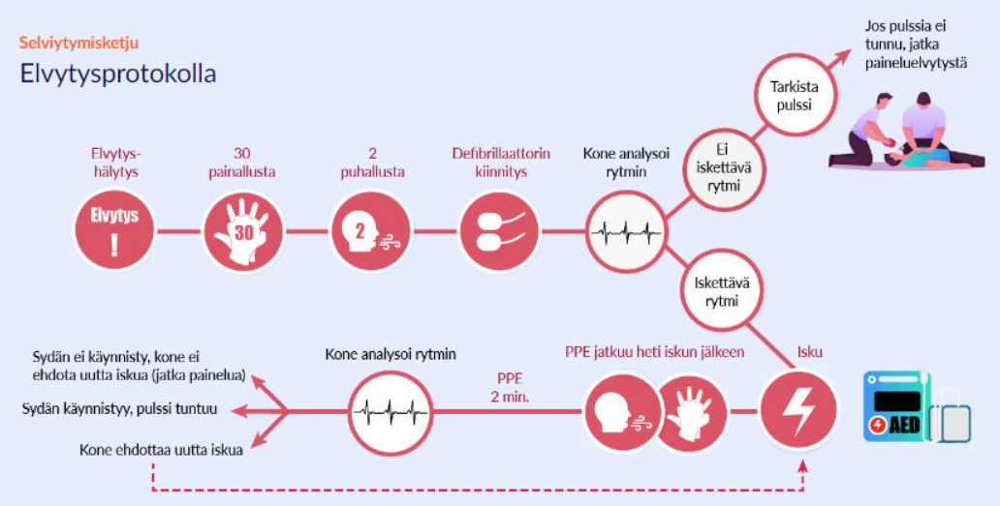
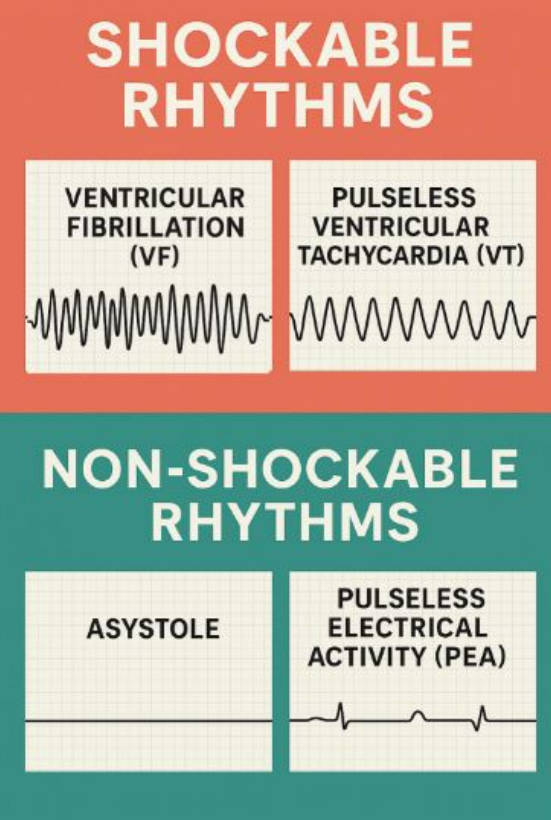
  

## Milloin elvytystä ei tule aloittaa? Milloin elvytys lopetetaan?

Ei vaihtoehtoja, tässä tärkeimmät aiheesta:

- Ei aloiteta, jos sekundaariset kuoleman merkit havaittavissa, löydetty asystolesta, ilmeinen kuolemaan johtava vamma tai potilaalla on DNR-päätös
- Lopetetaan, kun elvytysaika ylittää deffattavissa 40min (VF/VT) ja ei-deffattavissa 20min (PEA/ASY)

## Mikä on 4H ja 4T?

  <button class="solution-button" data-label="Vastaus" data-hide-label="Piilota vastaus">
    Vastaus
  </button>
  

    Sydänpysähdyksen hoidettavat syyt

Muistisääntö, joka auttaa muistamaan hoidettavissa olevat sydänpysähdyksen mahdolliset syyt (ei tietysti aivan kaikkia, mutta yleisimmät)

4 H: 1) hypoksia, 2) hypovolemia, 3) hypo- tai hyperkalemia, -kalsemia, -magnesemia tai -glykemia, 4) hypo- tai hypertermia

4 T: 1) tensiopneumothorax eli paineilmarinta, 2) sydäpussin tamponaatio, 3) tromboosi, 4) toksiinit eli myrkytys

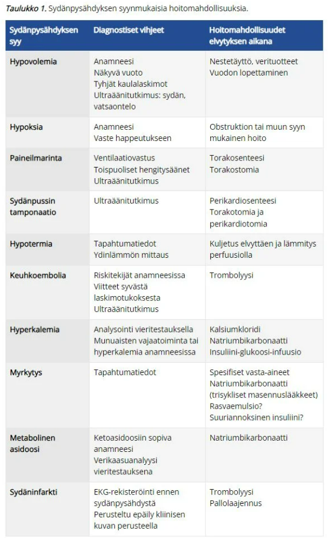
  

## Mitä kuuluu elvytyksen jälkeiseen hoitoon?

Ei vaihtoehtoja, tässä tärkeimmät aiheesta: 

- Hengityksen ja saturaation kontrolloiminen: SpO2 94-98%, normaali ventilaatiotiheys, normokapnia 
- Hemodynamiikka: Tavoitteena syst >100mmHg (joissain lähteissä MAP >65), ei brady- tai takykardiaa, tarv. nestehoito kristalloideilla (mahdollisesti tarvittaessa noradrenaliini myös)
- Lämpötila: Ei hypertermiaa eli tavoitelämpötila alle 37,8 astetta (ennen tavoiteltiin enemmän kontrolloitua hypotermiaa tasolla 32-36, nykyään tätä ei oikein tehdä enää)
- Sedaatio opioideilla/bentsodiatsepiineilla, jos potilas ahdistunut tai ei vielä ole täysin tajuissaan ja ilmateiden varmistusta ei voida poistaa. Sedatiiviset lääkkeet myös auttavat lämmönnousun estämisessä 
- Jatkoselvittelyt (EKG ja tarvittaessa angiografia ja PCI; tarvittessa sydämen UÄ ja/tai pään ja keuhkojen TT)
- Muiden asioiden huomioiminen; mm. normoglykemian ylläpito

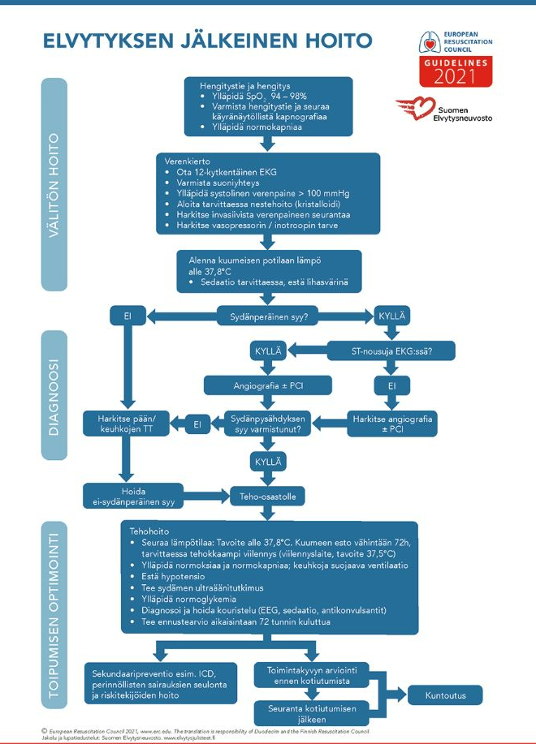

## Mitä tarkoitetaan leikkausriskillä ja leikkaus- ja anestesiakelpoisuudella?

Tässä lyhyesti:

Leikkausriski = Riski epäedulliselle lopputulokselle (leikkaus aiheuttaa haittaa potilaalle komplikaation tai virheen myötä), riski voi liittyä potilaan ominaisuuksiin, anestesian piirteisiin tai leikkaukseen liittyviin riskeihin. 

Kelpoisuus = Leikkaus- ja anestesiakelpoisuudella tarkoitetaan sitä, onko potilaan terveydentila sellainen, että leikkaus ja nukutus (tai muu anestesia) voidaan tehdä turvallisesti. Anestesiakelpoisuutta arvioidaan ns. ASA-asteikolla. 

## Kerro anestesiakomplikaatioista?

Monia, tässä wikissä mainitut:

- Huuli-, limakalvo- ja hammasvauriot
- Hemodynamiikan romahtaminen (yleisanestesia, puudutus), 
- Hermovaurio
- Hematooma pistospaikassa/epiduraalissa
- Paikallinen kudosvaurio ekstravasaation (lääkeaine suonen ulkopuoliseen tilaan) takia
- Aspiraatio
- Allergia
- Pahoinvointi
- Virtsaretentio sentraalisen puudutuksen jälkeen, 
- Postpunktiopäänsärky
- Pneumothorax
- Maligni hypertermia
- Totaalispinaali

## Mistä seikoista anestesiologi on erityisen kiinnostunut potilaassa?

Monista asioista, tässä wikissä mainitut:

Allergiat, onko suvussa anestesiaan vaikuttavia ominaisuuksia, aiempien anestesioiden sujuminen (nausea, pelko, vaikea hengitystie), ylipaino, tupakka, päihteet, kognitio…

## Selitä mikä on ASA-luokka?

ASA-luokka on anestesiakelpoisuuden arvioimisessa käytetty luokitus, jossa on 6 luokkaa:

- I = terve potilas
- II = lievä sairaus, joka ei vaikuta suorituskykyyn, tupakka, raskaus, BMI 30-40, stabiili DM…
- III = merkittävä sairaus, COPD, BMI>40, alkoholismi, hepatiitti, >3kk sitten TIA/sydäninfarkti..
- IV = henkeä uhkaava sairaus, <3kk TIA/sydäninfarkti, merkittävä läppävika, sepsis, mun. vt.
- V = potilas menehtyy ilman leikkausta, rupturoitunut aneurysma aortassa, aivoverenvuoto, MOF
- VI = kuollut elintenluovuttaja

## Miten hyytymisenestolääkitys vaikuttaa anestesiaan? Miten suhtaudut tauottamiseen?

Näin kirjoitettu wikissä:

Tauotuksessa konsultoi aina muita lääkäreitä (kardio, neuro jne), aina on tiedettävä miksi AK-hoito käytössä ja saako sitä tauottaa (esim. klopidogreeli STEMI jälkeen, EI SAA tauottaa stenttitrombiriskin takia). Tiedettävä myös tarviteeko siltahoitoa esim. LMWH.

Aktiivinen AK-hoito ei estä nukuttamista, mutta estää epiduraali- ja spinaalipuudutuksen lisääntyneen vuotovaaran takia. 

- Jos tauotus on riskialtista, ei tauoteta anestesian mahdollistamiseksi, ellei kyseessä oleva anestesiamuodon valinnalle ole painavia perusteita (esim. vaikea keuhkosairaus -> spinaalipuudutus parempi kuin yleisanestesia)

## Mikä on akuuttihoidon ABCDE?

Yritä vastata ilman vinkkejä

  <button class="solution-button" data-label="Vastaus" data-hide-label="Piilota vastaus">
    Vastaus
  </button>
  

    Tutkinta- ja hoitoprotokolla

A = airway – turvaa hengitystie

B = breathing – onko hengitys riittävää?

C = circulation – onko verenkierto riittävää?

D = neurological disability – tajunnan taso, puutosoireet, kallonsisäinen paine?

E = expose – tutki potilas järjestelmällisesti, hoida kipua, suojaa kylmältä
  

## Mitä ovat tukkeutuneen hengitystien tuntomerkkejä? (A = airway)

Näin wikissä:

Vaikeus/kykenemättömyys puhua, poikkeavat hengitysäänet (stridor, kuorsaus, ei hengitysääniä), poikkeavat hengitysliikkeet (apuhengityslihakset, paradoksaalinen rintakehän liike), alentunut tajunnantaso, hypoksia, syanoosi, elottomuus

## Miten huolehdit hengityksen riittävyydestä? (B = breathing)

Hengitys = happeutuminen + ventilaatio

Ongelma voi olla :
- hapetushäiriö (SpO2 tai PaO2 matala) eli tyypin 1 hengitysvajaus -> lisähappea (muista: COPD-potilailla älä ylihapeta, 88-92% saturaatio riittää); lisähapesta kannattaa muistaa yleisesti, että sillä voi olla haittojakin (altistaa atelektaaseille ja happiradikaalien toksisille vaikutuksille)
- ja/tai ventilaatiovajaus (CO2 retentio, resp. asidoosi, eli korkea EtCO2 tai PaCO2) eli tyypin 2 hengitysvajaus -> ventilaation tuki (ensisijaisesti 2PV eli bipap, jossa sisään- ja uloshengityksen paine-ero tuottaa mekanistisesti ventilaatiota)

**Karkeasti katsottuna siis, akuutti tyypin 1 hengitysvajaus tarvitsee happihoitoa, kun tyypin 2 hengitysvajaus vaatii noninvasiivista ventilointia (NIV)**
- Myös tyypin 2 hengitysvajauksessa (hyperkapninen hengitysvajaus, pääasiassa hypoventilaatiosta johtuvaa) voidaan antaa tarvittaessa happilisää, jos pelkkä ventilaatiotuki ei korjaa samaan aikaan aina esiintyvää hypoksemiaa hyperkapniseen (ventilaatiovajaukseen liittyy aina myös hypoksemia) (lisähappea tulee antaa varovasti keuhkokroonikolle, jos ei pysty seuraamaan CO2 kertymistä); NIV toteutetaan pääasiassa kaksoispaineventilaattoreilla (2PV), joissa sisään- ja uloshengityksen paine voidaan säätää erikseen -> auttaa tuulettamaan CO2, kun potilas ei siihen itse riittävästi pysty
- Tyypin 1 hengitysvajaus on pääasiassa hypokseeminen -> annetaan happea; NIV-hoitoa voidaan käyttää myös hypokseemisissa hengitysvajauksissa, mutta sydämen vajaatoiminnasta johtuvaa keuhkoödeemaa lukuun ottamatta näyttö hoidon tehosta on ollut vaihtelevaa

## Miten turvaat verenkierron? (C = circulation)

Näin wikissä:

- Jos sokki -> tee työdg, onko kyseessä hypovoleeminen, distributiivinen, kardiogeeninen vai obstruktiivinen sokki?

- Onko tila kompensoitu (takykardia, viileä periferia, janon tunne), vai kompensoimaton (alentunut tajunnan taso, hypotensio, sentraalinen syanoosi, hengitys-ekshaustio)?

- Toimenpiteet: Tyrehdytä vuoto, tarvittaessa nestehoitoa (esim. ringer/plasmalyte 500ml boluksina vastetta seuraten, EI GLUKOOSIPITOISIA YLLÄPITONESTEITÄ HYPOVOLEMIAAN), potilas Trendelenburgin asentoon (ei jos kallovamma, hengitysvaikeus, pään/kaulan vuoto), tarv. vasopressiiniä/noradrenaliinia tms.

## Neurologian tutkiminen? (D = neurological disability)

Näin wikissä:

- GCS, pupillat (koko, puoliero, valoreaktiot, katsedeviaatio), Babinski, motoriset puolierot ja mimiikka (liikkuuko raajat, puristusvoima, raajan kannatus, irvistys), puheen sujuvuus, niskajäykkyys

## Miksi nestehoito on tärkeää palovammapotilaalla, millä nesteellä nesteytät?

Näin wikissä:

- Riittämätön nesteresuskitaatio voi johtaa palovamman syvenemiseen, pidentää shokin kestoa ja kuolleisuutta. Nesteytys myös parantaa kudos- ja elinperfuusiota.
- Nesteytys ensisijaisesti balansoiduilla kristalloideilla

## Mikä on Parklandin kaava

  <button class="solution-button" data-label="Vastaus" data-hide-label="Piilota vastaus">
    Vastaus
  </button>
  

    Palovammapotilaan nesteytysohje

4ml / kg x palovamma-alue % (puolet 8h aikana, puolet seuraavan 16h aikana = 24h) ja tarvittaessa nesteytä runsaammin jos tulos ei tyydytä (tavoitteena diureesi 0,5-1ml/kg/h, ei takykardiaa, RR>100mmHg, asidoosi väistyy ja laktaatti laskee)

  

## Kerro palovammashokin patofysiologiasta

Ei muuten tarkempaa kysymyksenasettelua wikissä, tässä tärkeimmät aiheesta:

- Sekoitus distributiivista, hypovoleemista ja kardiogeenistä shokkia. 
- Alussa voi olla distributiivinen: Vaurioituneista soluista vapautuu tulehduksen välittäjäaineita ja syntyy laaja inflammatorinen vaste -> verisuonten permeabiliteetti lisääntyy -> turvotus, efektiivinen hypovolemia
- Hypovoleeminen: Nestettä vuotaa ja haihtuu vamma-alueelta sekä yleisen permeabiliteetin nousun takia nestettä häviää interstitaalitilaan lopulta johtaen efektiiviseen hypovolemiaan 
- Kardiogeeninen: Kiertävät tulehdusvälittäjäaineet lisäävät happiradikaalien tuotantoa ja tämä voi johtaa vaurioihin ympäri kehoa, mm. sydämen myokardiumiin. Tämä vähentää sydänlihaksen kontraktiliteettia ja laskee minuuttitilavuutta johtaen kardiogeeniseen sokkiin. Minuuttitilavuuden vähentämistä ja sydänlihasstressiä lisää afterloadin reaktiivinen nousu plasmatilavuuden vähentyessä. 

### Mitä laajan palovamman ensivaiheen väistyttyä tapahtuu?

Wikissä näin kirjoitettu:

48-72h kohdalla vuotavan alueen solukalvot alkavat eheytyä, sytokiinimyrsky laantuu ja neste pysyy suonissa -> hypervolemiariski jos jatkaa liian korkealla nesteytyksellä!

## Astrupin tulkintaa

Ei kysymyksenasettelua wikissä, vain aihe mainittu. Tässä lyhyesti astrupin tulkinnasta tärkeimmät: 

Katso pH, pCO2, HCO3 (tai BE). Näistä voit päätellä, mikä happo-emästasapainon häiriö on kyseessä. CO2 kuvaa respiratorista komponenttia ja HCO3 (samoin BE) kuvastavat metabolista komponenttia. Jos ei ymmärrä aihetta, niin kannattaa opiskella asia täysin uudestaan, mutta tässä nopea muistisääntö astruppien tulkitsemiseen: ROME 

- Respiratory Opposite, Metabolic Equal 
- Jos asidoosi/alkaloosi johtuu respiratorisesta syystä, niin pCO2:n suunta on eri suuntaan kuin metabolisen häiriön. Esimerkiksi jos kyseessä on respiratorinen asidoosi, niin pH menee alas (asidoosi), kun taas CO2 menee ylös (respiratorinen asidoosi). Samoin respiratorisessa alkaloosissa CO2 menee alas. 
- Jos asidoosi/alkaloosi johtuu metabolisesta syystä, niin HCO3:n suunta on samaan suuntaan kuin metabolisen häiriön. Esimerkiksi jos kyseessä on metabolinen asidoosi, niin pH menee alas (asidoosi), ja HCO3 menee myös alas (metabolinen asidoosi). Samoin metabolisessa alkaloosissa HCO3 nousee.

Happo-emäsepätasapainoa yritetään myös aina kompensoida. Respiratorisessa syyssä metabolinen puoli kompensoi ja metabolisessa syyssä respiratorinen puoli kompensoi. 
- Kompensaatio voi olla osittaista (pH ei ole normaali, mutta kompensaation merkkejä näkyy astrupissa) tai täydellistä (pH on normalisoitunut)
- Kompensaationuolen suunta on sama kuin aiheuttaneen muutoksen (esim. metabolisessa asidoosissa HCO3 matala -> kompensatorisesti hengitys tiheytyy ja CO2 laskee myös)

Viitealueet on myös hyvä osata ulkoa: 

- Normaali valtimoveren pH on 7.35-7.45 
- Normaali pCO2 on 4,5-6 kPa
- HCO3:n viitealue on 22-26 mmol/l (metabolisessa asidoosissa matala ja alkaloosissa korkea). 
- BE:n (emäsylimäärä) viitealue on -2.5-2.5. Jos BE on positiivinen, on veressä liikaa emäksiä, jos taas negatiivinen niin liikaa happoja. Pääasiassa voi käyttää HCO3:n korvikkeena (eroavat hieman, mutta käytännössä voi valita jommankumman ja totutella sen käyttöön)

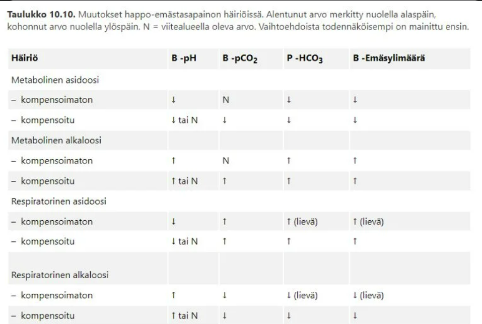

## Kanyylien värit

Ei kysymyksenasettelua, tässä värit ja niiden koot taulukoituna. Aikuisille menee yleensä n. pinkin kokoinen, isompaa sitten tarvittaessa. 

## Opioidit kroonisen neuropaattisen kivun hoidossa

Opioidit eivät ole ensisijaisia lääkkeitä neuropaattisen kivun hoidossa. 

- Aiemmin opioideja on pidetty tehottomina neuropaattisessa kivussa, mutta myöhemmin on todettu, että osa neuropaattista kipua potevista potilaista hyötyy opioideista
- Vahvojen opioidien asema on edelleen vakiintumaton neuropaattisen kivun hoidossa, koska vain osa potilaista hyötyy näistä lääkkeistä ja koska vahvat opioidit voivat aiheuttaa riippuvuutta

Ensisijaiset lääkevaihtoehdot neuropaattisessa kivussa ovat gabapentinoidit (pregabliini/gabapentiini), SNRI-lääkkeet (venlafaksiini tai duloksetiini) tai trisykliset masennuslääkkeet (amitriptyliini tai nortriptyliini). Toissijaisesti voidaan harkita mm. topikaalista kapsaisiinia tai lidokaiinia (esim. laastareina). 

- Yksi toissijainen lääkevaihtoehto on eräs heikko opioidi eli Tramadoli. Tämä ei pääasiassa johdu sen opioidivaikutuksista, vaan sen SNRI-vaikutuksista (tramadoli estää noradrenaliinin ja serotoniinin takaisinottoa samoin kuten SNRI-lääkkeet) 

Jos em. vaihtoehtojen vaikutus jää riittämättömäksi, niin silloin voidaan harkita vahvojen opioidien yrittämistä. 

## Sepsiksen suolisto-oireet

Ei vaihtoehtoja tai kysymyksenasettelua wikissä, tässä aiheesta tärkeimmät: 

Sepsis on systeeminen ongelma ja se voi tietysti siten aiheuttaa suolisto-oireita, vaikka tila ei olisikaan suolistolähtöinen. 

- Verenkierron muutoksen ja suolistoverenkierron heikentyminen voi johtaa pahoinvointiin, oksenteluun ja vatsakipuun. 
- Verenkierron heikentyminen voi johtaa limakalvovaurioon, joka voi pahentaa sepsistä päästämällä bakteereita enemmän verenkiertoon.  
- Sekä ripulia että ummetusta voi esiintyä. 

## Kakektisen, monisairaan todella kivuliaan potilaan kipulääkkeen annostelu päivystyksessä

Ei vaihtoehtoja wikissä, tässä ajatuksia aiheesta: 

- Monisairaan potilaan kivunhoidossa tulee aina ottaa huomioon muut lääkitykset sekä mm. munuaisten toiminta 
- Heikossa munuaisten toiminnassa NSAIDit eivät ole hyviä lääkkeitä (heikentävät perfuusiota munuaisiin) 
- NSAIDit ovat samoin huonoja, jos potilaalla on muita hyytymiseen vaikuttavia lääkkeitä (esim. AK-lääkitys) 
- Munuaisten vajaatoiminnassa tulee myös vähentää mm. opioidiannoksia (samoin maksan vajaatoiminnassa tulee olla varovaisempi annostelun kanssa) 
- Kakektisen potilaan kanssa tulee muutenkin olla annostelun kanssa tarkempi, koska kevytpainoiselle ei ehkä tarvitse antaa normaalia määrää lääkkeitä. 

## Tipan valinta viikon kestävässä antibioottihoidossa

Jos hoito kestää viikon, niin perifeerinen laskimokanyyli voi vielä olla mahdollinen vaihtoehto, mutta jos hoito jatkuu viikkoa pidempään, niin suositellaan toista suoniyhteysmetodia, esim. midline, keskuslaskimokatetri tai PICC. 

- Samoin tulee harkita keskuslaskimoon asetettavaa katetria (CVK tai PICC), jos annostellaan vähänkään pidempään mikrobilääkettä, joka rasittaa perifeerisiä verisuonia (esim. vankomysiini, kefepiimi, kefatsoliini).  

## Perustäyttöneste leikkauksessa

TYKSissä käytetään Plasmalyteä eniten leikkauksissa ja leikkausosastoilla.

## Hypokalemian hoito

Ei tarkempaa kysymyksenasettelua tai vaihtoehtoja wikissä, mutta tässä tärkeimmät aiheesta: 

- Hoidon kulmakivet ovat kaliumpitoisuutta pienentävien lääkkeiden lopettaminen ja kaliumvajauksen (sekä mahdollisen magnesiumvajauksen) korjaus
- Kaliumvajaus korjataan ensisijaisesti suun kautta antamalla 2–6 g kaliumkloridia (esim. kaleroid-tabletti tai kalisol oraaliluoksena; ps. näiden ongelmat ovat kaleorid-tabletin suuri koko (vaikea niellä) ja kalisolin paha maku). Laskimoon kaliumia voidaan infusoida enintään 20 mmol tunnissa. Perifeeriseen laskimoon kalium infusoidaan glukoosiliuoksena (40 mmol/l), koska vahvempi ärsyttää suonia liikaa; sentraaliseen suoneen voidaan antaa väkevämpiä liuoksia ja myös nopeammin. 
- Hypomagnesemia korjataan infusoimalla magnesiumsulfaattia 40–60 mmol/vrk tai suun kautta käyttämällä magnesiumia sisältäviä valmisteita (Emgesan®, Miral®) 0,5-1,5 mmol/kg/vrk
- Kaliumpitoisuutta pienentävistä lääkkeistä tärkeimpiä ovat diureetit, kuten tiatsidit ja loop-diureetit (kaliumia säästäviä diureetteja on esim. spironolaktoni). Insuliini on myös tärkeä kaliumia laskeva lääke ja insuliinin liika-annostelu voi aiheuttaa hypokalemiaa. s

## Mitkä tekijät voivat estää leikkauksen?

Ei vaihtoehtoja wikissä, tässä tärkeimmät: 

Potilaan terveydentila

- Akuutti sairaus (esim. kuumeinen infektio yms), joka tekee elektiivisen leikkauksen siirron aiheelliseksi
- Vakava perussairauden paheneminen (esim. dekompensoitu sydämen vajaatoiminta tai COPD:n/astman pahenemisvaihe)
- Leikkauskohdan ihon infektio

Lääkitys 

- Potilas ei ole tauottanut antikoagulaatiolääkitystä (AK-hoito ei siis estä nukutusta tai suurinta osaa puudutuksista, mutta tietyissä leikkauksissa ja esim. epiduraali- tai spinaalipuudutuksissa AK-lääkitys tulee olla tautettuna tietyn ajan)

Muut tekijät 

- Potilas ei ole paastonnut 
- Potilas kieltäytyy elektiivisestä leikkauksesta 

Logistiset syyt 

- Puuttuva välineistö tai henkilöstö 
- Leikkaussalien ruuhkautuminen 

Hyöty-haitta-suhde

- Toimenpiteen hyöty pienempi kuin riskit 
- Potilaan eliniän ennuste on hyvin lyhyt ja leikkauksesta ei uskota saavat merkittävää hyötyä potilaan loppuelämää ajatellen 

## Miten elvytetyn potilaan uloshengityksen CO2 pitoisuus käyttäytyy ROSCin jälkeen?

  <button class="solution-button" data-label="Vastaus" data-hide-label="Piilota vastaus">
    Vastaus
  </button>
  

    EtCO2 nousee 
    
EtCO2 = kapnometrian arvo, joka kuvastaa hiilidioksidin pitoisuutta uloshengitysilmassa ekshalaation loppuvaiheessa (end-tidal carbon dioxide) 

Kapnografia kertoo elvytyksen aikana paineluelvytyksen laadusta niin, että mitä korkeampi lukema, sen parempaa paineluelvytys on. Se ei kuitenkaan elottomalla ihmisellä nouse normaaleihin lukemiin, joten kapnometrian etCO2-luvun noustessa 4–5 kPa:han, tarkoittaa se yleensä normaalin verenkierron palautumista.

EtCO2:n nousua normaaliksi ei kuitenkaan yksin tulisi käyttää verenkierron palautumisen merkkinä, eikä painelusykliä tule keskeyttää, vaikka EtCO2 suurenisikin.
  

## NEWS pisteytyksen käyttö

Ei tarkempaa kysymyksenasettelua wikissä, tässä aiheesta tärkeimmät: 

NEWS = National Early Warning Score

- Peruselintoimintojen arvioimiseen käytetty pisteytys -> käytetään tilan huononemisen varhaiseen havaitsemiseen
- Korkeat NEWS-pisteet ennustavat sydämenpysähdystä, tehohoitoon ajautumista tai kuolemaa seuraavan vuorokauden aikana
- Hoitajat mittaaavat NEWS-pisteitä tietyin aikavälein ja pisteiden noustessa 7 tai yli, on tyypillistä tehdä MET-hälytys, jos se on käytössä. 
- Lapsilla on oma taulukkonsa (PEWS)

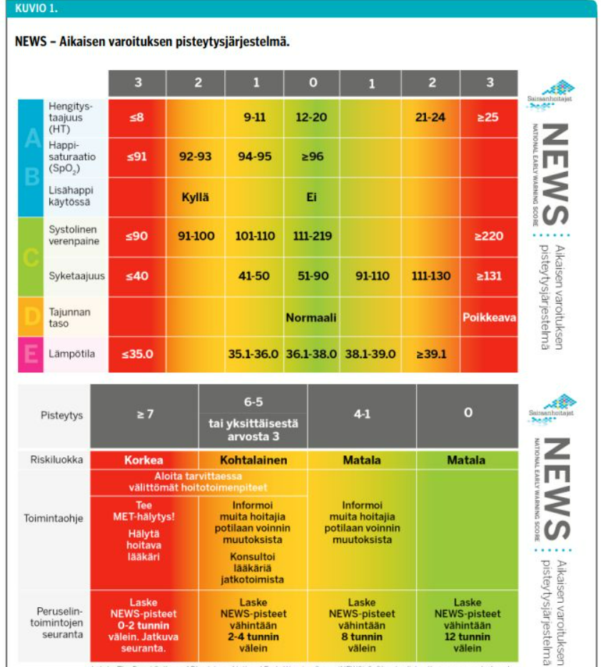

## Mikä on inotrooppi?

Ei vaihtoehtoja wikissä, mutta tulisi osata vastata ilman vinkkejäkin

  <button class="solution-button" data-label="Vastaus" data-hide-label="Piilota vastaus">
    Vastaus
  </button>
  

     Lihassupistusta lisäävä lääke
     
Lähes aina puhutaan sydänlihaksen supistusvoiman lisäämisestä. Inotrooppi siis parantaa sydämen kontraktiliteettiä ja siten voi parantaa minuuttitilavuutta. Kronotrooppi taas lisäisi sykettä. 

Tyypillisiä inotrooppeja on mm. dobutamiini, levosimendaani ja milrinoni. Myös mm. adrenaliinilla on inotrooppisia vaikutuksia (on myös kronotrooppi ja vasokonstriktori). 

Dobutamiini on synteettinen katekoliamiini, joka lisää sydämen supistumista lisäämällä solunsisäisten Ca2+-ionien määrää. Dobutamiini lisää sydänlihaksen hapenkulutusta, ja sen käyttöön liittyy vakavien rytmihäiriöiden riskin suureneminen.

Levosimendaani on verisuonia laajentava inotrooppi, joka lisää supistuvien sydänlihassolun proteiinien Ca2-herkkyyttä. Levosimendaanin vaikutus on riippumaton katekolamiineistä, ja levosimendaani soveltuu myös beetasalpaajaa käyttävälle potilaalle.

Milrinoni on PDE3-antagonisti, joka vaikutusmekanisminsa ansiosta sekä laajentaa verisuonia (mm. keuhkovaltimoita) että lisää sydänlihaksen supistusvireyttä. Milrinonin vaikutus ei ole katekolamiiniriippuvainen.
  

## Mikä aiheuttaa AKI:n seuraavista? 

Ei vaihtoehtoja wikissä, mutta kerrottu oikea vastaus, joka on ilmeisesti dehydraatio ja NSAID

- Dehydraatio heikentää virtaavaa verivolyymiä ja siten heikentää munuaisperfuusiota 
- NSAIDit heikentävät munuaisten toimintaa, koska COX-1- että COX-2-entsyymit (molemmat jatkuvasti ekspressoituneita munuaisissa) tuottavat erityisesti afferenttia arteriolia dilatoivia prostaglandiineja -> NSAIDien aiheutta COX-inhibitio heikentää munuaisten perfuusiota 

Molemmat siis heikentävä munuaisten perfuusiota ja altistavat prerenaaliselle AKI:lle (akuutti munuaisvaurio). 
- Renaalinen syy taas johtuisi munuaisten sisäisestä syystä (esim. akuutti tubulusnekroosi, akuutti interstitielli nefriitti) ja postrenaalinen syy obstruktiosta virtsateissä (esim. virtsakivet, BPH, tuumorit, neurofeeninen rakko). 

## Potilastapaus: potilaan rinnuksilla on oksennusta, ht 8 krt/min, saturoi huonosti, mitä teet hengityksen turvaamiseksi?

1. Poistetaan näkyvä lika tai oksennus suusta niin, että hengitystiet ovat avoimet 

2. Oksentelu viittaa korkeaan aspiraatioriskiin, joten intubaatio voi olla aiheellinen riskin vähentämiseksi. Riippuen potilaan tajunnantilasta ja happisaturaation heikkoudesta, voi olla aiheellista intuboida potilas ja antaa hänelle lisähappea ja ventilaatiotukea. 

## Vitamiinilisät parenteraalisessa ravitsemuksessa

Ei tarkempaa kysymyksenasettelua wikissä, tässä tärkeimmät aiheesta 

Parenteraalinen ravitsemus (PN) aloitetaan, jos enteraalinen ravitsemus ei ole mahdollista tai sillä ei saavuteta asetettuja tavoitteita eli vähintään 60 % tavoitekaloreista ja proteiineista

- Parenteraalinen ravitsemus toteutetaan useimmiten sentraaliseen, mutta joskus myös perifeeriseen suoneen hoidon pituuden ja ravitsemusliuoksen konsentraation mukaan

**Ravitsemusseoksiin ei saa lisätä lääkeaineita käyttöohjeissa mainittuja elektrolyyttejä ja vitamiineja lukuun ottamatta**

- Monikammiopusseihin ei lisätä lääkeaineita, vaan ne annetaan erilliseen infuusiolinjaan
- Ohjeista poikkeaminen voi johtaa verisuonia tukkivien saostumien muodostumiseen ja rasvaemulsion särkymiseen. Kalsiumin ja fosfaattien määrät ovat kriittisimmät, koska ne reagoivat herkästi keskenään muodostaen niukkaliukoisia suoloja

_Rasvaliukoiset ja vesiliukoiset vitamiinit tulee antaa päivittäin jo ensimmäisestä ravitsemuspäivästä lähtien._ Kaupalliset valmisteet sisältävät keskimääräistä perustarvetta vastaavat määrät näitä vitamiineja. Joistakin vitamiinivalmisteista puuttuu K-vitamiini, jolloin se tulee muistaa lisätä erikseen.

- Kroonista munuaisten vajaatoimintaa sairastavilla A- ja D-vitamiinin annosta tulee tarvittaessa vähentää.

## Mitkä seuraavista on heikkoja opioideja? 

Valitse yksi

a) tramadoli ja kodeiini 
b) hydromorfoni ja kodeiini 
c) rokuroni ja tramadoli 
d) fentanyyli ja kodeiini

  <button class="solution-button" data-label="Vastaus" data-hide-label="Piilota vastaus">
    Vastaus
  </button>
  

    a

Kliinisesti tärkein tapa jaotella opioidit on niiden vahvuuden mukaan. 

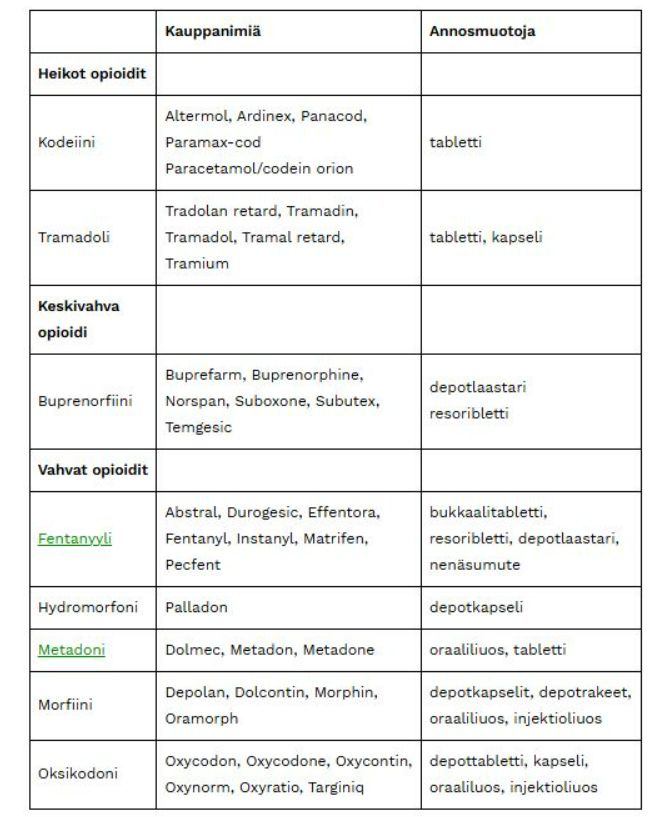
  

## Missä asennossa elvytetty tai aivovamman saanut pitää kuljettaa? 

Valitse yksi

a) vaakatasossa 
b) trendelenburgissa 
c) pää hieman koholla

  <button class="solution-button" data-label="Vastaus" data-hide-label="Piilota vastaus">
    Vastaus
  </button>
  

    c

Halutaan estää/vähentää aivopaineen (ICP) nousua. Lievä kohoasento vähentää ICP:n liiallista nousua ilman että riskeeraataan aivoperfuusiota. 
  

## SIRS-kriteerit

Ei tarkempaa kysymyksenasettelua wikissä, tässä tärkeimmät aiheesta: 

SIRS (Systemic Inflammatory Response Syndrome)-kriteereistä (ja termistäkin, ei ole enää suositellussa käytössä) on pääasiassa luovuttu niiden epäspesifisyyden takia, mutta niitä käytettiin ennen erityisesti sepsiksen tunnistamisessa. SIRS määritettiin tilaksi, jossa on vähintään kaksi seuraavista ehdoista: 

- ydinlämpö <36 tai >38
- syke > 90/min
- hengitystaajuus >20/min tai a-pCO2 <4,3 kPA 
- valkosolut <4 tai >12 

Sepsis määriteltiin enne sepsis 3-määritelmää SIRSinä, jossa on epäilty/varmistettu infektio 

- Nykyään sepsis = yksi uusi elinhäiriö + epäilty/varmistettu infektio 
- Uusi elinhäiriö voidaan arvioida nopeasti qSOFA-kriteerejä käyttämällä. Tulee olla vähintään kaksi kriteeriä seuraavista: hengitysfrekvenssi >22, systolinen verenpaine <100, muuttunut tajunnan taso 
- Tarkempi arvio kuin qSOFA on SOFA ja jos sen pisteytys on 2 tai yli, niin on kyseessä elinhäiriö 

Aikaisemmin sepsiksen ajateltiin olevan jatkumo SIRS+infektio kautta vaikeaan sepsikseen ja sitä kautta septiseen sokkiin
- Nykyään on vain sepsis ja septinen sokki, ei enää virallisesti ole "vaikea sepsis"-käsitettä
- Septinen sokki (sepsis + vasopressoritarve (MAP <65 nestehoidon kanssakin) + laktaatti >2mmol/l riittävän neste-elvytyksen jälkeen)

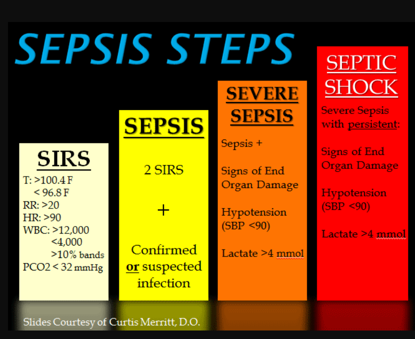

## Anafylaktisen sokin tyyppi? 

Valitse yksi

- a. distributiivinen
- b. kardiogeeninen
- c. hypovoleeminen 
- d. joku neljäs vaihtoehto (ei wikissä)

  <button class="solution-button" data-label="Vastaus" data-hide-label="Piilota vastaus">
    Vastaus
  </button>
  

    a

Distributiivisia sokkeja ovat infektio (septinen sokki), allergeenit (anafylaktinen sokki), selkäydinvamma (neurogeeninen sokki; ns. spinaalisokki), systeeminen inflammaatio (esim. vaikea pankreatiitti) ja toksiinit (esim. tietyt käärmeenpuremat, raskasmetallimyrkytys)

Distributiivinen sokki johtaa matalaan verenpaineeseen yleistyneen vasodilataation takia. Potilailla havaitaan kapasitanssisuonten ja arteriolien poikkeava vasodilataatio, jolloin alkuvaiheessa voidaan havaita ns. "lämmin sokki". Sydämen toiminta tyyppitilanteessa on normaalia tai hyperdynaamista, joskin inflammaatio voi aiheuttaa myös sydämen toiminnan lamaa. Kiertävä veritilavuus on alkuvaiheessa normaali, mutta vasodilataation ja myös verisuonten läpäisevyyden lisääntymisen myötä potilaille kehittyy hypovolemia ja hypovoleemisen sokin taudinkuva.

Anafylaksian hoito perustuu adrenaliinin annosteluun. Anafylaksiassa adrenaliinia voidaan annostella i.v. (vain sokissa) tai i.m. Annostelu on iv:sti aikuisille 0,05-0,1mg ja im:sti 0,3-0,5 mg. Lapsille im-annostelu on 0,01 mg/kg.
  

## Hyponatremiasta monta kysymystä

Ei vaihtoehtoja wikissä tai mitään kysymyksenasettelua. Tässä hyponatremiasta pari tärkeintä asiaa 

- Hyponatremia on yleisin neste- ja elektrolyyttitasapainon häiriö
- Hyponatremian syyn selvittämiseksi tärkeimmät tutkimukset ovat status (nestevolyymistatus eli onko hypo-, eu-, vai hypervoleeminen potilas), seerumin tai plasman osmolaliteetti, virtsan osmolaliteetti ja virtsan natriumpitoisuus
- Aluksi on tärkeää määrittää seerumin osmolaliteetin kautta, onko kyseessä hypo- (yleisin ja ns. klassinen hyponatremia), iso- vai hypertoninen hyponatremia; jos S-Osmol on alle 275 (tai labrasta riippuen 280) mosm/kg H2O, niin kyseessä on hypotoninen hyponatremia. 
- Seuraavaksi tarkastellaan virtsan osmolaliteettia, ja sen perusteella voidaan jakaa hyponatremia kahteen. Jos U-Osm on alle 200, niin kyseessä on ns. ADH-riippumaton hyponatremia eli ADH on suppressoitu ja keho yrittää virtsata normaalisti nestettä pois ja palauttaa normonatremian, mutta tämä ei ole mahdollista (syitä ovat esim. liiallinen nesteiden juominen suhteessa suolojen saantiin; esim. beer-potomania tai "tea and toast"-dieetti). 
- Jos U-Osm >200, niin on kyseessä ns. ADH-riippuvainen hyponatremia, jonka seurauksena virtsan osmolaliteetti on turhan korkea, vaikka plasman osmolaliteetti on matala. Näitä syitä on monia ja tässä jaottelussa auttaa virtsan natriumpitoisuus ja potilaan volyymistatus. 

Hoito pähkinänkuoressa: 

- Tärkein periaate hyponatremian hoidossa yleisesti on, että natriumpitoisuutta suurennetaan hitaasti ja hallitusti (tavoite on 5 mmol/l minkä tahansa 24 t jakson aikana ja saa nousta enintään 8 mmol/l/24 t, kunnes P-Na on 130 mmol/l tai suurempi). Jos hyponatremian korjaa liian nopeasti, voi haittavaikutuksena tapahtua aivosillan osmoottinen myelinoosi, jonka mahdollisia oireita: ataksia, puhevaikeus, nielemisvaikeus, katsehalvaus, sekavuus, kouristelu, neliraajahalvaus, loukkuhalvaus (locked-in-oireyhtymä). "From low to high, your pons will fry". Tästä poikkeus on hyperakuutti hyponatremia (esim. vedenjuontikilpailu), jolloin hypoantremian saa korjata nopeasti.
- Jos kyseessä on vaikeasti oireinen hyponatremia (oksentelu, voimakas päänsärky, huomattava sekavuus, kouristelu, tajuttomuus), niin annetaan 100ml hypertonista NaCl 3 % -liuosta 10 minuutissa; tarvittaessa toistetaan ad x2. Tavoitteena on nostaa P-Na 5 mmol/l (tai jos oireet väistyvät niin alle tämän) lähtötilanteesta muutaman tunnin kuluessa, jolloin aivoturvotuksen oireet vähenevät ja herniaatioriski väistyy; P-Na tarkistetaan heti infuusion jälkeen. NaCl 3 % -hoito lopetetaan heti, kun hyponatremian vakavat oireet ovat väistyneet, vaikka P-Na ei olisi noussut 5 mmol/l. Hoito toteutetaan vain valvontahuoneolosuhteissa (PÄIV, TEHO), jossa mahdollisuus tiheään P-Na pitoisuuden seurantaan. 
- Muuten hoito simppelisti näin: 
  - Hypovoleeminen hyponatremia: Ringer (tai 0,9% nacl)
  - Euvoleeminen hyponatremia: Nesterajoitus
  - Hypervoleeminen hyponatremia: Neste- ja suolarajoitus ja loop-diureetit
- Jos natrium korjaantuu liian nopeasti tai sitä ennakoidaan (runsas diureesi), tulee lopettaa hyponatremian aktiivinen hoito ja aloittaa G5-infuusio ja valvontaolosuhteissa mahdollisesti desmopressiini

Jos olet unohtanut hyponatremiasta perusteet ja miksi mikäkin tila aiheuttaa hyponatremiaa ja miksi mikäkin hoito auttaa eri tilanteissa (eikä vain anneta suolatabletteja), niin kannattaa lukea: 

## Potilas hengittää spontaanisti, saturaatio 96%, GCS 5, mitä teet hengitysteille?

Valitse yksi 

- a. intubointi
- b. seuranta
- c. nielutuubi
- d. maskiventilaatio

  <button class="solution-button" data-label="Vastaus" data-hide-label="Piilota vastaus">
    Vastaus
  </button>
  

    a

Yleissääntö on, että "GCS under 8, intubate". Merkittävässä kognitiivisessa häiriössä potilailla on depressoitunut kakomis- ja yskärefleksit, mikä altistaa aspiraatiolle, koska potilas ei pysty suojaamaan omia hengitysteitään. "GCS under 8, intubate"-dogma on saanut kritiikkiä, mutta se on monissa tilanteissa ihan hyvä yleissääntö ja se kannattaa muistaa. 
  

## Mikä ei ole vasta-aihe puudutukselle (spinaali/epiduraali)? 

Valitse yksi 

- a. potilas on lapsi
- b. puudutusalueen infektio
- c. korjaamaton hypovolemia
 -d. joku (ei wikissä)
 

  <button class="solution-button" data-label="Vastaus" data-hide-label="Piilota vastaus">
    Vastaus
  </button>
  

    a

Spinaali- ja epiduraalipuudutukset voidaan tehdä myös lapsille, joten se ei ole vasta-aihe

b: Puudutusalueen infektio on vasta-aihe sentraaliselle puudutukselle, koska ei tietystikään haluta viedä infektiota syvemmälle selkäydinkanavan lähelle

c: Sentraaliset puudutukset voivat yleensä aiheuttaa hypotensiota sympaattisen hermoston salpauksesta johtuen -> korjaamaton hypovolemia altistaa massiiviselle verenpaineen romahdukselle sentraalisen puudutuksen yhteydessä

d: Vaikka kohonnut kallonsisäinen paine on vasta-aihe spinaalipuudutukselle, samoin aktiivinen antikoagulaatiohoito (ei haittaa, että pieniannos-ASA on päällä, mutta muuten äytännössä kaikki antitromboottiset/antikoagulatiiviset lääkkeet tulee tauottaa joksikin aikaa ennen sentraalista puudutusta (vaihtelee lääkkeen mukaan))

  

## Mikä ei ole vasta-aihe tulehduskipulääkkeelle? 

Valitse yksi 

- a. hyytymisenestolääkitys
- b. sairastettu sydäninfarkti
- c. reumalääkitys
- d. joku vielä (ei wikissä) 

  <button class="solution-button" data-label="Vastaus" data-hide-label="Piilota vastaus">
    Vastaus
  </button>
  

    c
   
Reumalääkitys (esim. REKO-hoito eli metotreksaatti, hydroksiklorokiini, sulfasalatsiini, pieniannoksinen glukokortikoidi) ei ole tulehduskipulääkkeen (NSAID) vasta-aihe. Moni reumapotilas käyttääkin säännöllisesti NSAID-lääkkeitä. 

a: Hyytymisenestolääkitys (antikoagulaatio) lisää selvästi NSAID-lääkkeiden aiheuttamaa vuotoriskiä → vasta-aihe / voimakas varovaisuus

b: Sairastettu sydäninfarkti on merkittävä sydän- ja verisuonitautien riskitekijä, ja NSAID-lääkkeet lisäävät sydäntapahtumien riskiä (niin COX-2-selektiiviset kuin nonselektiivisetkin) → vasta-aihe / vältettävä

d: Yksi mahdollinen NSAIDien vasta-aihe olisi akuutti munuaisten vajaatoiminta (AKI), jolloin ei haluta pahentaa tilannetta (NSAIDit heikentävät munuaisperfuusiota)
  

## Potilaan PaCO2 8.9, mitä teet? 

Valitse yksi

- a. Ventiloin lisää
- b. Ventiloin vähemmän
- c. Annetaan korjaantua itsestään

  <button class="solution-button" data-label="Vastaus" data-hide-label="Piilota vastaus">
    Vastaus
  </button>
  

    a

Normaali arteriaveren hiilidioksidiosapaine on 4.5-6 kPa. Hyperkapniassa on kyse tyypin 2 hengitysvajauksesta (hiilidioksidi kertyy) eli tilanne johtuu hypoventilaatiosta. Sen korjaaminen onnistuu ventilaation tehostamisella. 
  

## Kuka päättää anestesiamuodon? 

Valitse yksi 

- a. potilas
- b. kirurgi
- c. anestesiologi

  <button class="solution-button" data-label="Vastaus" data-hide-label="Piilota vastaus">
    Vastaus
  </button>
  

    c

Loppupeleissä anestesialääkäri leikkauksen vaatimusten ja potilaan toiveiden mukaan. 
  

## Covid-potilas vaipumassa tajuttomaksi, HT 4/min, oksennellut, mitä teet? 

Ei vaihtoehtoja wikissä, mutta intubaatio, koska aspiraatioherkkä potilas (oksentelu, tajunnantason heikentyminen) ja hengitysvajausta todettavissa. 

## Turvallinen vieläkin käytössä oleva kolloidi? 

Valitse yksi: 

- a. albumiini
- b. mannitoli
- c. kaksi muuta (ei wikissä)

  <button class="solution-button" data-label="Vastaus" data-hide-label="Piilota vastaus">
    Vastaus
  </button>
  

    a

Albumiini (kauppanimellä Albuman; nimi tulee siitä, että albumiiniliuos valmistetaan ihmisen plasmasta (human albumin -> albuman)) on ainoa yleisessä käytössä oleva kolloidivalmiste

Kolloidi = Kristalloidien (kivennäisaineista ja muista pienistä vesiliukoisista molekyyleistä muodostuvia vesiliuoksia) ja isojen molekyylien, kuten proteiinien seoksia. Veri itsessään siis on kolloidi ja kolloidi-nesteiden annolla on se idea, että annetaan nestettä, jolla on korkea kolloidi-osmoottinen paine ja siten neste saataisiin pysymään paremmin intravaskulaaritilassa.

Mikään kolloidi ei nykytiedon mukaan paranna potilaan ennustetta kristalloideihin verrattuna ("kannettu vesi ei pysy kaivossa") eikä synteettisten kolloidien käyttö ole perusteltua yhdessäkään potilasryhmässä. Kolloidit ja varsinkin albumiini ovat myös merkittävästi kalliimpia nesteliuoksia kuin kristalloidit, jonka takia niitä käytetään hyvin harvoin.

b: Mannitoli on kristalloidi, ei kolloidi. Mannitoli on siis sokeria ja siten nesteliuoksena on ns. kristalloidi neste. 

c: Esimerkiksi vaihtoehtoina voinut olla hydroksietyylitärkkelysliuokset (HES) ja gelatiiniliuokset. Nämä ovat synteettisiä kolloideja, jotka eivät ole yleisessä käytössä. Niiden käyttöön liittyy munuaisvaurion vaara. Ensimmäiseksi havaintoa sovellettiin elinluovuttajien hoidossa ja myöhemmin sepsispotilailla. Vuonna 2012 Euroopan tehohoitolääketieteen yhdistys antoi suosituksen, että synteettisiä kolloideja ei tule käyttää septisille potilaille.
  

## Mitä tarkoittaa allodynia?

Ei vaihtoehtoja wikissä, mutta tulisi osata vastata ilman vinkkejäkin 

  <button class="solution-button" data-label="Vastaus" data-hide-label="Piilota vastaus">
    Vastaus
  </button>
  

    Normaalisti kivuttomat ärsykkeet aiheuttavat kipua
    
Esim. kevyt kosketus aiheuttaa kipua alueen vaurioitumisen jälkeen; tyypillinen esimerkki on kuuma suihku auringossa palamisen jälkeen. 

Eroaa hyperalgesiasta = stimulus, joka yleensäkin aiheuttaa kipua, aiheuttaa nyt vielä suurempaa kipua
  

