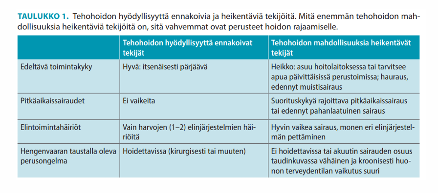
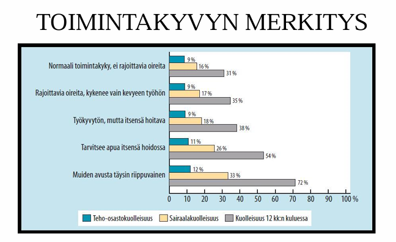
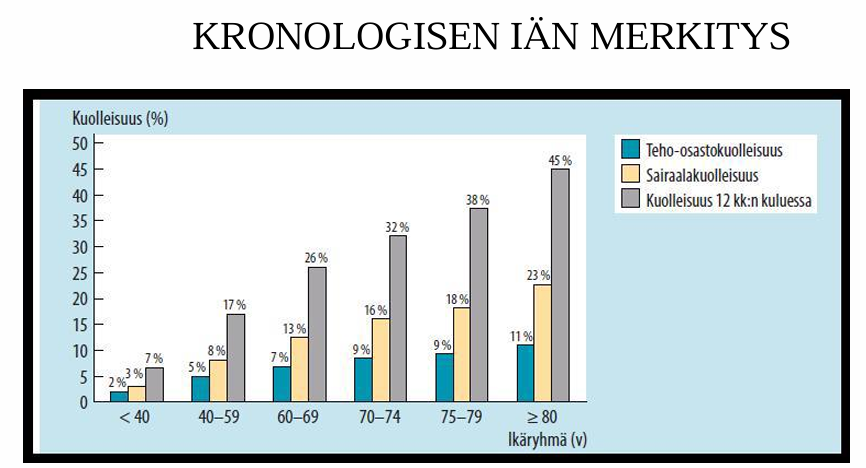

# 2021 (Sisäänpääsytentti)

Tähän laitettu vain ne, jotka soveltuvat helposti tällaiseen kysymysformaattiin (ei esim. yhdistelytehtäviä). 

##  Mistä alla olevista potilaista kuuluu tehdä MET-hälytys? 

Valitse yksi tai useampi

- a. Kouristanut kaikilla raajoilla, kouristus ohittunut spontaanisti minuutissa, epilepsia tiedossa. Hengitystiheys 20/min, SpO2 92, HR 110, RR 150/80. Alkaa hereillä, avaa silmät spontaanisti, puhe vielä hieman sekavaa, paikantaa kivun 
- b. Hengitystiheys 10/min, SpO2 95, HR 50, RR 120/70, hyvin tajuissaan
- c. Hengitystiheys 16/min, SpO2 99, HR 170, RR 85/50, hyvin hereillä
- d. Hengitystiheys 30/min, SpO2 85 lisähapella, HR 100, RR 180/100, hyvin hereillä, kokee hengenahdistusta 

  <button class="solution-button" data-label="Vastaus" data-hide-label="Piilota vastaus">
    Vastaus
  </button>
  

     c ja d 

a ja b: Ei vikaa hengityksessä tai hemodynamiikassa 

c: Potilas hemodynaamisesti epävakaa   

d: Potilaan hengitys herättää huolta ja tarvitsee tarkempaa arviointia ja hoitoa 
  

## Mitkä ovat tärkeimmät tekijät potilaan tehohoitokelpoisuutta arvioitaessa? 

Vaitse yksi tai useampi

- a. Potilaan sukupuoli
- b. Pelkästään ikä
- c. Merkittävien perussairauksien vaikeusaste
- d. Potilaan yleinen toimintakyky

  <button class="solution-button" data-label="Vastaus" data-hide-label="Piilota vastaus">
    Vastaus
  </button>
  

     c ja d 

a: Sukupuolella ei ole merkittävää merkitystä tehohoidon suhteen

b: Ikä voi vaikuttaa päätöksentekoon hieman, mutta se tulee aina suhteuttaa potilaan muuhun tilaan (pelkkä korkea ikä ei estä hoitoa) 

c: Esim. vaikea sepelvaltimotauti, COPD tai munuaisten vajaatoiminta saattavat huonontaa ennustetta huomattavasti 

d: Yleinen toimintakyky on äärimmäisen tärkeä asia tehohoitoon ottamisesta päätettäessä. 

  

## Potilastapaus

28-vuotias mies käynyt syömässä pizzaa klo 12 ja kotimatkalla murtanut nilkkansa. Päivystyksessä todettu leikkausta vaativa nilkkamurtuma. Anestesiamuodoksi valittu spinaalipuudutus. Leikkaussalissa on tilaa ja potilas voisi siirtyä sinne heti. Koska potilaan voi aikaisintaan puuduttaa? 

- a. Potilas on anestesiakelpoinen heti seuraavana aamuna paastottuaan yön yli
- b. Aikaisintaan klo 18
- c. Potilaan saa puuduttaa heti 
- d. Aikaisintaan klo 16

  <button class="solution-button" data-label="Vastaus" data-hide-label="Piilota vastaus">
    Vastaus
  </button>
  

     b 

Ennen leikkausta tulisi olla 6 tuntia syömättä ja 2 tuntia juomatta kirkkaita nesteitä. Tämä pätee myös tilanteeseen, jossa ei olla yleisanestesiassa, vaan sedatoituna ja puudutettuna, koska niissäkin on korkea aspiraatioriski.
  

## Kuinka suuri on aikuisen 50kg painavan potilaan veritilavuus? 

Valitse yksi

- a. 5000 ml
- b. 3500 ml
- c. 7500 ml
- d. 2000 ml 

  <button class="solution-button" data-label="Vastaus" data-hide-label="Piilota vastaus">
    Vastaus
  </button>
  

     b

Nestetilat kehossa menee näin: 60% painosta on nestettä. Tästä nesteestä 2/3 on solunsisäistä nestettä ja 1/3 solunulkoista. Solunulkoisesta nesteestä 75-80% on interstitiaalinestettä ja 20-25% plasmaa. 50kg henkilöllä siis 50kgx(1/3)x(1/5)=3.3 kg (jos olisi 25% verta niin olisi n. 4200ml) eli lähimpänä on 3500 ml. 
  

## Mikä potilaan GCS-pistemäärä on, kun potilas avaa silmät puheelle, puhuu sekavia ja torjuu kivun? 

Valitse yksi 

- a. 6
- b. 15
- c. 3
- d. 11

  <button class="solution-button" data-label="Vastaus" data-hide-label="Piilota vastaus">
    Vastaus
  </button>
  

     d

  

