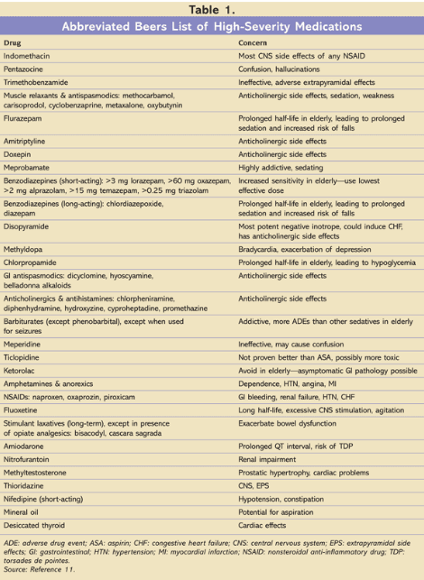
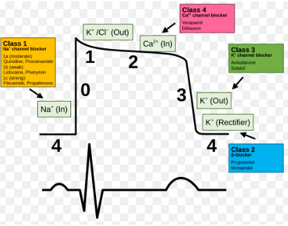
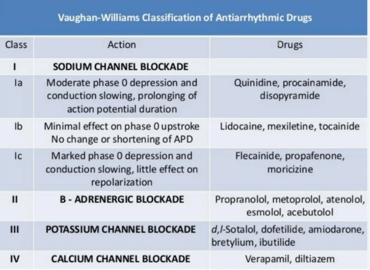
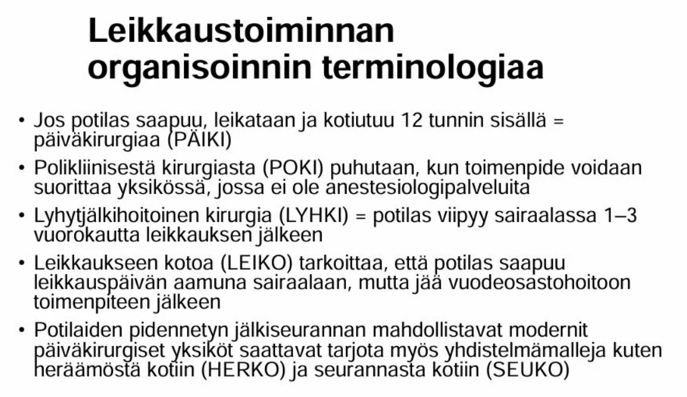
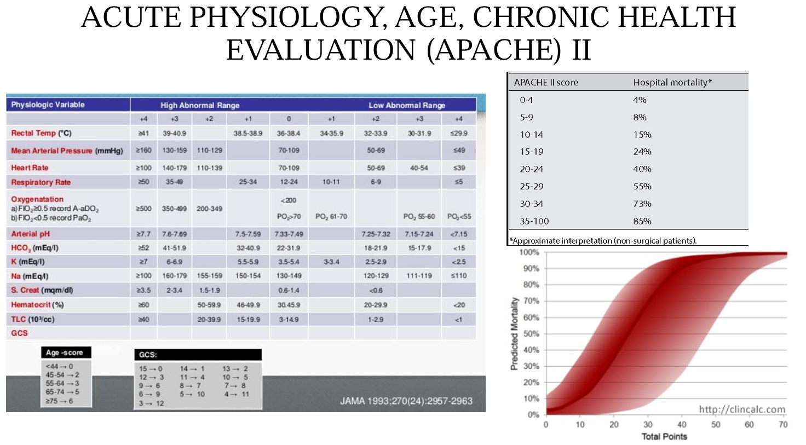
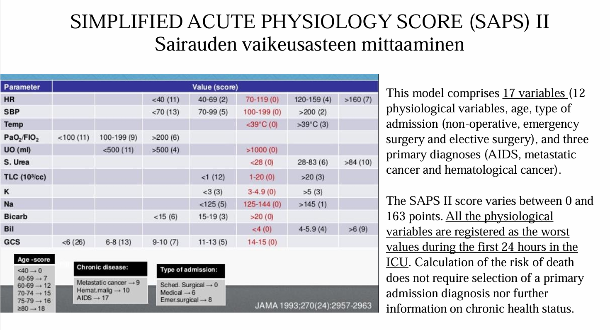
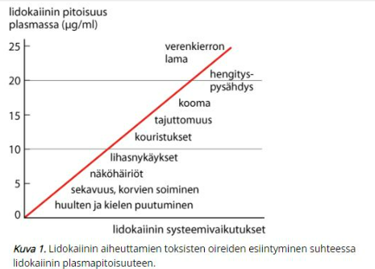
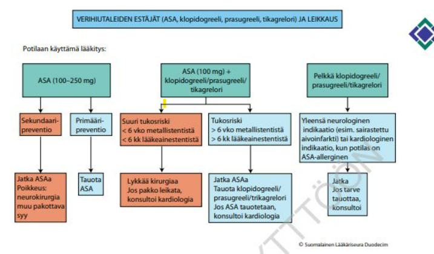
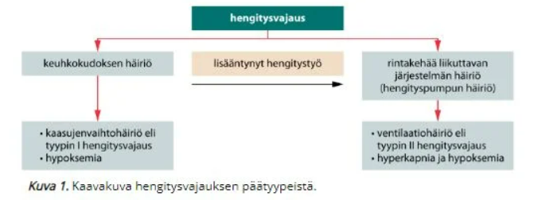

# 2022

Suurimmassa osassa kysymyksistä ei ole wikissä vaihtoehtoja tai kysymyksenasettelua, joten olen kirjoittanut näiden yhteydessä aiheesta tärkeimmät tiedot tai keksinyt mahdollisen kysymyksenasettelun itse. 

## Elvytyslääkkeet

Ei kysymyksenasettelua wikissä, mutta tässä tärkeimmät aiheesta: 

- Elvytyslääkkeiden käyttö eroaa sen mukaan, onko kyseessä iskettävä vai ei-iskettävä rytmi, mutta ensisijaiset "elvytyslääkkeet" ovat adrenaliini (peruslääke) ja amiodaroni (rytmihäiriölääke). Lidokaiinia voidaan käyttää amiodaronin asemasta, ellei amiodaronia ole saatavissa. 
- Adrenaliinin anto (1 mg) elvytystilanteessa lisää verenkierron palautumisen (ROSC) todennäköisyyttä, mutta tieteellinen näyttö hyödystä neurologisen toipumisen osalta puuttuu
- Lääkkeet annostellaan i.v. (ensisijaisesti) tai intraosseaalisesti eli i.o. (jos suoniyhteyttä ei saada)

Elvytyslääkkeiden annosteluskeema, jos kyseessä on iskettävä rytmi: 

- 3. iskun jälkeen adrenaliini 1mg + amiodaroni 300mg i.v. tai i.o.
- 5. iskun jälkeen adrenaliini 1mg + amiodaroni 150mg i.v. tai i.o.
- 7. iskun ja tämän jälkeen joka toisen painelusyklin (2minP painelua ja rytmintarkastus ja tarvittaessa isku
) jälkeen adrenaliini 1mg

Elvytyslääkkeiden annosteluskeema, jos kyseessä on ei-iskettävä rytmi: 

- Adrenaliinia 1mg i.v. tai i.o. annetaan heti, kun se on mahdollista (myös niissä tilanteissa, joissa rytmi on edeltävästi ollut iskettävä)
- Jatkossa elvytyksen aikana adrenaliinia annetaan 3–5 joka toinen painelusykli

Lapsille annostelu on seuraava: 

- Adrenaliinia 0,01 mg/kg (max 1mg)
- Amiodaronia 5mg/kg (1. annoksella max 300mg ja toisella max 150mg) 

## ROSC:in merkit

Ei vaihtoehtoja wikissä, tässä tyypillisimmät:

- Selkeä etCO2:n nousu 
- Potilaan liikehdintä
- Palpoitavissa oleva pulssi
- Mitattavissa oleva verenpaine ilman painelua 
- Spontaani hengitys normaalia 
- UKG-löydökset (kammion kontraktiliteetti ja veren virtaus) 

## Mikä on 100kg tyypin tyypillinen nestetarve vuorokaudessa?

Ei vaihtoehtoja wikissä, mutta tulisi osata vastata ilman vinkkejä

  <button class="solution-button" data-label="Vastaus" data-hide-label="Piilota vastaus">
    Vastaus
  </button>
  

    3 litraa 
    
Normaalitilanteessa nestetarve on noin 30ml/kg/vrk  
  

## Mikä on furosemidin vaikutus plasman kaliumpitoisuuteen?

  <button class="solution-button" data-label="Vastaus" data-hide-label="Piilota vastaus">
    Vastaus
  </button>
  

    Laskeva 
    
Loop-diureetit (juuri esim. furosemidi) ja tiatsididiureetit aiheuttavat hypokalemiaa. On kuitenkin ns. kaliumia säästäviä diureetteja, kuten spironolaktoni, jotka eivät aiheuta hypokalemiaa (itse asiassa hyperkalemiariski).   
  

## Käytetäänkö vanhuksilla tramadolia?

Ei vaihtoehtoja wikissä, mutta yritä vastata ilman vinkkejä. 

  <button class="solution-button" data-label="Vastaus" data-hide-label="Piilota vastaus">
    Vastaus
  </button>
  

     Kyllä voidaan antaa

Yli 75-vuotiailla eliminaatio voi olla hidastunut. Sen vuoksi annosväliä on tarvittaessa pidennettävä ja annosta vähennettävä potilaan tarpeen mukaan.
  

## Vanhuksen lääkitys

Ei vaihtoehtoja wikissä, mutta tässä yksi tärkeä aspekti vanhusten lääkitystä ajatellen: Beersin lista 

- Beersin lista on vanhuksille eli yli 65-vuotiaille sopimattomien lääkkeiden lista. Listan lääkkeitä tulisi mahdollisuuksien mukaan välttää ja niiden käyttöä tulee harkita tarkasti. 

## Monivammapotilaan paastoaika

Yleisesti ennen yleisanestesiaa, sedaatiota tai laajaa puudutusta tulee aikuispotilaan olla

- syömättä kuusi tuntia (sis. sakeat nesteet ja maitotuotteet, mukaan lukien maitokahvi)
- juomatta kaksi tuntia (sis. kirkkaat nesteet, musta kahvi).

Edellä mainitut varoajat eivät kuitenkaan ole riittäviä potilasryhmissä, joissa riski on suuri, esimerkiksi diabeettista gastropareesia sairasvilla tai monivammapotilailla.

- Aiemmin terveelläkin vakavasti akuutisti vammautuneella tai kriittisesti sairaalla potilaalla maha-suolikanavan motiliteetti hidastuu, mikä suurentaa aspiraatioriskiä

Jos mahdollista, leikkausta siirretään, kunnes maha on tyhjentynyt.

- Jos on hätäleikkaus, niin paastoaikoja ei tietystikään voida noudattaa.
- Mahalaukku voidaan mahdollisesti tyhjentää nenä-mahaletkulla ennen anestesian induktiota. Letkua ei tarvitse poistaa induktion ajaksi.
- Muitakin keinoja mahan tyhjentämisen nopeuttamiseen on.

## Aspiraatioriskistä 2-3kyssäriä

Ei kysymystenasettelua wikissä, mutta tässä tärkeimpiä aspiraatioriskistä: 

- Aspiraatiossa mahansisältöä nousee ylös pitkin ruokatorvea (regurgitaatio) ja joutuu hengitysteihin.
- Aspiraatio voi tapahtua anestesian kaikissa vaiheissa, mutta erityisiä riskivaiheita ovat induktio ja heräämisvaihe unessa suoritetun ekstubaation jälkeen.
- Etenkin kiireellisissä ja päivystystoimenpiteissä aspiraation riski on usein suurentunut, koska leikkausta ei voida välttämättä lykätä riittävän paastoajan takaamiseksi, ja akuutti vaikea sairaus tai trauma hidastavat maha-suolikanavan toimintaa.

Aspiraatio on mahdollista myös laajoissa puudutuksissa ja sedaation yhteydessä.
- Paikallispuudutuksessa tehtävää pienkirurgiaa lukuun ottamatta puudutustoimenpiteissä on noudatettava samoja paastoaikoja kuin yleisanestesiaa vaativien toimenpiteiden kohdalla, koska laaja puudutus joudutaan ajoittain muuttamaan yleisanestesiaksi.
- Sedaatio on vasta-aiheinen, jos aspiraatioriski on suuri.

Ennen yleisanestesiaa, sedaatiota tai laajaa puudutusta tulee aikuispotilaan olla

- syömättä kuusi tuntia (sis. sakeat nesteet ja maitotuotteet, mukaan lukien maitokahvi)
- juomatta kaksi tuntia (sis. kirkkaat nesteet, musta kahvi).
- Näiden suositusaikojen katsotaan pienentävän aspiraatioriskiä riittävässä määrin potilailla, joiden riskitaso ei ole erityisen suuri
- Pitkäaikaissairauksien lääkkeet ja esilääkkeet voi nauttia pienen vesitilkan kera noin tuntia ennen leikkaussaliin siirtymistä

Aspiraation riskitekijät voidaan jakaa potilaaseen, leikkaukseen ja anestesiaan liittyviin 

- Potilaaseen liittyviä ovat mm. akuutti vamma, tajuttomuus, kohonnut kallonsisäinen paine, muut aivo-ongelmat (lisää alla taulukossa)
- Leikkaukseen liittyviä ovat mm. laparoskopia, Trendelenburgin asento, pitkä leikkaus, yläruuansulatuskanavan tähystykset ja muut toimenpiteet 
- Anestesiaan liittyviä ovat mm. liian pinnallinen anestesia, vaikea hengitystie, larynx-maskin käyttö intubaation sijasta... 

## Amiodaroni 

Ei kysymyksenasettelua wikissä, mutta wikin vastauksesta päätellen voi myös kysymyksen päätellä. Minkä tyyppinen lääke amiodaroni on? 

  <button class="solution-button" data-label="Vastaus" data-hide-label="Piilota vastaus">
    Vastaus
  </button>
  

     Rytmihäiriölääke

Amiodaroni on tarkalleen ottaen luokan III rytmihäiriölääke; käytetään esim. iskettävien rytmien hoitoelvytyksessä  rytmihäiriölääkkeenä. 

  

## Mitkä laitteet elvytyksen hoidossa?

Tärkeimpiä ovat defibrillaattori (tärkein) ja monitorointilaitteista kapnografia. 

- Hengitysteiden ja hengityksen turvaamisessa käytettäviä "laitteita" ovat maski-pussi-ventilaattori, happilähde, nieluputki, larynxmaski, intubaatioputki...
- Verenkierron tukilaitteita ovat mm. automaattipainelija ja io-yhteyden saamisessa käytetty pora yms.
- Diagnostiikassa mm. ultraääni on hyödyllinen laite; samoin verensokerimittari 

## Elvytetty potilas kakoo intubaatioputkea -> mitä teet? GCS 6

Valitse toinen 

- a. Lääkkeillä anestesiaa
- b. Vaihdat iGeliin

  <button class="solution-button" data-label="Vastaus" data-hide-label="Piilota vastaus">
    Vastaus
  </button>
  

    a 
  
ROSC:n jälkeen peruselintoimintojen arviointi ja tukeminen tapahtuu ABCDE-periaatetta noudattaen

Hengitystiet tulee varmistaa viimeistään tässä vaiheessa supraglottisella välineellä (tai intubaatiolla, jos paikalla toimenpiteen hallitseva henkilö); jos aikaisemmin on jo asetettu varmistava väline, niin sitä ei poisteta automaationa, vaan jos potilas reagoi hengitystien varmistusvälineeseen, hänet sedatoidaan ja väline poistetaan vain, jos potilas on selvästi tajuissaan ja noudattaa kehotuksia.
  

## Sugammadeksin käyttö: minkä lääkkeen kumoaa?

Ei vaihtoehtoja wikissä, mutta tulisi osata vastata ilman vinkkejäkin

  <button class="solution-button" data-label="Vastaus" data-hide-label="Piilota vastaus">
    Vastaus
  </button>
  

    Rokuroni 
  
Sugammadeksi on lihasrelaksantti rokuronin (ja vekuronin) antagonisointiin valmistettu kumoaja, ja se ei vaikuta muihin lihasrelaksantteihin. Se muodostaa steroidirunkoisten lihasrelaksanttien kanssa inaktiivin kompleksin, minkä seurauksena vapaan lihasrelaksantin plasmapitoisuus pienenee jyrkästi. Hermo-lihasliitoksessa oleva relaksantti siirtyy konsentraatiogradientin vuoksi plasmaan ja samalla lihasrelaksaatio kumoutuu. Lihasrelaksantin ja sugammadeksin muodostama kompleksi poistuu elimistöstä erittymällä virtsaan.

Sugammadeksi antagonisoi voimakkaankin salpauksen erittäin nopeasti, toisin kuin AKE:n estäjät (esim neostigmiini). Sillä ei ole myöskään niiden haitallisia muskariinivaikutuksia.
  

## Minkä sokkityypin sokki sydäntamponaatio on? spinaalisokki

Ei vaihtoehtoja wikissä, mutta tulisi osata vastata ilman vinkkejäkin

  <button class="solution-button" data-label="Vastaus" data-hide-label="Piilota vastaus">
    Vastaus
  </button>
  

    Obstruktiivinen sokki 

Obstruktiivinen sokki johtuu ekstrakardiaalisesta pumppausvajaatoiminnan syystä; esim. tensiopneumothorax, keuhkoembolia, pulmonaalihypertensio, konstriktiivinen perikardiitti tai tamponaatio 
  

## Minkä sokkityypin sokki spinaalisokki on?

Ei vaihtoehtoja wikissä, mutta tulisi osata vastata ilman vinkkejäkin

  <button class="solution-button" data-label="Vastaus" data-hide-label="Piilota vastaus">
    Vastaus
  </button>
  

    Distributiivinen sokki 

Selkäydinvamma voi aiheuttaa ns. spinaalisokin, joka on distributiivisen sokin tyyppi. Spinaalisokki eroaa muista distributiivisista sokeista siten, että sille on tyypillistä bradykardia; mekanismi perustuu autonomisten välitysreittien häiriöön CNS-vaurion takia. 

Muita distributiivisen sokin (systeeminen vasodilataatio aiheuttaa verenpaineen romahduksen ja verenkiertovajauksen) aiheuttajia ovat infektiot (septinen sokki), allergeenit (anafylaktinen sokki), systeeminen inflammaatio (esim. vaikea pankreatiitti) ja toksiinit (esim. reskasmetallimyrkytys). 
  

## Anafylaksian oireet

Ei vaihtoehtoja wikissä, tässä tärkeimmät:

Periaate: Mitä nopeammin oireet alkavat ja etenevät, sitä vaikeampi reaktio on.

Ensioireet: 

- Ihon kuumotus, punoitus, pistely tai kutina
- Takykardia
- Täyteläisyyden tunne kurkussa, rinnassa, yskiminen
- Mahdollisesti pahoinvointi, oksentelu

Seuraavat oireet: 

- Ihon turvotus (erityisesti silmäluomissa, huulissa), limakalvoturvotus (angioedeema)
- Nokkosihottuma (urtikaria)
- Kurkunpään turvotus, käheys, vinkuva hengitys, yskänpuuskat
- Vatsakipu, pahoinvointi, ripuli, oksentelu
- Verenpaineen lasku, hikoilu, kalpeus
- Vaikeimmissa tapauksissa kurkunpään tukkeutuminen, sokki, hengityksen ja sydämen pysähtyminen

## Viikon ajan antibiootti hyväsuoniselle potilaalle

Valitse yksi: 

- a. Perifeerinen kanyyli 
- b. Tunneloitu keskuslaskimokatetri

  <button class="solution-button" data-label="Vastaus" data-hide-label="Piilota vastaus">
    Vastaus
  </button>
  

    Kanyyli 

Hyväsuoniselle potilaalle viikon mittainen antibioottihoito voidaan turvallisesti toteuttaa perifeerisellä laskimokanyylilla. Tunneloitu keskuslaskimokatetri on tarkoitettu pitkäaikaiseen hoitoon (viikot–kuukaudet) tai silloin, kun perifeeristä suoniyhteyttä ei saada tai annosteltava lääke ärsyttää perifeerisiä suonia liikaa.
  

## Aivohalvauksen jälkeen elektiivinen leikkaus kannattaa suorittaa milloin?

Ei vaihtoehtoja wikissä, koita vastata ilman vinkkejä 

  <button class="solution-button" data-label="Vastaus" data-hide-label="Piilota vastaus">
    Vastaus
  </button>
  

    N. 6kk 

Aivoinfarktin jälkeen elektiivistä kirurgiaa siirretään 3–6 kuukautta, jos se on mahdollista kirurgisen hoidon kiireellisyyden kannalta. Suurimmassa osassa lähteitä suositellaan vähintään 6kk ja suositellusti jopa 9kk, mutta anestesiologian oppikirjassa kirjoitetaan 3-6kk. 

Muu _kiireellinen_ leikkaus kuin endarterektomia voidaan suorittaa kahden viikon kuluttua aivoinfarktista. Jos aivoinfarktin taustasyyksi paljastuu kaulavaltimon ahtauma, voi olla aiheellista suorittaa endarterektomia viiveettä uuden infarktin ehkäisemiseksi. 
  

## Mitä LEIKO tarkoittaa? 

Ei vaihtoehtoja wikissä, koita vastata ilman vinkkejä 

  <button class="solution-button" data-label="Vastaus" data-hide-label="Piilota vastaus">
    Vastaus
  </button>
  

    Leikkaukseen kotoa  

  

## Mikä on APACHE?

Ei vaihtoehtoja wikissä, koita vastata ilman vinkkejä 

  <button class="solution-button" data-label="Vastaus" data-hide-label="Piilota vastaus">
    Vastaus
  </button>
  

    Tehohoidon pisteytysjärjestelmä
    
APACHE = acute physiology, age and chronic health evaluation

  

## Mikä on SAPS? 

Ei vaihtoehtoja wikissä, koita vastata ilman vinkkejä 

  <button class="solution-button" data-label="Vastaus" data-hide-label="Piilota vastaus">
    Vastaus
  </button>
  

    Tehohoidon pisteytysjärjestelmä
    
SAPS = simplified acute physiology score

  

## Mikä on SOFA?

  <button class="solution-button" data-label="Vastaus" data-hide-label="Piilota vastaus">
    Vastaus
  </button>
  

    Tehohoidon/Elinhäiriöiden pisteytysjärjestelmä 

SOFA = sequential organ failure assessment

SOFA, APACHE ja SAPS siis kaikki ovat tehohoidon pisteytysjärjestelmiä, ja tentissä on voinut olla kysymys, jossa pitää tietää, mitä nämä kolme termiä tarkoittavat (yksi vaihtoehto voinut olla, että termit ovat tehohoidon pisteytysjärjestelmiä)

  

## Sepsiksessä vasoaktiivien käyttö

Ei kysymyksenasettelua wikissä, mutta tässä tärkeimmät: 

- Sepsiksen hoito tulee aloittaa mahdollisimman nopeasti 
- Hoitoon kuuluu tärkeimpänä antibiootin aloitus ja nestetytys. 
- Jos nesteytys ei riitä ylläpitämään verenpainetavoitetta (MAP >65) ja laktaatti on yli 2, niin kyseessä on septinen sokki 
- Tässä tilanteessa tulee turvautua verenkierron tukilääkitykseen. Ensisijainen lääke on noradrenaliini. Toissijaisena lääkkeenä voidaan käyttää vasopressiiniä tai adrenaliinia. Dopamiini ei sovellu septisen sokin lääkkeeksi, sillä se saattaa lisätä kuolleisuutta. 
- Hoitoon lisätään hydrokortisoni 200mg/vrk (50mg x 4) i.v. ellei neste+noradrenaliini riitä MAP-tavoitteeseen

Mikäli verenkierron häiriöön liittyy sydänlihaslama ja sydämen huonontunut pumppaus sekä samanaikaisesti todetut riittämättömän kudosperfuusion merkit (sekoittuneen laskimoveren happikyllästeisyys (SvO2) alle 60–65 %, laktatemia ja metabolinen asidoosi), inotrooppisen lääkityksen aloittaminen on perusteltua, ja dobutamiinia tai levosimendaania voidaan käyttää parantamaan elimistön hapentarjontaa.

## Mitä elintoimintojen monitorointeja leikkauksessa potilascaset

Ei kysymyksenasetteluja wikissä, mutta tässä aiheesta tärkeimmät: 

Kaikissa leikkauksissa monitoroidaan vähintään (Poislukien pieni paikallispuudutustoimenpide (leikkausosaston ulkopuolella) -> ei monitorointia): 

- Pulssioksimetri
- Noninvasiivinen verenpaineen mittaus (NIBP)
- 3-kytkentäinen EKG
- Yleensä myös lämpötilan mittaus, paitsi kaikkein lyhimmissä toimenpiteissä

Jos potilas on nukutettu (eli hengityskoneessa tai naamariventiloitavana), mitataan lisäksi myös ainakin mm. hengitysteiden paineita, tilavuuksia ja kaasupitoisuuksia

- Useimmiten myös seurataan anestesiasyvyyttä EEG-pohjaisilla menetelmillä (esim. BIS) 

Lihasrelaksaation mittaus (TOF%) lihasrelaksaatiota käytettäessä 

## Millon leikkaus hengitystieinfektion jälkeen

Ei tarkemmin esitetty wikissä, mutta tässä periaatteet: 

- Jos potilaalla on ylähengitystietulehdus (samea tai vihertävä nuhaerite, kuiva tai erittävä yskä, yli 38 °C:n kuume) leikkausta tulisi siirtää 1–2 viikkoa
- Jos taas alahengitystieinfektio (samoin muut oireiset keuhkosairaudet, kuten astman tai COPD:n pahenemisvaihe) -> elektiivistä leikkausta tulisi siirtää 4-6 viikkoa
- Lievä ylähengitystieinfektio ilman kuumetta ja pieni tmp: ei tarvetta siirtää toimenpidettä

## Puudutemyrkytyksen merkit

Ei vaihtoehtoja wikissä, tässä tärkeimmät aiheesta: 

Puudutteiden systeemisiä haittavaikutuksia syntyy kahdella tavalla:

- Puuduteannos voidaan ruiskuttaa vahingossa verisuoneen, jolloin veren puudutepitoisuus suurenee nopeasti ja mahdollisesti vakavatkin oireet ilmaantuvat pian
- - Toisaalta puudute saattaa imeytyä hitaasti verenkiertoon teknisesti oikein suoritetun piston jälkeen ja aiheuttaa hitaasti suurenevan pitoisuuden seurauksena myrkytysoireita
- Jotta vältetään puudutemyrkytys imeytymisen seurauksena, niin puudutteilla on maksimimäärät / kg / vrk (tai kerta), joita ei saa ylittää

**Lievä puudutemyrkytys aiheuttaa ensimmäisenä puutumisen tunnetta suun ympärillä, korvien soimista ja puheen puuroutumista. Myös metallin maku suussa on tyypillistä.**

Puudute on ruiskutettava hitaasti ja puuduttaessa on syytä aina pitää puhekontakti potilaaseen, jotta nämä oireet havaittaisiin ajoissa.
- Mikäli puudutepitoisuus kuitenkin suurenee, myrkytysoireina tulee ensin lihasnykäyksiä ja myöhemmin grand mal -tyyppisiä kouristuksia ja tajuttomuus.
- **Hengityspysähdys ja verenkierron lama ovat hoitamattoman puudutemyrkytyksen pahimmat vaikutukset.**

## Elvytyksen jälkeen hengitystavoite

Ei vaihtoehtoja wikissä. Vastaa tähän kuitenkin: Mikä hiilidioksiditavoite ja  happisaturaatiotavoite?

  <button class="solution-button" data-label="Vastaus" data-hide-label="Piilota vastaus">
    Vastaus
  </button>
  

    Normaalit 

Tavoitellaan siis normokapniaa (ventilaatiotiheyttä säädetään niin, että valtimoveren hiilidioksidiosapaine on 4,5-6 kPa) ja normoksemiaa (happivirtausta vähennetään ja se tyypillisesti säädetään tasolle, joka pitää veren happikyllästeisyyden tasolla 94–98%). 
  

## NIV

Ei kysymyksenasettelua wikissä, vain aihe mainittu. Tässä tärkeimmät NIV:sta: 

- Noninvasiivinen ventilointi (NIV) toteutetaan nykyään lähes yksinomaan ns. kaksoispaineventilaattoreilla (2PV, BIPAP), joissa sisään- ja uloshengityksen paine voidaan säätää erikseen. IPAP - EPAP = painetuki (määrää ventilaatiotuen suuruuden) 
  - sisäänhengityspaine eli IPAP = inspiratory positive airway pressure, uloshengityspaine eli EPAP = expiratory positive airway pressure

NIV auttaa hoitamaan tyypin 2 hengitysvajausta eli hyperkapnista hengitysvajausta; laite auttaa tuulettamaan CO2:a, kun potilas ei siihen itse riittävästi pysty

Jotkut kutsuvat CPAP-hoitoakin noninvasiiviseksi ventilaatioksi, mutta käytännössä se ei ole sitä, sillä CPAP ei mekaanisesti auta ventilaatiota 
- CPAP:ssa on vain jatkuva positiivinen paine (continuous positive airway pressure), joka auttaa pitämään alveoleja auki 
- On siis tärkeää ymmärtää, että CPAP-hoidossa potilas itse tekee kaiken hengitystyön: laite ei anna painetukea potilaan sisäänhengityksille. Jos potilas on liian väsynyt, voi CPAP-hoito olla riittämätön.
- On kuitenkin hengitysvajauksen noninvasiivinen hoitokeino -> terminologia usein vääristyy ja CPAP:ia kutsutaan NIV:ksi usein

## Kodeiinin analgeettinen teho

Ei tarkempaa kysymyksenasettelua tai vaihtoehtoja wikissä, mutta tässä tärkeimmät: 

- Kodeiinin (heikko opioidi) analgeettinen teho (kipua lievittävä vaikutus) perustuu sen muuttumiseen morfiiniksi elimistössä. Itse kodeiinin analgeettinen vaikutus on hyvin pieni. 
  - Osa kodeiinista (normaalisti n. 10%) muuttuu maksassa morfiiniksi entsyymin CYP2D6 kautta ja morfiini toimii pääasiallisena kodeiinin vaikutuksenvälittäjänä. 
- Koska kodeiinin metaboloituminen vaihtelee yksilöiden välillä paljon (CYP2D6:n aktiivisuudesta johtuen), niin kodeiinin teho vaihtelee merkittävästi 
  - Hitaat metaboloijat → kodeiini ei muutu tehokkaasti morfiiniksi → vähäinen kipulievitys
  - Ultranopeat metaboloijat → kodeiini muuttuu morfiiniksi poikkeuksellisen tehokkaasti → voimakas vaikutus mutta myös suurempi haittariski

Kodeiinia saa Suomessa vain yhdistelmävalmisteissa (esim. parasetamolin tai ibuprofeenin kanssa).

## Kaliumin tarve päivässä millimooleina

Ei vaihtoehtoja wikissä, koita vastata ilman vinkkejä

  <button class="solution-button" data-label="Vastaus" data-hide-label="Piilota vastaus">
    Vastaus
  </button>
  

    N. yli 3g 

Kaliumin päivittäinen saantisuositus perusterveille miehille on vähintään 3 500 mg/vrk ja naisille 3 100 mg/vrk
  

## Balansoitu anestesia

Ei tarkempaa kysymyksenasettelua wikissä, mutta tässä tärkeimmät: 

- Balansoitu anestesia koostuu kolmesta osatekijästä: unesta, kivuttomuudesta ja lihasvoiman salpaamisesta
  - Indusoidaan laskimoanesteetin, opioidin ja lihasrelaksantin yhdistelmällä

Joidenkin lähteiden mukaan balansoitu anestesia = käytetään sekä laskimoanesteetteja että inhalaatioanesteetteja

- Useimmiten kuitenkin balansoitu anestesia = anestesiamuoto jossa kolme perusehtoa: nukutus, kivuttomuus ja lihasrelaksaatio ja nämä aiheutetaan erikseen spesifeillä lääkeaineilla. 

## Mitä elektiivinen leikkaus tarkoittaa?

Ei vaihtoehtoja wikissä, mutta tulisi osata vastata ilman vinkkejä

  <button class="solution-button" data-label="Vastaus" data-hide-label="Piilota vastaus">
    Vastaus
  </button>
  

    Suunniteltu, ei-kiireellinen leikkaus 

Toteutetaan ajanvarauksella ennalta sovittuna ajankohtana. Se eroaa päivystysleikkauksesta, joka on akuutin tilanteen vuoksi tehtävä kiireellinen leikkaus. Elektiivisissä leikkauksissa potilaalle annetaan aikaa valmistautua toimenpiteeseen, ja ne tehdään yleensä arkipäivisin. 
  

## Potilaan sepelvaltimo stentattu ja sen jälkeen määrätty AK-hoito. Koska voi tehdä polviproteesileikkauksen?

Ei vaihtoehtoja wikissä, koita vastata ilman vinkkejä

  <button class="solution-button" data-label="Vastaus" data-hide-label="Piilota vastaus">
    Vastaus
  </button>
  

    Aikaisintaan 6kk päästä

Nykyään käytetään yleensä lääkestenttejä ja niiden yhteydessä DAPT (kaksoishiutaleenestäjälääkitystä eli ASA + P2Y12-estäjä, kuten klopidogreeli) tyypillisesti n. 12kk ajan, joka on äärettömän tärkeä lääkitys estämään stenttitromboosia. 

Tromboosinestolääkitystä sepelvaltimostentin jälkeen ei saa ilman todella painavaa syytä keskeyttää 6 viikon sisällä metallistentin eikä 6 kuukauden sisällä lääkeainestentin asennuksesta. 

Jos elektiivinen, ei-sydänkirurginen leikkaus joudutaan tekemän edellä mainittujen aikaikkunoiden sisällä, leikkaus tulisi tehdä keskeytymättömän klopidogreeli-, prasugreeli- tai tikagrelorihoidon aikana. Poikkeuksena ovat erityisen suuren vuotovaaran toimenpiteet, kuten neurokirurgia

Jos hoidon keskeyttämistä näiden aikojen sisällä harkitaan, suositellaan kardiologin tai sisätautilääkärin konsultaatiota. 

Keskeytyksen yhteydessä ei tarvita rutiinimaista siltahoitoa glykoproteiini (GP) IIb/IIIa:n estäjällä, mutta sitä voidaan erityistilanteissa harkita

  

## Mitä seurataan heräämössä 

Ei vaihtoehtoja wikissä, mutta tässä tärkeimmät heräämövaiheesta:

- Heräämössä jatketaan yleensä vähintään pulssioksimetriaa, noninvasiivista verenpaineen seurantaa ja EKG-seurantaa
- Seurataan kipua, tajuntaa ja orientaatiota, pahoinvointia,
haavan tilannetta, dreenivuotoa, diureesia, kognition toipumista
  - Hemodynamiikan lievä labiilius, niukka diureesi ja shivering-tyyppinen
tärinä ovat tavallisia ongelmia heräämöhoidon aikana
- Potilaan psyykkistä tilaa seurataan; leikkausta edeltävä jännitys voi joskus purkautua psyykkisenä
ahdistuksena heräämövaiheessa, ja joskus leikkauksessa on selvinnyt sairauden huono ennuste

Seuranta-aika heräämössä vaihtelee potilaittain ja leikkauksittain 0 min:sta
(perifeerinen puudutus, ei sedaatiota) jopa yön yli (esim. elektiivinen kraniotomia)

Kaikkia invasiivisia menetelmiä puretaan mahdollisuuksien mukaan vähitellen pois, koska vuodeosastot eivät yleensä ota potilasta vastaan, jos tällä on esim. arteriakanyyli.

Siirron edellytykset vuodeosastolle: 

- hemodynamiikka stabiili
- kivut ja pahoinvointi hallinnassa
- diureesi riittävä
- puudutus väistymässä
- potilaan kokonaisvointi riittävän hyvä
- hereillä tai helposti havahdutettavissa

## Hengitysvajaus

Ei tarkempaa kysymyksenasettelua wikissä, tässä pitkähkö tiivistelmä aiheesta: 

Hengitysvajaus on tila, jossa keuhkojen kyky ylläpitää riittävää happi- ja hiilidioksidiosapainetta hengitettävän ilman ja valtimoverenkierron välillä on heikentynyt.

Hengitysvajaus jaetaan yleensä kahteen päätyyppiin: 

- Kaasujenvaihto alveoleissa on heikentynyt 
- Keuhkotuuletus eli ventilaatio on heikentynyt

Puhtaasti alveolitason kaasujenvaihtohäiriöstä johtuva hengitysvajaus johtaa hypoksiaan (hypokseeminen hengitysvajaus eli tyypin 1 hengitysvajaus, aB-pO2 < 8 kPa, SpO2 < 90 %) ja puhtaasti ventilaation vajauksesta johtuva hengitysvajaus johtaa hyperkapniaan (hyperkapninen hengitysvajaus eli tyypin 2 hengitysvajaus, aB-pCO2 > 6.0 kPa)

- Tyypissä 2 myös aina mukana hypoksemiaa, jos ei anneta lisähappea

Kolme yleismekanismia hypoksemian syntymiselle ovat:

- Matala alveolikaasun happiosapaine
  - Matala alveolikaasun happiosapaine sisältää hengitetyn ilman matalan hapen osapaineen (esim. korkealla ilmanalalla), matalan happipitoisuuden (FiO2) ilmassa (esim. suljetussa tilassa hengittäminen) sekä hypoventilaation. 
  - Hypoventilaation pääpiirre on hyperkapnia (korkea CO2), mutta ventilaatiota tarvitaan myös siihen, että alveoleihin saadaan happea -> vaikea hypoventilaatio lopulta aiheuttaa matalan alveolikaasun happiosapaineen ja sitä kautta hypoksemiaa. 
- Diffuusiohäiriö
  - Diffuusiohäiriö tapahtuu alveoli-kapillaari-rajapinnan tulehduksen (esim. pneumonia, ARDS) tai fibroosin takia
  - Pääasiallinen piirre on hypoksemia eikä hyperkapnia (CO2 on 20x liukoisempaa veteen kuin O2 -> diffuusiohäiriöt eivät häiritse yhtä paljon hiilidioksidin poistoa)
- Lisääntynyt laskimosekoittuma (yleisin)
  - Osa keuhkoverenkierrosta kulkee tuulettumattoman tai huonosti tuulettuvan keuhkokudoksen kautta (matala V/Q-epäsuhta) ja sunttautuu (oikovirtaa) heikosti hapettuneena sydämen vasemmalle puolelle
  - Suntti eli oikovirtaus voi olla keuhkojen sisäistä tai sydämen sisäistä (ns. oikealta vasemmalle suntti esim. synnynnäisen sydänvian takia); vähähappista verta sekoituu runsashappiseen vereen laskien sen hapen osapainetta.
  - Ventilaatio-perfuusioepäsuhta eli V/Q-suhteen poikkeaminen tarkoittaa, että alveolin ventilaatio ja sitä ruokkivan kapillaarin verenkierto (perfuusio) eivät ole sopivassa suhteessa, eli joko ventilaatio on liiallista suhteessa alueen perfuusioon (kuollut tila; esim. keuhkoembolian affisioima alue) tai perfuusio on liiallista suhteessa alueen ventilaatioon (esim. ilmatien tukos vierasesineestä johtuen tai COPD:n/astman ahtauttamana)
  - Normaalisti huonosti ventiloitujen alueiden verisuonet supistuvat ohjaten verenkiertoa paremmin hapetetuille alueille (vasodilataattorit voivatkin tätä mekanismia häiritsemällä pahentaa hypoksemiaa).
  - Hukkaventilaatio aiheuttaa havaittavaa happeutumishäiriötä yleensä vain laajana, sillä verenkierto siirtyy paremmin ventiloiduille alueille ja hapettuu siellä hyvin. Jos hukkaventilaatio kuitenkin käsittää suuren osan keuhkoista, niin lopulta ventilaatio ei enää riitä hapettamaan lisääntynyttä verenkiertoa terveillä alueilla -> veri ei hapetu täysin
  
Hyperkapnian eli tyypin 2 hengitysvajauksen syitä voi olla heikentynyt kokonaisventilaatio (esim. hengityskeskuksen lamaantuminen opioidiyliannostuksessa), lisääntynyt kuolleen tilan ventilaatio (suuri keuhkoembolia) tai lisääntynyt hiilidioksidin tuotto, jota elimistö ei pysty kompensoimaan kokonaisventilaatiota lisäämällä. 

Hoito

- Karkeasti katsottuna akuutti tyypin 1 hengitysvajaus tarvitsee happihoitoa (lisähappi), kun tyypin 2 hengitysvajaus vaatii noninvasiivista ventilointia (NIV), jotta ylimääräinen hiilidioksidi saadaan puhallettua pois. 
  - Myös tyypin 2 hengitysvajauksessa (hyperkapninen hengitysvajaus, pääasiassa hypoventilaatiosta johtuvaa) voidaan antaa tarvittaessa happilisää, jos pelkkä ventilaatiotuki ei korjaa samaan aikaan aina esiintyvää hypoksemiaa hyperkapniseen (ventilaatiovajaukseen liittyy aina myös hypoksemia) (lisähappea tulee antaa varovasti keuhkokroonikolle, jos ei pysty seuraamaan CO2 kertymistä);   - NIV toteutetaan pääasiassa kaksoispaineventilaattoreilla (2PV), joissa sisään (IPAP)- ja uloshengityksen paine (EPAP) voidaan säätää erikseen -> näiden erotus eli painetuki (PS) auttaa tuulettamaan CO2, kun potilas ei siihen itse riittävästi pysty. Painetuen (PS) tulee olla riittävä hengitystyön vähentämiseksi (yleensä 6–20 cmH2O). 

## Mistä anelääkärin ei pidä huolehtia leikkauksen aikana?

Valitse yksi

- a. Leikkauksen aikainen homeostaasi
- b. Antibiootin ja haavansulkutekniikan valinta
- c. Potilaan asennon tarkoituksenmukaisuus
- d. Joku muu (ei wikissä)

  <button class="solution-button" data-label="Vastaus" data-hide-label="Piilota vastaus">
    Vastaus
  </button>
  

    b 

a: Anestesiologi ylläpitää potilaan elintoimintoja leikkauksen aikana 

b: Nämä ovat kirurgin päätettävissä 

c: Anestesiatiimi asettaa potilaan leikkausasennon ennen kirurgin saapumista leikkaukseen 
  

## Potilaalla pH 7.22, pCO2 3.4, BE -17. Onko kyseessä?

Valitse yksi

- a. Respiratorinen alkaloosi
- b. Metabolinen alkaloosi
- c. Respiratorinen asidoosi
- d. Metabolinen asidoosi

  <button class="solution-button" data-label="Vastaus" data-hide-label="Piilota vastaus">
    Vastaus
  </button>
  

    d

BE eli base excess eli emäsylimäärä kuvastaa sitä, kuinka paljon veressä on liikaa emäksiä (positiivisena liikaa emäksiä, negatiivisena liian vähän). Nyt BE:n ollessa merkittävästi negatiivinen (-17), niin kyseessä on merkittävä emäsvaje eli happoylimäärä.

pH on matala samalla, kun on happoylimäärä -> metabolinen asidoosi 

Tilaa yritetään kompensoida hiilidioksidia puuskuttamalla ulos (pCO2 matala 3.4 (normaali 4.5-6)), mutta tämä ei ole riittänyt pH:n normalisointiin. Kyseessä on siis osittain kompensoitu metabolinen asidoosi. 

  

## Mihin elvytyksen jälkeen ei pyritä

Valitse yksi:

- a. Normoksiaan
- b. Normotensioon
- c. Normotermiaan
- d. Joku vielä (ei wikissä)

  <button class="solution-button" data-label="Vastaus" data-hide-label="Piilota vastaus">
    Vastaus
  </button>
  

    c (ja b)
    
Kysymyksen tekovuotena tavoiteltiin vielä useasti ns. terapeuttista hypotermiaa eli n. 32-36C, mutta nykyään on pikemminkin tärkeää estää hypertermian kehittyminen. Elvytyksen jälkeen lämpötavoite on siis alle 37.8C. Lämpötilan suhteen ei siis ole niinkään tärkeää, että potilaalla olisi täysin normaali kehonlämpötila; tärkeintä on vain estää hypertermia (lievän hypotermian puolelle siis voidaan dipata). 

Normotensioon ei myöskään sinänsä pyritä, vaan tavoitteena on tarkemminkin svp >100 mmHg tai MAP >65 mmHg lähteestä riippuen. On näkemyksestä riippuvaista, ovatko nämä normotensiota vai eivät. 

Normoksemiaan pyritään eli happisaturaation tulisi olla >94%. Samoin pyritään normokapniaan eli pCO2 4.5-6 kPa.
  

## Mikä puudute on lonkkamurtumapotilaan käypä hoito -suosituksessa?

Valitse yksi: 

- a. Interkostaaliblokki
- b. Popliteaplokki
- c. Femoraali- (tai iskias-)hermon puudutus
- d. Kertaluontoinen epiduraali

  <button class="solution-button" data-label="Vastaus" data-hide-label="Piilota vastaus">
    Vastaus
  </button>
  

    c
    
Femoralisblokki eli reisihermon puudutus on yksi lumbaalisen pleksuksen puudutuksista. Puudutuksen avulla voidaan vähentää potilaan kokemaa kipua mm. lonkkamurtumasta johtuen ja vähentää opioidin tarvetta. Potilaalle kannattaa laittaa fascia iliaca- tai femoralis-puudutus heti, kun hän tulee päivystykseen lonkkamurtuman kanssa. Puudutus kannattaa uusia ennen leikkausta, heräämössä ja vuodeosastolla, jos säännöllisesti annetulla parasetamolilla ja kohtuullisilla annoksilla opioidia ei saada tyydyttävää kivun lievitystä.

a: Kylkivälihermon (interkostaalinen) puudutus. Interkostaalipuudutusta käytetään kivun hoitoon. Puudutuksella parannetaan potilaan hengitystä ja yskimistä torakotomian, kylkiluumurtuman sekä yksipuolisen ylävatsakirurgian jälkeen sekä neuralgian, neuriitin ja pleuriitin yhteydessä. 

b: Puudutetaan n. ischiadicus polvitaipeen kohdalta. Käytetään usein yhdessä femoralispuudutuksen kanssa koko alaraajan puudutukseen. 

d: Yleensä epiduraalipuudutus toteutetaan jatkuvana annosteluna katetrin kautta, mutta on myös mahdollinen kertapuudutteeena. Epiduraalipuudutusta ei useimmiten käytetä pääanestesiamuotona, vaan osana leikkauksen aikaista hoitoa yleisanestesiaan yhdistettynä ja/tai leikkauksen jälkeen kivun hoitona ja tällöin tyypillisesti tila on katetrisoituna jatkuvaa annostelua varten. Spinaalipuudutus taas tyypillisesti toteutetaan kertapistoksena. Spinaalipuudutus on siis enimmäkseen leikkauspuudutus ja epiduraalipuudutus on taas harvinaisempi leikkauspuudutuksena (käytetään ennen kaikkea kivun hoidossa).
  

