# 2024

Taas laitettu tähän vain ne, joita ei ole aikaisemmissa tenteissä. Jos kysymystä on avattu heikosti wikissä, niin olen yrittänyt kirjoittaa tähän aiheesta tärkeimmät asiat tai keksiä mahdollisen kysymyksenasettelun. 

## Mikä seuraavista on tehokas kroonisen neuropaattisen kivun hoidossa?

Valitse yksi: 

- a. oksikodoni
- b. kodeiini
- c. buprenorfiini 
- d. ei mikään näistä

  <button class="solution-button" data-label="Vastaus" data-hide-label="Piilota vastaus">
    Vastaus
  </button>
  

    d 
    
Opioidit eivät ole ensisijaisia lääkkeitä neuropaattisen kivun hoidossa. Aiemmin opioideja on pidetty täysin tehottomina neuropaattisessa kivussa, mutta myöhemmin on todettu, että osa neuropaattista kipua potevista potilaista hyötyy opioideista. Vahvojen opioidien asema on edelleen vakiintumaton neuropaattisen kivun hoidossa, koska vain osa potilaista hyötyy näistä lääkkeistä ja koska vahvat opioidit voivat aiheuttaa riippuvuutta.

Ensisijaiset lääkevaihtoehdot neuropaattisessa kivussa ovat gabapentinoidit (pregabliini/gabapentiini), SNRI-lääkkeet (venlafaksiini tai duloksetiini) tai trisykliset masennuslääkkeet (amitriptyliini tai nortriptyliini). Toissijaisesti voidaan harkita mm. topikaalista kapsaisiinia tai lidokaiinia (esim. laastareina). 

Yksi toissijainen lääkevaihtoehto on eräs heikko opioidi eli Tramadoli. Tämä ei pääasiassa johdu sen opioidivaikutuksista, vaan sen SNRI-vaikutuksista (tramadoli estää noradrenaliinin ja serotoniinin takaisinottoa samoin kuten SNRI-lääkkeet) 

Jos em. vaihtoehtojen vaikutus jää riittämättömäksi, niin silloin voidaan harkita vahvojen opioidien yrittämistä. 
  

## Mitä plasmalyte ei sisällä?

Valitse yksi 

- a. natrium
- b. kloori
- c. kalium
- d. kalsium

  <button class="solution-button" data-label="Vastaus" data-hide-label="Piilota vastaus">
    Vastaus
  </button>
  

    d 
    
Tässä on yksi isoimmista eroista Ringerin ja Plasmalyten välillä: Ringerissä on kalsiumia, kun taas Plasmalytessä ei sitä ole. Verenvuotopotilaan täyttönesteenä Plasmalyteä käytettäessä tulee siis muistaa antaa potilaalle kalsiumia vuodon pitkittyessä. 

  

## Mikä kristalloidi lähimpänä plasmaa?

Ei vaihtoehtoja, mutta tulisi osata vastata ilman vinkkejä

  <button class="solution-button" data-label="Vastaus" data-hide-label="Piilota vastaus">
    Vastaus
  </button>
  

    Plasmalyte
    
Plasmalyte on kristalloideista ns. fysiologisin eli on lähimpänä plasman elektrolyyttikoostumusta. 
    

  

## Miten Ringer vertautuu plasman koostumukseen?

Ei vaihtoehtoja, mutta tulisi osata vastata ilman vinkkejä

  <button class="solution-button" data-label="Vastaus" data-hide-label="Piilota vastaus">
    Vastaus
  </button>
  

    Suhteellisen fysiologinen

Ringer on natriumia, kloridia, magnesiumia, kalsiumia ja kaliumia sisältävä neste, joka sisältää lisäksi laktaatti- tai asetaattipuskurin. Suomessa käytössä on lähinnä asetaattiversio, koska se on todettu hieman turvallisemmaksi erityisesti sokkipotilailla. 

Ringer on hyvin lievästi hypotonista (270 mosmol/kg vs plasman 295 mosmol/kg) natriumin suhteen, mikä on huomioitava hyponatremiapotilailla. Kaliumia ja kloridia se sisältää varsin saman määrän kuin plasma. Noin 25-30% infusoidusta Ringeristä pysyy verisuonten sisällä. Ringeristä ei ole saatavilla glukoosipitoista versiota.

  

## Miten balansoitu kristalloidi jakautuu elimistössä? esim intrasellulaari jne..

Ei tarkemmin vaihtoehtoja, mutta tässä tärkeimmät aiheesta: 

- Annettaessa nestehoitoa on yleensä toiveena, että neste pysyisi hyvin verisuonten sisällä karkaamatta suonten ulkopuolelle kudosturvotusta aiheuttamaan. 
- Kristalloideja kuitenkin menetetään suonten ulkopuolelle johtuen niihin liuenneiden partikkelien pienestä koosta. Jos on jo annettu paljon nestettä potilaalle, ja edelleen verenpaineet roikkuvat ja suonensisäinen nesteen määrä vaikuttaa pieneltä, kannattaa etsiä muita ratkaisuja kuin lisäkristalloidi, jotta ei aiheutettaisi kudosturvotusta tai pahimmassa tapauksessa keuhkopöhöä.

Kristalloidin, kuten ringerin voi ajatella jakautuvan näin: n. 75% interstitiaalitilaan ja n. 25% pysyy plasmassa. Interstitiaalitilasta nestettä ei siirry merkittävästi intrasellulaaritilaan, koska kyseessä on isotoninen neste -> ekspansoi pääasiassa ekstrasellulaarista nestetilaa. 

## Mikä aivotapahtuma, kun ilman traumaa räjähtävä päänsärky, katekoliamiinimyrsky ja pään TT:ssä sammakkomainen kuvio?

Ei vaihtoehtoja, mutta tulisi osata vastata ilman vinkkejä 

  <button class="solution-button" data-label="Vastaus" data-hide-label="Piilota vastaus">
    Vastaus
  </button>
  

    Subaraknoidaalivuoto (SAV)
    
Subaraknoidaalivuodolle (SAV) on tyypillistä äkillinen voimakas päänsärky (thunderclap headache / "worst headache of my life") ja pahoinvointi (oksentelua), niskajäykkyys ja valoarkuus. Oireiden voimakkuus vaihtelee paljon. Potilaalle voi syntyä nopeasti syvä tajuttomuus, ja toisessa ääripäässä on taksilla lääkäriin saapuva hyväkuntoinen potilas.

Tyyppipotilas nuori henkilö, jolla ponnistuksen yhteydessä kova päänsärky ja oksentelu. SAV on usein spontaani ja tällöin taustalla on puhjennut aivovaltimonpullistuma eli aneurysma -> aina epäiltävä aneurysmaa aivovaltimoissa. Yleisin syy SAV:lle ylipäätään on kuitenkin trauma ja tällöin ilmenee usein epiduraali- tai subduraalihematooman kanssa (aivovammapotilaista n. 10–15 %:lla on TT:ssä löydöksenä subraknoidaalivuoto). 

Katekoliamiinimyrsky: SAV voi aiheuttaa sympaattisen ylivirittymisen, joka näkyy takykardiana, verenpaineen nousuna, joskus jopa “stressi-kardiomyopatian” eli Takotsubon kardiomyopatian kaltaisena sydänlihasvauriona.

Lukinkalvonalainen veri näkyy TT-kuvissa aivouurteiden ja basaalisisternojen (interpedunkulaarinen sisterna) hyperdensisenä muutoksena -> "sammakkomainen kuvio". 

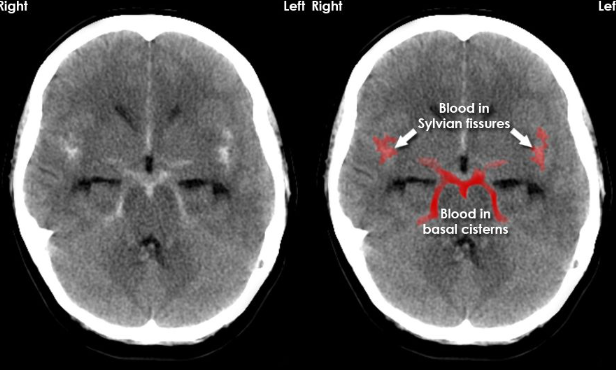
  

## Aivovammapotilaalla RR 198/100 mitä teet

Ei vaihtoehtoja, mutta tässä periaatteet: 

ABCDE-tarkastus tietysti ensiksi

Aivovammapotilaan hoidossa tulee olla tietoinen kohonneen kallonsisäisen paineen (ICP) riskistä ja aina turvata aivojen perfuusiopaine (CPP). 

- CPP = MAP - ICP; normaalisti CPPn. 60-80 mmHg ja ICP n. 1-10 mmHg. Aivovammapotilailla CPP:n tavoitearvo on 60–70 mmHg. 
- Potilaan MAP on n. 133 mmHg (MAP = dvp + 1/3(svp-dvp) eli MAP = 100 + 1/3(198-100)). Tämä on todennäköisesti kompensatorinen reaktio kohonneelle ICP:lle, kun keho yrittää ylläpitää riittävää CPP:tä nostamalla verenpainetta. Tätä kutsutaan Cushingin refleksiksi, jolle on tyypillistä hypertensio, bradykardia ja epäsäännöllinen hengitys (kohonnut ICP konstriktoi aivovaltimoita -> iskemia -> matala pH ja koholla oleva CO2 -> kompensatorinen perifeerinen vasokonstriktio (hypertensio) -> bradykardia (baroreseptorirefleksi); oireet ovat vastakkaiset sokille). 
- Verenpaineen nousu päävamman yhteydessä voi siis olla protektiivinen tiettyyn pisteeseen saakka, mutta voi myös aiheuttaa sekundaarisia aivovaurioita pahentamalla vasogeenista ödeemaa ja intrakraniaalista hypertensiota. Tällä hetkellä ei ole yksiselitteistä konsensusta sen suhteen, miten hypertensiota tulisi kontrolloida päävammapotilailla. Eräältä kannalta verenpaineen laskeminen riskeeraa aivoiskemiaa CPP:n laskiessa, toiselta kannalta taas intrakraniaalisen verenvuodon ja aivoödeeman riski laskee verenpaineen laskiessa.  
- Monien lähteiden mukaan systolisen verenpaineen tavoite tulisi olla 100-140, mutta Duodecimin oppikirjassa annetaan tällainen ohje: systolisia verenpainearvoja yli 180 mmHg tulee pääsääntöisesti hoitaa beetasalpaajalla. Hypotensiota tulee varoa ja lyhytaikainenkin matala verenpaine (syst < 90 mmHg) kaksinkertaistaa kuolemanriskin, tavoite ainakin >120 mmHg. 

Aivovammapotilaita usein sedatoidaan tarpeen mukaan vähentämään aivojen metaboliaa, hoitamaan kohonnutta kallonsisäistä painetta ja helpottamaan hengityslaitteeseen sopeutumista

- Sedaatio kylläkin vaikeuttaa tajunnantason arviota 

**Lyhyesti: Todennäköisesti hyvä olisi laskea verenpainetta varovaisesti, kuitenkin siten, että systolinen verenpaine ei pääsisi tippumaan alle 120 mmHg. Verenpaineen kontrolloimisesta päävammapotilailla ei ole tarjottavissa yksiselitteisiä guidelineja, mutta hypotensiota tulee vältellä CPP:n tippumisen takia.**

## Mihin ei pyritä elvytyksen jälkeen?

Valitse yksi

- a. Normotermia
- b. Normoksia
- c. Systolinen verenpaine 80-100 mmHg
- d. Elottomuuden syyn selvittämiseen

  <button class="solution-button" data-label="Vastaus" data-hide-label="Piilota vastaus">
    Vastaus
  </button>
  

    c
    
Samanlaisia tärppejä ollut jo aikaisemmin, nyt tarjolla myös vaihtoehdot. Näistä vaihtoehdoista yksiselitteisimmin väärä on c, koska systolisen verenpaineen tavoite elvytyksen jälkeen on systolinen verenpaine >100 mmHg. Normotermia on kyseenalainen, koska pikemminkin pyritään hypertermian välttämiseen, eikä tarkka normotermia ole suora tavoite (lievä hypotermia voi olla ihan ok). 

Normoksiaan (saturaatio >94%) tavoitellaan ja tietysti elottomuuden syyn selvittäminen on äärimmäisen tärkeää, jotta taustalla oleva syy voidaan hoitaa. 

  

## Mitä tapahtuu hyperkapniassa

Valitse yksi

- a. Potilas hengittää poikkeuksellisen tiheään ja syvään
- b. Hengityskeskuksen säätely muuttunut huumeiden vuoksi
- c. Kuolleen tilan määrä vähenee
- d. Pulssioksimetri ei voi näyttää normaalia happiosapainetta

  <button class="solution-button" data-label="Vastaus" data-hide-label="Piilota vastaus">
    Vastaus
  </button>
  

    b
    
Hyperkapnia (= kohonnut CO₂) johtuu riittämättömästä alveolaariventilaatiosta, eli kyseessä on tyypin 2 hengitysvajaus. Tätä voi aiheuttaa mm. hengityskeskuksen lamautuminen esim. opioidien tai muiden sedatiivien aiheuttamana → hengitys hidastuu → CO₂ nousee. 

a: Potilas hengittää liian hitaasti ja/tai pinnallisesti, jolloin CO2 nousee

c: Kuolleen tilan määrän _lisääntyminen_ voi aiheuttaa hyperkapniaa. Aiheuttajia ovat esim. laaja keuhkoembolia. Kuollut tila tarkoittaa osaa keuhkoista, joka ventiloidaan, mutta ei perfusoida. Tällaisella alueella ei tapahdu kaasujenvaihtoa -> ventiloidaan turhaan = hukkatila -> CO2 nousee

d: SpO₂ voi olla suhteellisen normaali, vaikka CO₂ olisi selvästi koholla. Tyypin 2 hengitysvajaukseen kuuluu aina jossain määrin myös hypoksemiaa, mutta jos se on korjattu lisähapella, niin hyperkapnia voi säilyä, vaikka SpO2 olisikin normaali. 
  

## Kauanko pitää olla juomatta kirkkaita nesteitä ennen leikkausta?

Ei vaihtoehtoja, mutta tulisi osata vastata ilman vinkkejä 

  <button class="solution-button" data-label="Vastaus" data-hide-label="Piilota vastaus">
    Vastaus
  </button>
  

    2 tuntia (aikuiset) / 1 tunti (lapset)
    
Tarpeettoman pitkä paasto johtaa lapsen epämukavaan oloon, lisää ärtyneisyyttä, eikä nykykäsityksen mukaan kuitenkaan suojaa aspiraatiolta. 

Kirkkaiksi nesteiksi luetaan vesi, kirkkaat mehut, tee ja kahvi ilman maitoa, ja preoperatiivisen paaston vaikutuksia vähentämään suunniteltu kirkas, rasvaton hiilihydraattijuoma. Vrt. lehmänmaito, jota ei saisi juoda 6 tuntiin ennen leikkausta

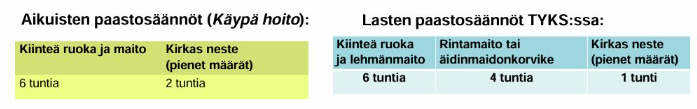
  

## SIRS-kriteerit: Mikä näistä ei ole SIRS-kriteeri?

Valitse yksi

- a. Lämpötila >38C tai <36C
- b. Syke >90/min
- c. CRP >100
- d. Hengitystaajuus >20/min tai pCO2 <4,3 kPa

  <button class="solution-button" data-label="Vastaus" data-hide-label="Piilota vastaus">
    Vastaus
  </button>
  

    c
    
SIRS (Systemic Inflammatory Response Syndrome)-kriteereistä (ja termistäkin, ei ole enää suositellussa käytössä) on pääasiassa luovuttu niiden epäspesifisyyden takia, mutta niitä käytettiin ennen erityisesti sepsiksen tunnistamisessa. SIRS määritettiin tilaksi, jossa on vähintään kaksi seuraavista ehdoista: (1) ydinlämpö <36 tai >38; (2) syke > 90/min; (3) hengitystaajuus >20/min tai a-pCO2 <4,3 kPA; (4) valkosolut <4 tai >12 

Sepsis määriteltiin enne sepsis 3-määritelmää SIRSinä, jossa on epäilty/varmistettu infektio. Nykyään sepsis = yksi uusi elinhäiriö + epäilty/varmistettu infektio 

Uusi elinhäiriö voidaan arvioida nopeasti qSOFA-kriteerejä käyttämällä. Tulee olla vähintään kaksi kriteeriä seuraavista: hengitysfrekvenssi >22, systolinen verenpaine <100, muuttunut tajunnan taso. Tarkempi arvio kuin qSOFA on SOFA ja jos sen pisteytys on 2 tai yli, niin on kyseessä elinhäiriö 

Aikaisemmin sepsiksen ajateltiin olevan jatkumo SIRS+infektio kautta vaikeaan sepsikseen ja sitä kautta septiseen sokkiin. Nykyään on vain sepsis ja septinen sokki, ei enää virallisesti ole "vaikea sepsis"-käsitettä. Septinen sokki = sepsis + vasopressoritarve (MAP <65 nestehoidon kanssakin) + laktaatti >2mmol/l riittävän neste-elvytyksen jälkeen. 

  

## Massiiviverenvuodon hoidosta

Ei vaihtoehtoja tai tarkempaa kysymyksenasettelua wikissä, mutta tässä tärkeimmät aiheesta:

Aivan akuutissa vaiheessa ennen verituotteiden saapumista voidaan käyttää kristalloideja hypotension hoidossa. Potilaalle asetetaan useita isoja perifeerisiä laskimokanyylejä. Mahdollisimman nopeasti kuitenkin siirrytään verituotteisiin: sairaalan verikeskukseen tehdään ilmoitus massiivisen verensiirron protokollan (MTP, massive transfusion protocol) käynnistämisestä sairaalan ohjeiden mukaan

- Verikeskus toimittaa sovitut verituotteet sovitun protokollan mukaisesti. Esimerkiksi punasolu-Octaplas-trombosyyttisuhde 4:4:1 
- Hätäverenä käytetään O Rh(-), mutta nopeasti tulisi saada potilaan veriryhmä selville. Otetaan siis Veriryhmämääritys (E-ABORh) ja) B-XKoe. 
-  Traneksaamihappoa annetaan, ellei ensihoito ole jo antanut, voi toistaa
- Ringerin antoa jatketaan huuhtelemaan lääkkeitä ja täyttämään perustarpeet sekä täydentämään volyymikorvausta (volyymikorvauksen ykköstuote nyt jääplasma, kristalloidit toissijaisia)
- Kalsiumia nnostellaan sen kuluessa verenvuodoissa; varaudutaan myös fibrinogeenin ym. antoon. 
-  Hb-tavoite 70-90(terve nuori potilas), trom 100 (monivamma), fibrinogeeni 1.5, INR alle 1.5

On myös äärimmäisen tärkeää puuttua verenvuodon syyhyn ja usein hoito on operatiivinen. Painesidokset ja muu mekaaninen vuodon rajoittaminen ennen pääsyä leikkaussaliin. 

Määritelmä: Massiivinen verenvuoto tarkoittaa koko veritilavuuden menetystä lyhyessä ajassa (alle vrk:ssa) tai

- 50 %:n veritilavuuden menetys 3 tunnissa
- vuotoa, jonka nopeus on vähintään 150 ml/min
- verenvuotoa, jonka korvaamiseen tarvitaan 10 punasoluvalmistetta ensimmäisten 24 tunnin aikana

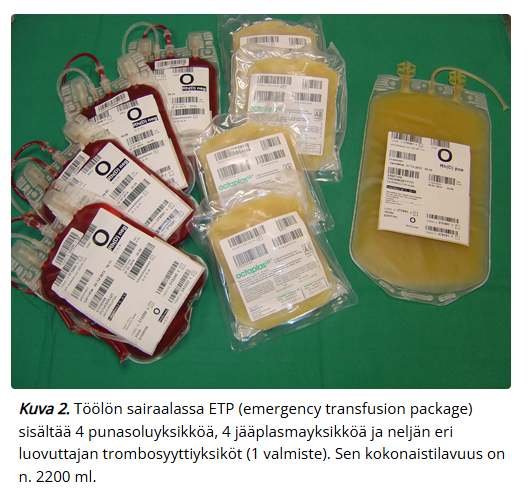

## Mitä jääplasma sisältää? 

Ei vaihtoehtoja, mutta wikissä annettu vastaus: hyytymistekijöitä

Veripalvelu välittää jääplasmaa pyytäessä Octapharman valmistamaa OctaplasLG®-jääplasmaa. 

- OctaplasLG® sisältää kaikkia veren plasman proteiineja, kuten hyytymistekijöitä ja fysiologisia antikoagulantteja, ja samassa suhteessa kuin ihmisen normaali plasma
- Hyytymistekijöiden pitoisuus on noin 1 ky/ml. Yhden OctaplasLG® yksikön tilavuus on 200 ml. Suositeltu aloitusannos on 12–15 ml/kg, ja tämän annostelu suurentaa potilaan plasman hyytymistekijäpitoisuuksia noin 25 %.
- Siirroissa huomioidaan ABO-veriryhmä. Siirtosäännöt ovat käänteiset punasoluvalmisteisiin nähden (eli esim. jos potilaalla on A-veriryhmä, niin hän voi saada A- ja AB-plasmavalmisteita). OctaplasLG®-valmiste ei sisällä punasolu- tai trombosyyttijäämiä, joten RhD-veriryhmää ei tarvitse huomioida.

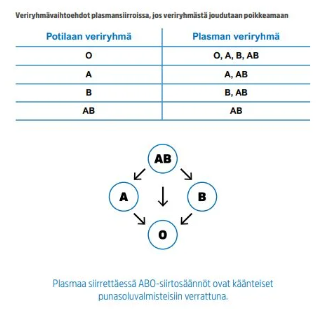

## Millä hyperkalemiaa ei voida hoitaa? 

Valitse yksi: 

- a. Insuliini
- b. Glukagoni
- c. Kationinvaihtaja
- d. Loop-diureetti

  <button class="solution-button" data-label="Vastaus" data-hide-label="Piilota vastaus">
    Vastaus
  </button>
  

    b

Glukagonilla ei ole vaikutusta seerumin kaliumpitoisuuden laskemiseen, toisin kuin insuliinilla, kationinvaihtajilla ja loop-diureeteilla

Hyperkaleeminen potilas hoidetaan suunnilleen näin, jos todetaan vaikea hyperkalemia (P-K ≥ 6,5 mmol/l) ja hyperkaleeminen EKG-löydös: 

1. Stabiloidaan kardiomyosyyttien solukalvot: Annetaan i.v. kalsiumia eli 5 min aikana 30 ml 10% kalsiumglukonaattia tai 10 ml 10% kalsiumkloridia; voidaan toistaa annos tarvittaessa

2. Siirretään kaliumia soluihin: Glukoosi-insuliini-infuusio: 10 ky lyhytvaikutteista insuliinia + 25 g glukoosia (250 ml G10) 15–30 min aikana; erityisen harkinnan perusteella voidaan antaa salbutamolia (beta-2-agonisti -> siirtää kaliumia soluihin) 10–20 mg nebulisaattorilla inhaloiden, jos on takyarytmiataipumus

3. Poistetaan kaliumia elimistöstä: Kationinvaihtajat (esim. natriumpolystyreenisulfaatti eli resonium), diureetit (loop/tiatsidi)+nesteytys ja tarvittaessa dialyysi

Voidaan myös antaa NaHCO3 (natriumbikarbonaatti) 7,5 % 100 ml i.v. 15–30 min infuusiona, jos on samanaikainen hyperkalemia ja metabolinen asidoosi
  

## NSAID haitat

Ei vaihtoehtoja wikissä, mutta tässä tulehduskipulääkkeiden tärkeimpiä haittavaikutuksia:

- Riski munuaisten vajaatoiminnalle, varsinkin yleistilaa heikentävien sairauksien ja ACE:n estäjien / ATR-salpaajien yhteydessä riski AKI:lle (NSAIDit estävät glomeruluksen afferenttia arteriolia dilatoivien prostaglandiinien tuotantoa ja siten vähentävät munuaisperfuusiota)
- Voivat nostaa verenpainetta ja heikentää verenpainelääkkeiden tehoa; pääasiassa johtuen COX-inhibitiosta munuaisissa, mikä vähentää Na+ poistumista (heikentynyt perfuusio johtuen afferentin arteriolin vasokonstriktiosta -> heikko GFR; mahdollisesti hypertensiivinen efekti liittyy myös NSAIDien suoriin vaikutuksiin verisuonen seinämään ja/tai typpioksidisynteesiä estäviin vaikutuksiin) 
- Yksi mahdollinen haittavaikutus on akuutti interstitiaalinen nefriitti (AIN, ATIN)}, joka on allerginen reaktio, joka voi ilmentyä ↑ P-Krea, steriilinä pyuriana (erityisesti ↑ eosinofiilit), hematuriana ja proteinuriana
- Antitromboottinen vaikutus ja siten alttius verenvuodoille (verihiutaleiden COX-esto) -> NSAIDeja ei tulisi käyttää AK-hoidon yhteydessä merkittävän vuotovaaran takia.
  - Vuotoja varsinkin suolistosta; COX1:n estäminen vähentää ruoansulatuskanavaa suojaavien prostaglandiinien tuotantoa ja siten altistaa mm. mahahaavoille ja niiden vuodoille.  
  - Samalla lääkkeillä on myös tromboosialttius ja siten lisääntynyt infarktiriski erityisesti sydänpotilailla. Sydänhaittojen riski liittyy sekä epäselektiivisten että COX-2-selektiivisten tulehduskipulääkkeiden käyttöön, erityisesti niiden suuriin annoksiin ja nimenomaan sydänpotilailla. Tulehduskipulääkkeiden sydänhaitat eivät siis liity varsinaisesti yhdisteen COX-2-selektiivisyyteen (kuten aikaisemmin oletettiin) vaan siihen, miten voimakkaasti lääkeaine estää hypoksiaan liittyvää endoteelin COX-2-välitteistä prostasykliinituottoa. 
- Voivat aiheuttaa keuhkoputkien supistumista, joka johtuu siitä, että leukotrieenisynteesi lisääntyy (suurempi osa arakidonihaposta ohjautuu LOX-entsyymille ja leukotrieenisynteesireitille COX-reitin ollessa estetty) -> Tulehduskipulääkkeet aiheuttavat jonkinasteisen keuhkoputkien supistuksen muutamalle prosentille astmaatikoista (Tätä astman muotoa kutsutaan ASA-herkäksi astmaksi tai ASA-intoleranssin pahentamaksi astmaksi (aspirin exacerbated respiratory disease, AERD)). NSAIDit eivät ole vasta-aiheisia astmaatikoilla, mutta tarkkana tulee olla. 

## Mikä anestesiamuoto todennäköisin nilkkaleikkauksessa?

Ei vaihtoehtoja, mutta koita vastata ilman vinkkejä 

  <button class="solution-button" data-label="Vastaus" data-hide-label="Piilota vastaus">
    Vastaus
  </button>
  

    Popliteapuudutus
    
Popliteaalipuudutusta käytetään nilkan ja jalkaterän leikkausten anestesiassa ja kivunhoidossa. Se täytyy tehdä riittävästi polvitaipeen yläpuolelta ennen hermon jakaantumista n. tibialikseksi ja n. peroneukseksi, jotta saadaan nämä molemmat puutumaan. Koska reisihermon (n. femoralis) loppuhaara, n. saphenus, myös hermottaa nilkkaa ja jalkaterää mediaalipuolella, se kannattaa puuduttaa tarvittaessa erikseen.
    
Kaikki raajaleikkaukset ja monet alavatsan alueelle tehtävät leikkaukset voidaan tehdä puudutuksessa. Anestesiamuotoa valittaessa täytyy aina pohtia kokonaisuutta. Ei voida suoraan sanoa, että yleisanestesia tai puudutus olisi varmasti parempi tietylle potilaalle. 
  

## Mikä lääkehoito vanhukselle, jolla lonkkamurtuma?

Ei vaihtoehtoja wikissä, mutta tässä lonkkamurtumapotilaan lääkityksestä 

- Ensivaiheen kipuhoidossa parasetamoli 1gx3 säännöllisesti ja opioidi tarvittaessa. Kivun hoidossa todella hyödyllinen hoitokeino on myös femoralisblokki, joka hoitaa kipua tehokkaasti ja vähentää opioiditarvetta. 
- Ennen leikkausta aloitetaan tromboosiprofylaksi (yleensä pienimolekyylinen hepariini), joka jatkuu 3–4 viikkoa leikkauksen jälkeen
- Nestehoito ja hypovolemian estäminen 
- Antibioottiprofylaksi leikkauksen yhteydessä
- Tilan stabiloiduttua tulee tarvittaessa harkita osteoporoosilääkitystä 

## Magnesiumsulfaatin käyttö mihin tarkoitukseen: 

Valitse yksi

- a. TdP
- b. Raskaushepatoosi
- c. AKI
- d. Kaikki

  <button class="solution-button" data-label="Vastaus" data-hide-label="Piilota vastaus">
    Vastaus
  </button>
  

    a

Torsades de Pointesin (TdP, kääntyvien kärkien kammiotakykardia) akuuttivaiheen hoito perustuu QT-aikaa pidentävien lääkkeiden lopettamiseen ja i.v. magnesiumsulfaatin antamiseen. Mahdollinen hypokalemia tulee myös korjata. Mikäli edellä mainitut toimenpiteet eivät estä rytmihäiriötä, nopeutetaan sydämen sykettä tasolle 90–120/min
väliaikaisella tahdistimella tai isoprenaliinilla, jos tahdistus ei ole mahdollista. Takykardian toistuessa tahdistuksesta ja magnesiumista huolimatta annetaan beetasalpaajaa laskimoon. Beetasalpaajan teho on erityisen hyvä synnynnäisen pitkä QT -oireyhtymän alatyypeissä LQT1 ja LQT2. Näissä sitä voidaan käyttää myös ensivaiheen hoitona. Hemodynamiikkaa lamaava kääntyvien kärkien kammiotakykardia hoidetaan tietysti defibrilloimalla. 

Käytetään myös pre-eklampsian ja eklampsian hoidossa sekä vaikeissa astmakohtauksissa. 

b: Raskaushepatoosi eli hepatogestoosi eli raskauskolestaasi on raskaudenaikainen maksan toimintahäiriö, jossa iho alkaa kutista ja maksa-arvojen pitoisuus veressä nousee. Ilmaantuu tavallisesti viimeisellä raskauskolmanneksella. Raskaushepatoosin hoidossa on käytetty useita eri lääkevalmisteita, mm. barbituraatteja, deksametasonia, kolestyramiinia ja ursodeoksikoolihappoa (UDCA). Käytetyin ja tehokkain näistä on UDCA. Se vähentää kutinaa ja pienentää äidin maksa-arvoja. Magnesiumsulfaatilla ei ole indikaatiota raskaushepatoosin hoidossa. 

c: AKI:n hoito vaihtelee runsaasti aiheuttajan mukaan (prerenaalinen, renaalinen, postrenaalinen) eikä magnesiumsulfaatilla ole oikein paikkaa AKI:n hoidossa. 

  

## Mitä oireita 15-25% verivolyymin menetys aiheuttaa?

Ei vaihtoehtoja wikissä, tässä tärkeimmät 

- Yleensä 15-25% menetys istuu luokan 2 hypovoleemiseen sokkiin, jolloin oireet ovat vielä vähäisiä kompensatoristen mekanismien takia; tyypillisesti todetaan takykardia, lievästi kohonnut hengitystaajuus ja vähentynyt diureesi. Muita statuslöydöksiä voivat olla mm. laskenut pulssipaine ja kapillaaritäytön hidastuminen >2 sekuntiin 
- Kompensatoriset mekanismit tyypillisesti vielä ylläpitävät verenpainetta normaalina 

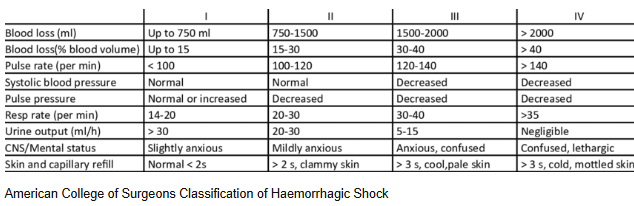

## Miten keskipaine (MAP) lasketaan (anna laskukaava)

Ei vaihtoehtoja, mutta tulisi osata vastata ilman vinkkejä 

  <button class="solution-button" data-label="Vastaus" data-hide-label="Piilota vastaus">
    Vastaus
  </button>
  

    MAP = DVP + 1/3 (SVP - DVP)

DVP = diastolinen verenpaine, SVP = systolinen verenpaine, MAP = mean arterial pressure 

Esim. verenpaine on 110/80 -> MAP = 80 + 1/3 (110-80) = 80 + 10 = 90

Vaihtoehtoisesti voi laskea (SVP+2xDVP)/3, jos tällä on helpompi sinulle laskea päässä. 
  

## Mikä ei aiheuta EKG-muutoksia: 

Valitse yksi 

- a. Hypernatremia
- b. Hypokalemia
- c. Hyperkalemia 
- d. Hypokalsemia

  <button class="solution-button" data-label="Vastaus" data-hide-label="Piilota vastaus">
    Vastaus
  </button>
  

    a

Huomattavat dysnatremiat voivat mahdollisesti aiheuttaa joitain dysrytmioita, mutta natriumtasojen vaihteluiden ei tyypillisesti ajatella olevan EKG-muutosten taustalla. 

b: Hypokalemialle tyypilliset EKG-muutokset ovat T-aallon madaltuminen/inversiot, U-aallon korostuminen ja ST-segmentin lasku. Vaihtelevia rytmihäiriöitä voi esiintyä: eteis- ja kammioperäisiä lisälyöntejä, sinusbradykardiaa, junktionaalista takykardiaa, atrioventrikulaarinen blokki, kammiotakykardiaa tai kammiovärinää.

c: Hyperkalemian varhaisimmat EKG-muutokset ovat korkeat, piikkimäiset T-aallot etenkin rintakytkennöissä. Tähän liittyy usein QT-välin lyheneminen. Lopulta hyperkalemian pahentuessa voi kehittyä ns. sinikuvio. 

d: Hypokalsemian tärkein vaikutus EKG-käyrään on QT-ajan piteneminen, mikä altistaa torsades de pointesille. 
  

## Minkä värinen kanyyli, jos on viikon paikallaan ja laitetaan antibiootti?

Ei vaihtoehtoja, mutta koita vastata ilman vinkkejä 

  <button class="solution-button" data-label="Vastaus" data-hide-label="Piilota vastaus">
    Vastaus
  </button>
  

    Sininen tai pinkki

Nestehoitoa aloitettaessa tulee ensin miettiä, minkälaisesta nestehoidosta on kysymys eli millaisen kanyylin potilas tarvitsee. Jos potilas tarvitsee vaikka vain ajoittaista lääkehoitoa, esim. antibioottitiputuksia, voi olla järkevää laittaa pienempi kanyyli, joka on myös potilaalle usein mukavampi. Jos taas tarvitaan isoja määriä nestettä nopeasti infusoituina, kuten vaikka akuutisti vuotavalle potilaalle, tulee panostaa mahdollisimman suuriin ja hyvin vetäviin suoniyhteyksiin. 

Pienin aikuisilla käytettävä kanyyli on yleensä 22G (sininen) ja tätä voi käyttää, jos on rauhallinen tilanne ja pienen koon aiheuttama hidas infuusioaika ei haittaa. Mitä pienempi kanyyli, niin sitä mukavampi ja vähemmän ongelmia se aiheuttaa. Pinkkiä käytetään ehkä jopa useammin kuitenkin, koska se usein asetetaan päivystyksessä paikalleen (ehkä yleisimmin käytetty kiireettömissä tilanteissa). 

  

## Millainen happihoito palovammapotilaalle?

Ei vaihtoehtoja, mutta tässä tärkeimmät aiheesta: 

Palovammapotilaan hoito tietysti cABCDE mukaan. 

A: Jos palovammapotilas ei tajunnan häiriönsä takia pysty pitämään hengitystietään auki, on se turvattava niillä keinoin, jotka auttajat hallitsevat parhaiten (perustaso: nieluputki tai kurkunpääputki, hoitotaso kurkunpääputki tai intubaatio ja lääkäriyksikkö intubaatio). Hengitysteiden turvaamisessa suositaan mahdollisuuksien mukaan intubaatiota. Supraglottisesti turvattu hengitystie saatetaan menettää turvotuksen edetessä ja tuolloin intubaatio saattaa olla jo mahdotonta.

B: Tyypillisesti palovammapotilailla ei ole ongelmia happeutumisessa tai tuulettumisessa ensimmäisten tuntien aikana. Alkuvaiheen ongelmana voi olla häkämyrkytyksen aiheuttama tajunnan tason heikkeneminen. **Kaikille laajan palovamman saaneille annetaan alkuun 100-prosenttista happea varaajapussillisella naamarilla.** Jos todetaan, ettei kyseessä ole suljetun tilan palo tai ei ole häkämyrkytyksen mahdollisuutta, voidaan happiprosentti pienentää yleistä hoitokäytäntöä vastaavaksi. Häkämyrkytyspotilaille annetaan 100-prosenttista happea ensimmäisten 6 tunnin ajan tai niin pitkään, kunnes voidaan luotettavasti todeta, että häkäpitoisuus on pieni (häkämyrkytyspotilailla happikyllästeisyysmittaus ei ole luotettava). Jos rintakehän ympäri ulottuu panssarimainen palovamma, on myöhäisemmässä vaiheessa varauduttava tekemään eskarotomia palovamma-alueelle.

## EtCO2 8,9 ROSC:n jälkeen, mitä tulisi tehdä ventilaatiolle? 

Ei vaihtoehtoja (ja kysymyksenasettelu alunperin vähän oudosti kirjoitettu, niin muokattu), mutta tulisi osata vastata ilman vinkkejä 

  <button class="solution-button" data-label="Vastaus" data-hide-label="Piilota vastaus">
    Vastaus
  </button>
  

    Lisää ventilaatiota 
    
EtCO2:n tulisi olla normaalialueella eli n. 4.5-6 kPa ROSC:n jälkeen (elvytyksen jälkeen tavoitellaan normokapniaa), joten 8,9 kPa on huomattavasti liian korkea ja viittaa hypoventilaatioon, jolloin CO2 kertyy. 
  

## Sydänpysähdyksen syyt? 

Ei vaihtoehtoja, mutta millä muistisäännöllä voidaan muistaa sydänpysähdyksen hoidettavat syyt? 

  <button class="solution-button" data-label="Vastaus" data-hide-label="Piilota vastaus">
    Vastaus
  </button>
  

    4H4T 
    
4 H: 1) hypoksia, 2) hypovolemia, 3) hypo- tai hyperkalemia, -kalsemia, -magnesemia tai -glykemia, 4) hypo- tai hypertermia

4 T: 1) tensiopneumothorax eli paineilmarinta, 2) sydäpussin tamponaatio, 3) tromboosi, 4) toksiinit eli myrkytys

  

## Asennat perifeeristä laskimokanyylia, tarvitsetko:

Valitse yksi

- a. Tehdaspuhtaat hanskat
- b. Steriilit hanskat 
- c. Pelkän hyvän käsihygienian

  <button class="solution-button" data-label="Vastaus" data-hide-label="Piilota vastaus">
    Vastaus
  </button>
  

    a 
    
Tehdaspuhtaita käsineitä tulee virallisten ohjeiden mukaan aina käyttää kanyloitaessa. Sentraalisten katetrien asettamisessa tulee kuitenkin huolehtia steriliteetistä ja toimenpide tehdään steriilien hanskojen kanssa ja pistettävä alue steriloidaan huolellisesti. 
  

## Minkä verituoteen antoa fertiili-ikäiselle naiselle tulee välttää?

Ei vaihtoehtoja, mutta koita vastata ilman vinkkejä 

  <button class="solution-button" data-label="Vastaus" data-hide-label="Piilota vastaus">
    Vastaus
  </button>
  

    K- (ja Rh-) positiivisia punasoluvalmisteita 

Tytöille tulee antaa Kell-negatiivisia valmisteita, koska halutaan estää alloimmunisaatio. Kell-vasta-aineet voivat aiheuttaa vastasyntyneen hemolyyttistä tautia: Äiti on kell-negatiivinen -> annetaan kell-positiivisia punasoluja -> muodostuu anti-kell-vasta-aineita -> Äidin anti-Kell vasta-aineet targetoivat sikiön punasoluja, jos sikiö on kell-positiivinen -> vastasyntyneen hemolyyttinen tauti (HDN)

Samasta syystä tietysti myös RhD-sopivuudesta pyritään pitämään kiinni aina, kun mahdollista. **Etenkin RhD-negatiivisille tytöille ja fertiili-ikäisille naisille ei tule antaa RhD-positiivisia trombosyyttejä kuin henkeä uhkaavissa tilanteissa, jos RhD-negatiivisia ei ole saatavilla.**. Anti-D-immunisaation ehkäisemiseksi anti-D-immunoglobuliini-suojauksesta tulee huolehtia, mikäli RhD-negatiivinen potilas on saanut RhD-positiivisia trombosyyttejä

  

## Mitä tarkoittaa kapnometri?

Ei vaihtoehtoja wikissä, mutta pitäisi osata vastata ilman vinkkejä

  <button class="solution-button" data-label="Vastaus" data-hide-label="Piilota vastaus">
    Vastaus
  </button>
  

    Hengitysilman hiilidioksidin mittari

Jos laite rekisteröi mittauksen ajan ja hengityssyklin funktiona ja piirtää sen käyränä, kyse on kapnografiasta (kuva alla). Mittausmenetelmät ovat joko massaspektrometrisiä tai spektrofotometrisiä. Mittauskohta voi olla joko intubaatio, tai larynksmaskin suulla tai hereillä olevan potilaan nenässä. Hiilidioksidimittaus on nopeasti reagoiva ja jo ensimmäisestä hengityssyklistä saadaan selville EtCo2 (uloshengityksen lopun CO2:n pitoisuus). EtCO2 näyttää myös heti suoraa viivaa, jos potilas lakkaa hengittämästä tai letkut irrotetaan hengityskoneesta. 

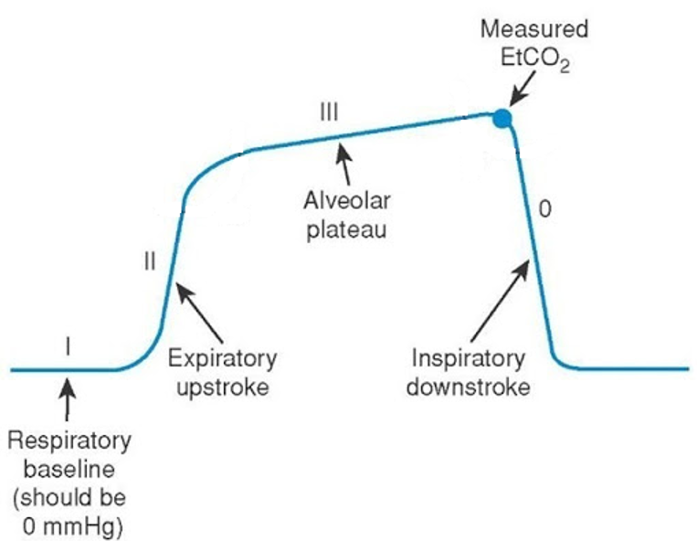
  

## Mikä tila aiheuttaa todennäköisimmin leikkauskomplikaatioita yms.? 

Valitse yksi 

- a. Korkea ikä
- b. Oireinen sydämen vajaatoiminta
- c. Hoitamaton verenpainetauti 
- d. joku (ei wikissä)

  <button class="solution-button" data-label="Vastaus" data-hide-label="Piilota vastaus">
    Vastaus
  </button>
  

    b

Sydämen vajaatoiminta (vaikka HFrEF eli pieni efektiofraktio) asettaa potilaan ASA-luokkaan 4.

a: Korkea ikä yksinään on suhteellisen vähäinen riskitekijä. Sitä ei edes huomioida ASA-luokituksessa. 

c: Huonossa hoitotasapainossa oleva kohonnut verenpaine asettaa potilaan vähintään ASA-luokkaan 3. 

  

## Mikä on oikein koskien nosiseptiota

Valitse yksi

- a. NSAID ei auta
- b. Normaali ilmiö kudosvauriossa
- c. Tarkoittaa kroonista kipuoireyhtymää 
- d. Johtuu kipuhermovauriosta

  <button class="solution-button" data-label="Vastaus" data-hide-label="Piilota vastaus">
    Vastaus
  </button>
  

    b

Nosiseptio = kipureseptorin ärsytys ja kulku C tai Aδ -säikeitä pitkin aivoihin ja sen vaikutukset siellä. Kun nosiseptiiviset signaalit aiheuttavat aivoissa epämiellyttävän kokemuksen, aiheutuu kipua (kipu on siis kokemus). Nosiseptiivinen kipu tarkoittaa kipua, jonka syynä on kipureseptoreiden aktivoituminen, kun _kudosvaurio on tapahtunut tai se on uhkaamassa_

a: NSAIDit juuri ovat hyviä nosesptiivisessä kivussa. 

c: Krooninen kipu ei ole yhtä kuin nosiseptio. Usein krooniseen kipuoireyhtymään liittyy hermovaurio (tyypin I CRPS). 

d: Kipuhermovaurion aiheuttama kipu on nimeltään neuropaattinen kipu. 
  

## Mitkä hermosolut välittävät nosiseptiota (tarkka solutyyppi)

Ei vaihtoehtoja wikissä, mutta koita vastata ilman vinkkejä 

  <button class="solution-button" data-label="Vastaus" data-hide-label="Piilota vastaus">
    Vastaus
  </button>
  

    A-delta (III) ja C (IV)

Sensorisista reseptoreista kulkee erilaisia hermosäikeitä, jotka voidaan jakaa joko Lloydin luokittelun (I-IV) tai Erlanger-Gasserin luokittelun mukaan (A-C). A-delta-säikeet välittävät terävää kipua ja kylmän tunnetta, kun taas C-säikeet hidasta, polttavaa kipua ja kuuman tunnetta 

  

## Mikä ei ole kroonisen kivun riskitekijä:

Valitse yksi 

- a. Nuori ikä
- b. Perimä
- c. Intubaatioyleisanestesia
- d. Huono postoperatiivinen kivunhoito

  <button class="solution-button" data-label="Vastaus" data-hide-label="Piilota vastaus">
    Vastaus
  </button>
  

   c

Intubaatioyleisanestesia ei ole riskitekijä kivun kroonistumiselle. Hyvä leikkauksenaikainen kivun hoito (oli se sitten yleisanestesiassa tai pelkässä puudutuksessa) on äärimmäisen tärkeää kivun kroonistumisen estämiselle. 

  

## Mikä seuraavista ei kuulu verenvuotopotilaan hoidon kolmikantaan? 

Valitse yksi 

- a. Verivolyymin palauttaminen
- b. Nopea glukoosin anto
- c. Hapenkuljetuskyvyn varmistaminen 
- d. joku (ei wikissä) 

  <button class="solution-button" data-label="Vastaus" data-hide-label="Piilota vastaus">
    Vastaus
  </button>
  

   b

Todennäköisesti d on ollut verenvuodon paikallistaminen ja sen hoito. Nopea glukoosin anto ei kuulu verenvuodon akuuttihoitoon, ellei potilaalla ole hypoglykemiaa tai muu erityinen tarve. 
  

## Heräämön vähimmäisseurantaan ei kuulu? 

Valitse yksi 

- a. Verenpaine
- b. Pulssioksimetri
- c. Kivun asteen määrittäminen
- d. Kapnometria

  <button class="solution-button" data-label="Vastaus" data-hide-label="Piilota vastaus">
    Vastaus
  </button>
  

   d

Potilaalla ei enää heräämössä tyypillisesti ole hengitysteiden varmistuslaitetta, joten kapnometriaa ei seurata. 

Heräämössä jatketaan yleensä vähintään pulssioksimetriaa, noninvasiivista verenpaineen seurantaa ja EKG-seurantaa. Seurataan kipua, tajuntaa ja orientaatiota, pahoinvointia, haavan tilannetta, dreenivuotoa, diureesia, kognition toipumista... 
  

## Mitä lisääntynyt laskimosekoittuma tarkoittaa?

Ei vaihtoehtoja, mutta koita vastata ilman vinkkejä 

  <button class="solution-button" data-label="Vastaus" data-hide-label="Piilota vastaus">
    Vastaus
  </button>
  

   V/Q-suhteen laskua

Lisääntynyt laskimosekoittuma on yleisin hypoksemian aiheuttaja. Osa keuhkoverenkierrosta kulkee tuulettumattoman tai huonosti tuulettuvan keuhkokudoksen kautta (matala V/Q-epäsuhta) ja sunttautuu (oikovirtaa) heikosti hapettuneena sydämen vasemmalle puolelle. Suntti eli oikovirtaus voi siis olla keuhkojen sisäistä tai sydämen sisäistä (ns. oikealta vasemmalle suntti esim. synnynnäisen sydänvian takia); vähähappista verta sekoituu runsashappiseen vereen laskien sen hapen osapainetta. 

Wikissä näin: Tilanne, jossa keuhkojen huonosti tai täysin tuulettumattomien alueiden kautta kulkeva vähähappinen veri sekoittuu muuhun keuhkoista palaavaan vereen alentaen sen happipitoisuutta  

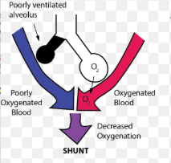
  

## Mitä hermosäikeitä kautta tylppä ja polttava kipu välittyy?

Ei vaihtoehtoja wikissä, mutta käyty juuri läpi pari kysymystä sitten. Koita vastata ilman vinkkejä. 

  <button class="solution-button" data-label="Vastaus" data-hide-label="Piilota vastaus">
    Vastaus
  </button>
  

   C (IV)

Sensorisista reseptoreista kulkee erilaisia hermosäikeitä, jotka voidaan jakaa joko Lloydin luokittelun (I-IV) tai Erlanger-Gasserin luokittelun mukaan (A-C). A-delta-säikeet välittävät terävää kipua ja kylmän tunnetta, kun taas C-säikeet hidasta, polttavaa kipua ja kuuman tunnetta 

  

## Mitä tarkoittaa DNAR-päätös?

Ei vaihtoehtoja wikissä, mutta tulisi osata vastata ilman vinkkejä 

  <button class="solution-button" data-label="Vastaus" data-hide-label="Piilota vastaus">
    Vastaus
  </button>
  

   Do Not Attempt Resuscitation

Elvytyskielto. Elvytystä ei tule aloittaa, jos potilaalla on elvytyksen kieltävä hoitotahto. Samaa tarkoittaa myös DNR (Do Not Resuscitate) ja AND (Allow Natural Death).
  

## Parenteraalinen nestehoito. Tarvitaanko vitamiinitäydennystä ja jos tarvitaan niin millaista?

Ei vaihtoehtoja wikissä, mutta koita vastata ilman vinkkejä 

  <button class="solution-button" data-label="Vastaus" data-hide-label="Piilota vastaus">
    Vastaus
  </button>
  

    Rasva- ja vesiliukoiset vitamiinit, määrät suositusten mukaisesti

Ravitsemusseoksiin ei saa lisätä lääkeaineita käyttöohjeissa mainittuja elektrolyyttejä ja vitamiineja lukuun ottamatta. Ne lisätään pusseihin steriilisti. Rasvaliukoiset ja vesiliukoiset vitamiinit tulee antaa päivittäin jo ensimmäisestä ravitsemuspäivästä lähtien. Kaupalliset valmisteet sisältävät keskimääräistä perustarvetta vastaavat määrät näitä vitamiineja. Joistakin vitamiinivalmisteista puuttuu K-vitamiini, jolloin se tulee muistaa lisätä erikseen. Kroonista munuaisten vajaatoimintaa sairastavilla A- ja D-vitamiinin annosta tulee tarvittaessa vähentää.
  

## Diabeettinen ketoasidoosi hoito

Ei vaihtoehtoja wikissä, mutta tulisi osata tarjota tyypillinen hoitoskeema (ainakin mitkä ovat kolme hoidon pilaria) ilman vinkkejä 

  <button class="solution-button" data-label="Vastaus" data-hide-label="Piilota vastaus">
    Vastaus
  </button>
  

    Alla

Tyypillinen hoito diabeettisessa ketoasidoosissa (DKA) ja hyperglykeemisessä hyperosmolaarisessa oireyhtymässä (HHS) on  i.v. nesteytys,i.v. insuliini ja i.v. kalium. Tätä enempää ei todennäköisesti kysymyksessä tarvinnut tietää, mutta alla on hoitoskeema tarkemmin. 

Nesteet (Ringer, Plasmalyte tai NaCl 0.9%) - Tarkoituksena korjata polyurian aiheuttama plasmavolyymin väheneminen. Annetaan 1 000 ml ensimmäisten 30–60 min:n aikana, jonka jälkeen n. 500 ml/t*, kunnes verensokeri on < 14 mmol/l, minkä jälkeen infuusionesteeksi vaihdetaan G5-liuos (G5-liuosta (sokeripitoista liuosta) annetaan, jotta voidaan antaa enemmän insuliinia; Hyperglykemia korjaantuu usein ennen (keto)-asidoosia -> Jotta ketoasidoosin edellyttämä insuliini-infuusio voidaan pitää riittävänä, nestehoitoon lisätään glukoosi-infuusio) 

Insuliini - Siirtää liiallista verensokeria soluihin ja lopettaa ketogeneesin DKA:ssa -> asidoosikin korjaantuu. Insuliini annostellaan jatkuvana laskimoinfuusiona 0.1 yks./kg/t, kunnes P-Gluk <14 mmol, jolloin annos on 0.05 yks./kg/t. DKA:n hoidossa P-Gluk-tavoite hitaan pienenemisen jälkeen on 8–11 mmol/l, kunnes asidoosi on korjautunut. Insuliini-infuusiota tulee jatkaa ketoasidoosin korjautumisen jälkeen ja s.c. insuliinin annosteluun voidaan siirtyä, kun P-Gluk <10 mmol/l ja pH >7.3 sekä anionivaje <14 mmol/l. 

K+ annetaan estämään kaliumvajaus, joka voi muodostua insuliinin annostelussa. Insuliinihoito myös aloitetaan vasta, kun P-K >3.5 mmol/l. Kun P-K  3.5–5 mmol/l -> Infuusionesteeseen lisätään kaliumkloridia (KCl) siten, että nesteen kaliumpitoisuus on 40 mmol/l (pääsääntöisesti kaliumia annetaan enintään 20 mmol tunnissa). Kun P-K on > 5.0 mmol/l -> ei kaliumlisää.

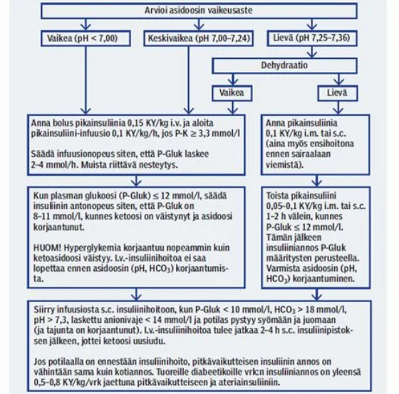

  

## Minkä elektrolyyttihäiriön suurien määrien verituotteiden anto voi aiheuttaa?

Ei vaihtoehtoja wikissä, mutta tulisi osata vastata ilman vinkkejä 

  <button class="solution-button" data-label="Vastaus" data-hide-label="Piilota vastaus">
    Vastaus
  </button>
  

    Hypokalsemia

Veri- ja plasma-valmisteissa käytetään sitraattia, joka sitoo ionisoitunutta kalsiumia. Suurissa infuusioissa kalsiumin sitoutuminen voi johtaa hypokalsemiaan, joka voi aiheuttaa mm. lihaskouristuksia ja QT-ajan pidentymistä -> altistaa tdp:lle. 
  

## Monivammapotilaan mahalaukun tyhjeneminen nopeus

Ei vaihtoehtoja, mutta onko hidastunut vai nopeutunut?

  <button class="solution-button" data-label="Vastaus" data-hide-label="Piilota vastaus">
    Vastaus
  </button>
  

    Hidastunut

Monivammapotilailla tyypilliset paastoajat eivät siis ole riittäviä. Mahdollisuuksien mukaan leikkaus tehdään vasta myöhemmin, mutta hätätilanteessa paastoaikoja ei voida seurata. Vatsan tyhjentymistä voidaan nopeuttaa mm. nenä-mahaletkulla ja motiliteettia nopeuttavilla lääkkeillä (esim. metoklopramidi). 
  

## Anestesian vaikutus sikiöön

Ei vaihtoehtoja, tässä tärkeimmät: 

- Sikiölle aiheutuvia riskejä ovat leikkauksenaikainen hapenpuute, keskenmeno tai ennenaikainen syntymä. Yleisimpien anestesia aineiden ei ole suoraan todettu olevan teratogeenisiä, mutta teratogeenisyys on varsin karkea mittari, eikä lääkeainealtistusten hienovaraisempia vaikutuksia kehittyville aivoille tunneta.
- Puuduteaineen toksiset vaikutukset voivat ilmentyä raskaana olevalla jo huomattavasti suositeltuja kerta-annoksia pienemmillä annoksilla. Sikiön kannalta suuret puudutemäärät voivat aiheuttaa vakavia haittavaikutuksia. 
- Mikäli leikkaukseen arvellaan liittyvän verenpaineen muutosten riski tai leikkausasento ei ole optimaalinen istukkaverenkierron suhteen, on syytä harkita sikiön sydänäänten seurantaa kardiotokografialla toimenpiteen aikana ja sen jälkeen, jolloin sikiön patologiset sykemuutokset voidaan havaita ajoissa harvana sykkeenä. Yleensä yleisanestesian aikana sikiön syke on monotoninen eli normaalia sikiön hereillä olon vaihtelua ei nähdä.
- Anestesia-aineet läpäisevät istukan. Ketamiinia, typpioksiduulia ja bentsodiatsepiineja suositellaan vältettävän ensimmäisellä raskauskolmanneksella. Sevofluraani relaksoi kohtua, mistä voi olla etua sikiön hapensaannille, mutta toisaalta inhalaatioanesteettien käyttöön on kokeellisissa tutkimuksissa liittynyt sikiön aivojen lisääntynyttä solukuolemaa.

## Midline-kanyylin käyttö:

Valitse yksi 

- a. Kaikki samat aiheet kuin keskuslaskimokatetrilla (CVK)
- b. Käytetään samoihin kuin perifeerinen laskimokanyyli
- c. Käytetään verinäytteiden ottoon 
- d. Joku (ei wikissä)

  <button class="solution-button" data-label="Vastaus" data-hide-label="Piilota vastaus">
    Vastaus
  </button>
  

    b (ja c)

Jos potilaalla on hankalasti kanyloitavat suonet ja/tai pitempiaikainen suonensisäinen neste- tai lääkehoidon tarve, voidaan perifeerisen laskimokanyylin sijasta potilaalle laittaa Midline-verisuonikanyyli. Kyseessä on normaalia pitempi (usein noin 10-12 cm) kanyyli, joka laitetaan ultraääniohjatusti olkavarren laskimoon.

Midline-kanyylin enimmäiskäyttöaika on yleensä neljä viikkoa. Huomioi, että kyseessä on perifeerinen kanyyli! Sinne voi infusoida samoja tuotteita kuin perifeeriseen laskimokanyylinkin. Midline-kanyylistä voi ottaa myös verinäytteitä (c siis käytännössä myös oikein). 

Ehkä kysymys wikissä onkin ollut enemmänkin, että mikä väitteistä ei olekaan totta, koska b ja c ovat totta ja d olisi ehkä todellinen väite ja silloin vain a olisi epätotta

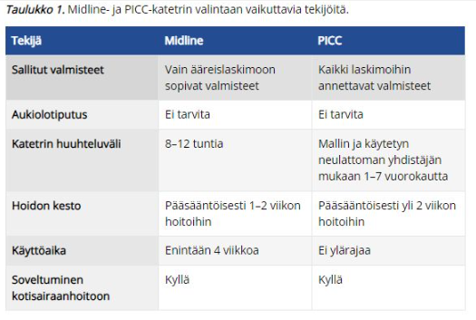
  

## Potilastapaus: Millainen kipulääkitys, jos buprenorfiiniriippuvainen 45-v muuten terve?

Ei vaihtoehtoja, mutta riippuu tilanteesta. Periaatteita:

- Pohjalla tyypillisesti kuuluu olla parasetamoli+nsaid, kuten muutenkin yleensä. 
- Buprenorfiinilääkitystä tulee jatkaa, koska nopea tauotus voi aiheuttaa vieroitusoireita ja lisääntynyttä kipua. Jos lääkkeet eivät riitä kivunhoitoon, niin voi olla järkevää lisätä buprenorfiiniannosta potilaan normaalin annoksen päälle. Tarvittaessa voidaan myös antaa vahvaa opioidia potilaalle. 

## Potilastapaus: Millainen kipulääkitys, jos 71-v eteisvärinä, verenpainetauti, hyperkolesterolemia, lääkityksenä statiini, varfariini ja joku verenpainelääke

Ei vaihtoehtoja, mutta riippuu taas tilanteesta. Periaatteita:

- NSAID tulee välttää, koska yhteiskäyttö AK-lääkityksen kanssa lisää vuototaipumusta merkittävästi
- Parasetamolin annos voi olla 1gx2 (normaalin 1gx3) sijaan, koska jatkuva yli 2 gramman vuorokausiannoksen parasetamolin käyttö voi jonkin verran tehostaa varfariinin vaikutusta
- Opioidit tarvittaessa pienillä annoksilla 

## Mihin käytetään APACHE ja SAPS luokituksia

Ei vaihtoehtoja, mutta käyty jo aikaisempien vuosien tärpeissä. Koita vastata ilman vinkkejä 

  <button class="solution-button" data-label="Vastaus" data-hide-label="Piilota vastaus">
    Vastaus
  </button>
  

    Tehohoidon pisteytysjärjestelmiä

Voidaan käyttää tehohoidon potilaiden sairaalamortaliteetin ennustamiseen

  

## Mikä on puudutemyrkytyksen ensioire

Ei vaihtoehtoja wikissä, tässä tärkeimmät ensioireet: 

- Lievä puudutemyrkytys aiheuttaa ensimmäisenä **puutumisen tunnetta suun ympärillä,** korvien soimista ja puheen puuroutumista. Myös metallin maku suussa on tyypillistä.
- Mikäli puudutepitoisuus suurenee vielä enemmän, niin myrkytysoireina tulee ensin lihasnykäyksiä ja myöhemmin grand mal -tyyppisiä kouristuksia ja tajuttomuus.
- **Hengityspysähdys ja verenkierron lama ovat hoitamattoman puudutemyrkytyksen pahimmat vaikutukset.**

## Noradrenaliinin vaikutus elimistössä

Ei vaihtoehtoja wikissä, tässä tärkeimmät: 

- Noradrenaliini (NA) on sympatomimeettinen katekolamiini. Sen tärkein vaikutus on α1-välitteinen valtimoiden ja laskimoiden vasokonstriktio ja siten verenpaineen (sekä systolisen että diastolisen) nostaminen. 
- Noradrenaliini myös toimii inotrooppisesti β1-välitteisesti. NA aiheuttaa siis sekä valtimoiden että laskimoiden konstriktiota, mutta kontraktiliteetin lisääntyminen johtaa suhteellisesti suurempaan nousuun systolisessa paineessa verrattuna diastoliseen. 

## Mikä ei ole peruselintoimintoihin vaikuttava tekijä

Valitse yksi 

- a. Anuria
- b. Spo2 < 89 %
- c. P-gluk 18 
- d. HT < 6 tai > 30

  <button class="solution-button" data-label="Vastaus" data-hide-label="Piilota vastaus">
    Vastaus
  </button>
  

    c

Korkea verensokeri ei akuutisti estä peruselintoimintoja (vaarantavat vaikutukset ovat enemmänkin pitkäaikaisia kuten diabeteksessa)

a: Anuria → häiritsee nestetasapainoa ja lopulta aiheuttaa munuaisvaurion → vaikuttaa peruselintoimintoihin

b: Merkittävä hypoksia → elinten perfuusio vaarantuu

d: Hypo- ja hyperventilaatio vaikuttavat merkittävästi kaasuosapaineisiin ja happo-emästasapainoon
  

## Mitä monitorointeja tarvitaan 88-v potilaalla jolla leikataan laparotomiassa septinen peritoniitti

Ei vaihtoehtoja wikissä, mahdollisesti nämä monitoroinnit: 

- Kaikissa leikkauksissa vähintään pulssioksimetri, noninvasiivinen verenpaineen mittaus (NIBP; mahdollisesti jopa valtimoverenpaineen seuranta eli ABP), 3-5-kytkentäinen EKG ja yleensä myös lämpötilan mittaus, paitsi kaikkein lyhimmissä toimenpiteissä
- Koska tehdään laparotomia, niin tulee myös lihasrelaksoida potilas ja tämän takia myös intuboida potilas; lihasrelaksaatiota seurataan TOF% avulla ja intubaatioputkeen myös lisätään kapnometri, jotta voidaan seurata etco2 ja ventilaatiota (hengitystiepaineita sekä –tilavuuksia) 
- Potilas on myös täysin nukutettu, joten yleisanestesian syvyyttä tulee seurata esim. BIS:n avulla 
- Mahdollisesti diureesin seuranta (virtsarakkokatetrin avulla)

## Mikä ei ole ROSCin merkki? 

Valitse yksi 

- a. SpO2 viivan piirtyminen
- b. EtCO2 nousu
- c. Agitaatio ja kouristus
- d. Carotispulssin tuntuminen

  <button class="solution-button" data-label="Vastaus" data-hide-label="Piilota vastaus">
    Vastaus
  </button>
  

    a

Happisaturaatiota voidaan mitata elvytyksen aikana, mutta se ei kuulu tyypillisesti monitorointiin ennen verenkierron palautumista. Happisaturaatio saattaa olla mitattavissa elvytyksen aikana, mutta se ei ole luotettava. SpO2-monitorointi kuitenkin kuuluu elvytyksen jälkeiseen hoitoon ja tähdätään normoksemiaan (>94%)

b: EtCO2:n selkeä nousu on klassinen spontaanin verenkierron palautumisen merkki. Sitä ei kuitenkaan tulisi käyttää ainoana vihjeenä eikä painelusykliä tulisi pysäyttää pelkästään EtCO2:n nousun perusteella. 

c: Potilaan liikehdintä, yskiminen, kouristus painelusta aiheutuvalle kivulle yms ovat ROSCin merkkejä 

d: Carotispulssin tuntuminen on suora ROSCin merkki (spontaani verenkierto palautunut -> pulssit palpoitavissa)
  

## Neuropaattisen kivun syntymisestä väitteitä, mikä on totta?

Valitse yksi (tehtävä sanoitettu huonosti wikissä, niin hieman muokattu kysymystä ja vaihtoehtoja)

- a. NMDA-reseptorien toiminta on merkittävässä roolissa neuropaattisen kivun synnyssä
- b. Gabapentinoidit lievittävät neuropaattista kipua salpaamalla GABA-reseptoreita 
- c. Ei-lääkkeellinen hoito ei toimi
- d. Fysikaalinen hoito huonompi kuin farmakologinen

  <button class="solution-button" data-label="Vastaus" data-hide-label="Piilota vastaus">
    Vastaus
  </button>
  

    a

NMDA-reseptorit voivat olla yliaktiivisia tai yliekspressoituja kipuhermojen synapseissa, mikä voi johtaa lisääntyneeseen neuronaaliseen toimintaan ja suurempaan kipuvasteeseen. NMDA-estäjillä, kuten ketamiinilla on analgeettisia vaikutuksia. 

b: Gabapentinoidien (esim. pregabaliini ja gabapentiini) vaikutus perustuu siihen, että ne sitoutuvat N-tyypin jänniteherkkien kalsiumkanavien α2δ-lisäalayksikköön. Näin ne estävät keskushermostossa mm. pronosiseptiivisten välittäjäaineiden vapautumista -> auttavat neuropaattisessa kivussa. Eivät siis kuitenkaan sitoudu GABA-reseptoreihin (gabapentinoidit saavat nimensä siitä, että ne ovat GABA:n kaltaisia rakenteeltaan, mutta ei ole affiniteettiä GABAA- eikä GABAB-reseptoreihin, eivätkä ne myöskään muuta GABAn metaboliaa)

c ja d: Ei lääkkeellinen hoito on hyvin tärkeä osa kroonisen kivun hoitoa. 
  

## Mitä opioidia krooniseen kipuun

Ei vaihtoehtoja wikissä, tässä periaatteet: 

Opioidilääkityksen harkitsematon aloitus ja käyttö pitkäaikaiseen kipuun voi altistaa potilaan pitkäaikaiskäytön haitoille, kuten toleranssin kehittymiselle, väärinkäytölle ja hormonaalisille vaikutuksille. Erityisesti aikaisempi päihde- tai lääkeaineriippuvuus altistaa potilaan opioidiriippuvuuden kehittymiselle

Opioidien käyttöä pitkäaikaisen kudosvauriosta johtuvan tai neuropaattisen kivun hoidossa voidaan harkita silloin, kun kivun syy on selvä, muut hoitokeinot on riittävässä laajuudessa kokeiltu, ja ne ovat osoittautuneet tehottomiksi

Jos kyseessä on neuropaattinen kipu, niin tramadoli on opioideista paras (SNRI-kaltaisia vaikutuksia)

## Septinen sokki

Ei vaihtoehtoja ja tai kysymyksenasettelua wikissä. Vastaappa tähän kysymykseen: **"Mikä on septisen sokin määritelmä?"**

  <button class="solution-button" data-label="Vastaus" data-hide-label="Piilota vastaus">
    Vastaus
  </button>
  

    Sepsis+lakt>2+NADR

Septinen sokki on tila, jossa on sepsis, laktaattitaso on >2mmol/l ja vasopressorihoitoa (ensisijaisesti noradrenaliini) tarvitaan pitämään MAP > 65mmHg huolimatta asianmukaisesta nestehoidosta.

Sepsiksen määritelmä nykyään on seuraava: Infektion (epäily riittää) aiheuttaman virheellisesti säädellyn immuunireaktion seurauksena vähintään yksi uusi elinhäiriö. Elinhäiriön toteamisessa voidaan käyttää esim. qSOFA- tai SOFA-kriteeristöjä. 

  

## Mikä elvytetyn potilaan minimivaatimus RR-tasosta? 

Valitse yksi 

- a. Syst > 140
- b. Syst > 120
- c. MAP 50 
- d. MAP 70

  <button class="solution-button" data-label="Vastaus" data-hide-label="Piilota vastaus">
    Vastaus
  </button>
  

    d

Elvytyksen jälkeen tavoitellaan yli 65 mmHg:n keskiverenpainetta, jolla virtsantulo on riittävä (> 0,5 ml/kg/t) ja laktaattipitoisuus pienenee hoidon aikana. Minimiverenpainetavoite elvytyksen jälkeen ilmoitetaan monissa lähteissä myös tavalla syst >100 mmHg. Käypä Hoidon Elvytys-artikkelissa ilmoitetaan nämä molemmat (algoritmikaaviossa systolinen >100 mmHg ja tekstissä Verenkierron seuranta-osiossa kirjoitetaan tavoitteeksi MAP >65 mmHg). 

  

## Tajuton aivovammapotilas, oksentanut, suu tyhjä, jotain astrup-arvoja annettu:

Valitse yksi 

- a. intuboitko
- b. annatko olla
- c. ventiloitko maskilla 
- d. nieluputkella

  <button class="solution-button" data-label="Vastaus" data-hide-label="Piilota vastaus">
    Vastaus
  </button>
  

    a

Potilas tajuton ja saanut aivavamman -> merkittävässä aspiraatioriskissä (on jo oksentanutkin) ja vaatii hengitystukea -> Intubaatio on paras (GCS under 8, intubate). 
  

## Kodeiinin vaikuttava aine

Ei vaihtoehtoja wikissä, tässä tärkeimmät 

- Kodeiinin ns. vaikuttava aine on kylläkin kodeiini, mutta sillä itsessään on äärimmäisen pieni analgeettinen vaikutus
- Varsinaisen analgeettisen vaikutuksen välittää morfiini (kodeiini on siis aihiolääke ja osa kodeiinista metaboloituu CYP2D6:n kautta morfiiniksi), ja tässä kysymyksessä on todennäköisesti haettukin morfiinia vastauksena 

## 71v elektiivinen sappitieleikkaus tehty, RR-tauti, eteisvärinä, hyperkolesterolemia, lääkityksenä enalapriili, varfariini, simvastatiini: leikkauksen jälkeinen kivunhoito

Valitse yksi: 

- a. kaksi vaihtoehtoa, missä ibuprofeeni
- b. paracetamol 1g x 4
- c. paracetamol 500mg x 4 ja oksikodoni 5-10 mg p.o. tarvittaessa

  <button class="solution-button" data-label="Vastaus" data-hide-label="Piilota vastaus">
    Vastaus
  </button>
  

    c

a: Varfariinin kanssa ei oikein saa käyttää NSAIDeja vuotoriskin takia 

b: Pelkkä parasetamoli ei oikein riitä kivunhoidoksi tässä tilanteessa. Annos on myös aika korkea, koska jatkuva yli 2 gramman vuorokausiannoksen parasetamolin käyttö voi jonkin verran tehostaa varfariinin vaikutusta (parasetamoli voi estää hyytymistekijöiden tuottoon tarvittavia K-vitamiinisyklin entsyymejä). 
  

## Mikä on hätäveren veriryhmä?

Ei vaihtoehtoja wikissä, mutta tulisi osata vastata ilman vinkkejä

  <button class="solution-button" data-label="Vastaus" data-hide-label="Piilota vastaus">
    Vastaus
  </button>
  

    O RhD-

Hätäplasmavalmiste taas AB-ryhmää (Rh-ryhmällä ei väliä); trombosyyteissä veriryhmä ei ole oleellinen. O RhD-positiivisia punasoluja voidaan käyttää hätäverensiirroissa, jos O RhDneg-punasoluja ei ole (tai jos tiedetään että potilas on RhD pos). Tällöin kyseessä on tietoinen immunisointi -> ei anneta anti-D-suojausta. HUOM! tytöille ja fertiili-ikäisille naisille vältetään kaikkien mahdollisuuksien mukaan RhD pos veren antamista (immunisointi ja tulevat sikiökomplikaatiot). 

Hätätilanteessa otetaan verensiirtotutkimuksia (veriryhmämääritys- ja XKoe) mahdollisuuksien mukaan jopa ennen verensiirtojen aloittamista ja niiden valmistumisen jälkeen siirrytään mahdollisimman nopeasti veriryhmäspesifisiin verituotteisiin. 
  

## Propofoli on 

Valitse yksi 

- a. analgeetti 
- b. hypnootti 
- c. yhtä paljon molempia 
- d. joku neljäs (ei wikissä)

  <button class="solution-button" data-label="Vastaus" data-hide-label="Piilota vastaus">
    Vastaus
  </button>
  

    b

Propofoli on yleisimmin käytetty laskimoanesteetti ja tarkalleen ottaen se on hypnootti (nukutuslääke), jota käytetään anestesian induktioon ja voidaan käyttää myös ylläpitoon. 

Propofolilla ei käytännössä ole analgeettisia vaikutuksia. 
  

## Mikä ei pidä paikkansa 

Valitse yksi

- a. Parkinsonlääkkeet ja epilepsialääkkeet tulee tauottaa ennen leikkausta 
- b. AK-lääkitystä tulee huomioida ennen spinaali- tai epiduraalipuudutusta 
- c. Rytmihäiriölääkkeet tulee yleensä jatkaa perioperatiivisesti
- d. Elinsiirtohyljinnänestolääkityksen tauottomuudesta täytyy huolehtia tarkasti leikkauksen yhteydessä

  <button class="solution-button" data-label="Vastaus" data-hide-label="Piilota vastaus">
    Vastaus
  </button>
  

    a

Epilepsia- ja parkinsonlääkkeitä on erittäin tärkeää jatkaa tauotta!

b: AK-lääkitys ei tyypillisesti rajoita muita puudutuksia kuin sentraalisia puudutuksia (spinaali- ja epiduraalipuudutukset). Riippuen lääkkeestä on tauotuspituus erilainen. 

c: Beetasalpaajaa ja (muita) rytmihäiriölääkkeitä jatketaan tyypillisesti perioperatiivisesti

d: Totta, elinsiirtopotilaan hyljinnänestolääkityksiin ei saa tulla taukoa!
  

## Lasten kivunhoito 

Valitse yksi 

- a. NSAID sopivat yli 3kk ikäisille
- b. Vahvat opioidit eivät sovi lapsille
- c. Leikki-ikäisillä tulisi pienentää annoksia, koska pienempi maksa 
- d. Lapsille ei sovi spinaali- tai epiduraalipuudutukset

  <button class="solution-button" data-label="Vastaus" data-hide-label="Piilota vastaus">
    Vastaus
  </button>
  

    a

NSAIDit yleensä sopivat >3kk ikäisille, mutta sitä nuoremmille ei tyypillisesti tulisi antaa. NSAIDeja ei tyypillisesti saa antaa alle 5 kg:n painoisille imeväisikäisille, mutta >3kk ikäisille yli 5kg painaville voidaan antaa tulehduskipulääkkeitä mm. oraalisuspensiona. 

b: Opioidit eivät ole vasta-aiheisia nuorilla lapsilla, niitä voidaan annostella vauvoillekin esim. tarvittaessa leikkauksissa.

c: Lapsilla annos suhteutetaan painon mukaan; maksan koolla ei niinkään ole väliä

d: Molempia voidaan käyttää lapsipotilaillakin
  

## 23v mies jolla runsaasti vuotava avomurtuma, nestehoidon linjaus? 

Valitse yksi

- a. etupainotteisesti verituotteita 
- b. kristalloideja mahdollisimman pitkälle, näitä jo aloitettu ensihoidon toimesta 
- c-d. jotain kolloideja ja veriplasmaa (ei tarkemmin wikissä)

  <button class="solution-button" data-label="Vastaus" data-hide-label="Piilota vastaus">
    Vastaus
  </button>
  

    a

Runsas verenvuoto + avomurtuma = uhkaava verenvuotoshokki. Kristalloideja voidaan käyttää alussa, mutta massiivisessa verenvuodossa siirrytään nopeasti verituotteisiin ja kristalloideja ei enää käytetä ensisijaisena resuskitaationesteenä. 
  

## Noradrenaliini, miten annetaan ensisijaisesti? 

Valitse toinen 

- a. infuusiona
- b. boluksina 

  <button class="solution-button" data-label="Vastaus" data-hide-label="Piilota vastaus">
    Vastaus
  </button>
  

    a

Noradrenaliinin tyypillisin annostelutapa on jatkuva infuusio. Tietysti voidaan annostella sen sekaan boluksia, mutta pääasiallinen annostelukeino on jatkuva infuusio. 
  

## Mikä on TRALI?

Ei vaihtoehtoja, mutta yritä vastata ilman vinkkejä 

  <button class="solution-button" data-label="Vastaus" data-hide-label="Piilota vastaus">
    Vastaus
  </button>
  

    Verensiirtoreaktio

Transfusion-related acute lung injury

Harvinainen verensiirtoreaktio. Johtuu verivalmisteen anti-leukosyytti-vasta-aineista, jotka hyökkäävät vastaanottajan neutrofiileja ja keuhkoendoteeliä vastaan -> Neutrofiilivälitteinen keuhkoendoteelin vaurio ja sitä seuraava eksudatiivinen nesteily johtaa nopeaan hypoksemiaan. Näkyy infiltraatteina keuhkoröntgenissä
  

## Epilepsiakohtauksista/niiden hoidosta

Valitse yksi: 

- a. Yli 16min kestänyttä kohtausta hoidetaan kuten status epilepticusta
- b. Pitkittynyt paikallinen kohtaus vaatii tehohoitoa
- c-d. joku (ei wikissä) 

  <button class="solution-button" data-label="Vastaus" data-hide-label="Piilota vastaus">
    Vastaus
  </button>
  

    b

Status epilepticuksella (SE) eli epileptisellä sarjakohtauksella tarkoitetaan tilaa, jossa epileptinen kohtaus kestää yli 30 minuuttia tai kohtaukset toistuvat niin tiheästi, että potilas ei toivu niiden välillä. Yli 5 minuuttia kestänyttä epileptistä kohtausta (tajuttomuus-kouristuskohtausta) on hoidettava kuten uhkaavaa status epilepticusta. SE:n aikaraja on tajunnanhämärtymiskohtauksessa 10 min ja poissaolokohtauksessa 10–15 min. 

Riippumatta siis siitä, onko epilepsia yleistynyt vai paikallinen, niin pitkittyneenä se vaatii tehohoitoa 

Hoitona on 0-5 min kohdalla vitaalitoimintojen turvaaminen (ABCDE) ja lisävammojen ehkäiseminen. 5-20min kohdalla bentsodiatsepiinit (esim. midatsolaami tai loratsepaami tai diatsepaami), 20-40 min kohdalla 2. vaiheen lääkehoito eli kyllästyshoito i.v.-epilepsialääkkeillä (useampia vaihtoehtoja, esim. fosfenytoiini, levetirasetaami tai valproaatti) 

a: Tyypillisesti yli 5 minuuttia kestänyttä epileptistä kohtausta (ainakin tajuttomuus-kouristuskohtausta) on hoidettava kuten uhkaavaa status epilepticusta

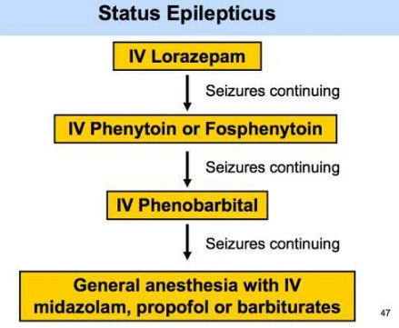
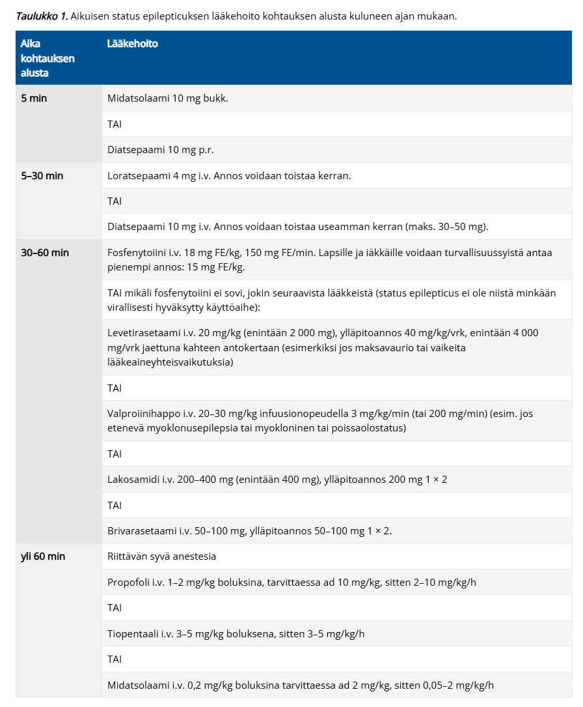

  

## Pernarepeämä, vuotoa, hemodynamiikka epästabiili, mitä teet?

Valitse yksi

- a. odotan 6h koska ei voi tietää onko ollut ravinnotta
- b. ei tarvitse odottaa koska trauma nopeuttaa motiliteettia 
- c. intuboitava leikkaukseen koska aspiraatioriskikoholla 
- d. joku (ei wikissä)

  <button class="solution-button" data-label="Vastaus" data-hide-label="Piilota vastaus">
    Vastaus
  </button>
  

    c

Hemodynaamisesti epästabiili pernarepeämä = hätäleikkauksen aihe. Aspiraatioriski on korkea, koska potilas on sokissa ja traumapotilas (hidastaa mahalaukun tyhjenemistä -> aspiraatioriski koholla) eikä ole aikaa odottaa paastoamista

Näitä potilaita intuboidaan ns. RSI-tekniikalla (rapid sequence induction and intubation, pikainduktio, "nopea intubaatio"). Tarkoitetaan yleisesti induktiotekniikkaa, jolla induktion yhteydessä hengitystie pyritään varmistamaan mahdollisimman nopeasti ja samalla estämään mahansisällön tai muun vahingollisen materiaalin joutuminen potilaan hengitysteihin. Sitä sovelletaan lähinnä potilaisiin, joilla aspiraatioriski on merkittävästi kohonnut (esim. paastoamaton potilas, akuutti mahakatastrofi, okkluusio, akalasia, isokokoiset Zenckerin divertikkelit tai muusta syystä johtuva sulamattoman ruoan retentoituminen tai akuutti verenvuoto hengitysteihin). Tekniikan tarkoituksena on minimoida aika tajunnan menetyksestä siihen hetkeen, jolloin hengitystie on saatu varmistettua. Samanaikaisesti pyritään estämään muilla keinoin mahalaukun sisällön joutuminen potilaan keuhkoihin niin kauan, kun hengitystie on suojaamaton.

Mikäli potilaalla on nenä-mahaletku, mahalaukku tyhjennetään sen kautta imulla. Jos mahakatastrofipotilaalla ei jostain syystä ole valmiiksi nenä-mahaletkua, se laitetaan viimeistään ennen induktiota ventrikkelin tyhjentämistä varten. Esim. okkluusiopotilaalla mahalaukussa saattaa olla useita litroja fekaalista suolensisältöä, jonka joutuminen keuhkoihin johtaa väistämättä henkeä uhkaaviin komplikaatioihin.

Ennen induktiota potilas käännetään jyrkkään anti-Trendelenburg-asentoon. Välittömästi potilaan nukahtamisen jälkeen avustaja komprimoi toisen käden peukalolla ja etusormella potilaan kurkunpäätä kilpiruston molemmilta puolilta suoraan alaspäin kohti selkärankaa (ns. Sellickin ote). Sellickin otteen tarkoituksena on ehkäistä mahansisällön nouseminen ruokatorvessa ylöspäin painamalla ruokatorvi mahdollisimman tehokkaasti kiinni. Ote säilytetään niin kauan, kunnes intubaatioputki on onnistuneesti paikallaan ja sen ilmakalvosin on täytetty.

  

## Yleisanestesiassa. 

- a. Potilas ei koskaan hengitä itse
- b. Potilas hengittää aina itse
- c. Potilas voi hengittää osittain itse ja osittain hengityskone avustaa

  <button class="solution-button" data-label="Vastaus" data-hide-label="Piilota vastaus">
    Vastaus
  </button>
  

    c

a: Joillain potilailla hengitys on lähes täysin koneen varassa (lihaksen relaksaatio, syvä anestesia)

b: Yleisanestesian aikana hengitys voi säilyä spontaanina ja tämä on usein jopa tavoiteltua. Ei kuitenkaan ole ns. "aina" tapahtuva juttu. 
  

## Kenelle voidaan käyttää synteettisiä kolloideja nykysuositusten mukaan?

Ei vaihtoehtoja wikissä, mutta koita vastata ilman vinkkejä

  <button class="solution-button" data-label="Vastaus" data-hide-label="Piilota vastaus">
    Vastaus
  </button>
  

    Ei kenellekään

Synteettisiin kolloideihin kuuluvat muun muassa gelofusiini ja hydroksietyylitärkkelys eli HES. Pääsääntöisesti synteettisiä kolloideja ei enää Suomessa käytetä, koska niiden käyttöön liittyy munuaisvaurion vaara. Albumiinia (ns. luontainen kolloidi; toinen olisi jääplasma) voi kokeilla rajatuissa tilanteissa, jos kristalloidit eivät tunnu riittävästi parantavan potilaan volyymistatusta ja hukka ekstravaskulaaritilaan tuntuu olevan suurta.
  

## Miten voidaan hoitaa aivoturvotusta?

Ei vaihtoehtoja wikissä, mutta tässä tärkeimmät: 

Aivoturvotus voi olla systotoksinen eli johtua aivoinfarktista, SAV:sta, aivoverenvuodosta, tulehduksesta yms tai olla vasogeeninen  eli johtua veriaivoesteen aukeamisesta, jolloin nestettä siirtyy aivokudoksen soluvälitilaan (esim. kasvain, hydrokefalus, meningiitti, muu syy) 

- Tarkempi hoito vaihtelee aiheuttajan mukaan, mutta sytotoksinen aivoturvotus vastaa huonosti glukokortikoidihoidolle, kun taas vasogeeninen usein lievittää deksametasonihoidolla. Muita hoidon periaatteita ovat mm. happeutumisesta ja kallon perfuusiopaineesta huolehtiminen. Jos potilas on tajuton, niin intubaatio ja lievä hyperventilaatio/normoventilaatio. 

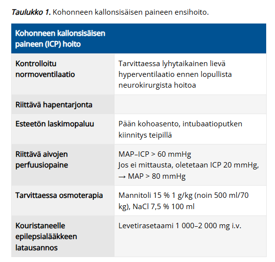

## Hyponatremian hoidossa aivojen osmoottinen myelinolyysi

Ei vaihtoehtoja, tässä tärkeimmät tästä vaarallisesta komplikaatiosta 

- Hyponatremia -> vettä siirtyy osmoottisesti neuroneihin -> solut kompensoivat tätä ödeemaa poistamalla sisältään orgaanisia osmolyyttejä, joiden korvaaminen on hidasta 
- Liian nopea (>8 mmol/l per 24h) hyponatremian korjaaminen nostaa plasman osmolaliteettia niin, että nestettä kulkee osmoottisesti ulos nyt vähäosmolaliteettisista neuroneista -> aivosillan demyelinisaatio (central pontine myelinolysis) -> pahimmillaan locked in syndrooma tai jopa kuolema 
- Jos natriumtasot ovat nousussa liian nopeasti, niin hyponatremian aktiivinen hoito on lopetettava -> infusoidaan heti G5-nestettä 10 ml/kg 1 tunnin aikana; valvontaolosuhteissa on myös harkittava desmopressiiniä (Minirin) 0,25–0,5 mikrog i.v.
- Osmoottisen myelinolyysin oireet tyypillisesti alkavat n. 2-6 päivää sen jälkeen, kun plasman natriumpitoisuus on noussut liian nopeasti. Diagnoosi on alussa kliininen, sillä alkuvaiheessa muutokset eivät välttämättä näy pään magneettikuvantamisessa, vaan ne saattavat tulla esille MRI:ssä vasta useita viikkoja oireiden alkamisen jälkeen

## ISBAR, mitä tarkoittaa A?

Ei vaihtoehtoja, mutta tulisi osata vastata ilman vaihtoehtoja

  <button class="solution-button" data-label="Vastaus" data-hide-label="Piilota vastaus">
    Vastaus
  </button>
  

    Assessment

ISBAR on raportointimenetelmä, jota voidaan käyttää sairaalaympäristössä ja sen ulkopuolella infromaation järjestämiseen selkeään ja suppeaan muotoon, mikä mahdollistaa ohdonmukaisen kommunikaation. 

I = Identify, S = Situation, B = Background, A = Assessment, R = Recommendation

  

## Mikä on opioidien vasta-aine (antidootti)?

Ei vaihtoehtoja wikissä, mutta tulisi osata vastata ilman vaihtoehtoja

  <button class="solution-button" data-label="Vastaus" data-hide-label="Piilota vastaus">
    Vastaus
  </button>
  

    Naloksoni

Naloksoni on opioidiantagonisti, jota käytetään pääasiassa opioidiyliannostuksen aiheuttamien oireiden kumoamiseen (tällöin annostellaan iv tai nenäsuihkeena). Käytetään myös yhdistelmävalmisteissa opioidien kanssa estämään ummetussivuvaikutuksia (esim. Targiniqissa on oksikodonia ja naloksonia; tabletissa oleva naloksoni vaikuttaa vain suolen seinämän hermopäätteiden opioidireseptoreihin. Koska se hajoaa nopeasti maksassa, sitä ei päädy keskushermostoon estämään opioidin kipua lievittävää vaikutusta). 
  

## Miksi potilaan ydinlämpötilaa on tärkeää seurata leikkauksen aikana?

Valitse yksi 

- a. harvinaiset anestesian komplikaatiot
- b. hyytymistekijöiden toiminta
- c. potilas jäähtyy leikkauksessa helposti
- d. kaikki edellä mainitut

  <button class="solution-button" data-label="Vastaus" data-hide-label="Piilota vastaus">
    Vastaus
  </button>
  

    d

a: Esim. maligni hypertermia, jota varten lämpöä on seurattava

b: Hypotermia heikentää koagulaatiota ja lisää verenvuotoa

c: Totta
  

## Mitä tarkoittaa palliatiivinen hoito?

Ei vaihtoehtoja, mutta koita vastata ilman vinkkejä 

  <button class="solution-button" data-label="Vastaus" data-hide-label="Piilota vastaus">
    Vastaus
  </button>
  

    Oireenmukaista hoitoa 

Palliatiivisella eli oireenmukaisella hoidolla tarkoitetaan kuolemaan johtavaa tai henkeä uhkaavaa sairautta sairastavan potilaan ja hänen läheistensä aktiivista kokonaisvaltaista hoitoa, jolla pyritään ehkäisemään ja lievittämään kärsimystä ja vaalimaan elämänlaatua. 

Palliatiivisella hoitolinjalla tarkoitetaan sairauden vaihetta, jossa taudin kulkuun ei enää voida olennaisesti vaikuttaa ja hoidon ensisijainen päämäärä on lievittää kärsimystä ja vaalia elämänlaatua. Palliatiivinen hoito eli oireita lievittävä hoito kuuluu kaikkiin sairauden vaiheisiin hoitolinjasta riippumatta.

Saattohoito on palliatiivisen hoidon viimeinen vaihe. Sen aika on viimeisinä elinviikkoina tai -päivinä. Tuolloin keskitytään hyvään kivun hoitoon, perushoitoon ja huolenpitoon. 
  

## Mitä nestevasteisuudella tarkoitetaan?

Ei vaihtoehtoja wikissä, koita vastata ilman vinkkejä 

  <button class="solution-button" data-label="Vastaus" data-hide-label="Piilota vastaus">
    Vastaus
  </button>
  

    Minuuttitilavuus nousee nesteboluksen myötä 

Nestevasteisuudella tarkoitetaan sitä, että pieni esikuorman tai laskimopaluun lisäys (yleensä noin 500 ml nestebolus annettuna puolessa tunnissa) nostaa minuuttitilavuutta 10–15 % eli potilaan hemodynaaminen tilanne on Frank-Starlingin käyrän nousevalla osuudella. Nestevasteisuutta voidaan arvioida täyttökokeella tai dynaamisilla nestevastemittauksilla. **Nestevasteisuus on terveillä normaali fysiologinen ilmiö eikä indisoi lisätäyttöä, ellei potilaalla ole verenkiertovajausta.**

Täyttökoe on hyvä ja yksinkertainen metodi potilaan mahdollisen hypovolemian ja nestevasteisuuden havaitsemiseksi. Täyttökokeessa potilaalle annetaan nopea nestebolus (yleensä 500 ml kristalloidia 30 min aikana) verenkierron vastetta seuraten. Minuuttitilavuuden nousu ja verenpaineen stabiloituminen viittaavat täytön hyödyllisyyteen. Toistuvissa täyttökokeissa on kuitenkin vaarana ylinesteytys erityisesti potilailla, joilla on huomattava permeabiliteettihäiriö. Nestevasteisuustutkimuksissa yleensä enintään puolet potilaista hyötyy täyttökokeesta.

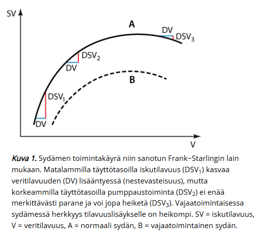
  

## Laktaatti

Valitse yksi (hieman muokattu wikin oudon sanoituksen takia)

- a. Aiheuttaa alkaloosia
- b. Laktaatin normaali määrä plasmassa on 0 mmol/l
- c. Kertyy anaerobisessa metaboliassa
- d. Joku vielä (ei wikissä)

  <button class="solution-button" data-label="Vastaus" data-hide-label="Piilota vastaus">
    Vastaus
  </button>
  

    c 

Laktaatti eli maitohappo on anaerobisen aineenvaihdunnan lopputuote. Pitoisuus suurenee, kun elimistö kärsii hapenpuutteesta, potilaalla on maksan vajaatoiminta tai on muusta syystä kehittynyt laktatemia (esim. mitokondriaaliset aineenvaihduntahäiriöt). 

a: Aiheuttaa asidoosia (korkean anionivajeen metabolinen asidoosi, HAGMA)

b: Normaali on 0.6 - 2.4 mmol/l ja määrä voi olla terveilläkin iso esim. urheilusuorituksen jälkeen 
  

## Päivystykseen tulee päihtynyt potilas, milloin teet lastensuojeluilmoituksen (lasu)? Jos potilas on

Valitse yksi

- a. alaikäinen
- b. raskaana
- c. alaikäisen vanhempi
- d. Kaikki vaihtoehdot

  <button class="solution-button" data-label="Vastaus" data-hide-label="Piilota vastaus">
    Vastaus
  </button>
  

    d

Yleisin poikkeus vaitiolovelvollisuuteen on lastensuojelulain velvoite tehdä lastensuojeluilmoitus lastensuojeluviranomaisille, jos on esimerkiksi epäilys siitä, että lasta on pahoinpidelty tai että hän on vaarassa vanhempien päihdeongelman takia. Alaikäisen alkoholin käytöstä tulee myös tehdä ilmoitus lastensuojeluviranomaisille. 
  

## Vaikeassa sepsiksessä voidaan todeta 

- a. trombeja 
- b. vuotoja 
- c. molempia 
- d. joku muu vielä (ei wikissä) 

  <button class="solution-button" data-label="Vastaus" data-hide-label="Piilota vastaus">
    Vastaus
  </button>
  

    c

Vaikea sepsis (ei itseasiassa enää ole virallinen termi) voi aiheuttaa esim. DIK-oireyhtymän, jolle on tyypillistä mikrotrombien muodostuminen ympäri kehoa. Tähän kuluu mm. fibrinogeenia  ja verihiutaleita, joka altistaa vuodoille myöhemmin. 
  

## Mikä seuraavista nostaa sykettä 

Valitse yksi 

- a. Fluraaneja 
- b. Beetasalpaaja + joku 
- c. Rokuroni + joku 
- d. Dobutamiini + joku (ilmeisesti tää on oikee)

  <button class="solution-button" data-label="Vastaus" data-hide-label="Piilota vastaus">
    Vastaus
  </button>
  

    c

Dobutamiini on β₁-agonisti -> lisää sydämen kontraktiivisuutta ja  nostaa sykettä (inotrooppinen ja kronotrooppinen vaikutus). Dobutamiinin inotrooppiset (supistumisvoimaa vahvistavat) vaikutukset ovat kuitenkin suurempia kuin kronotrooppiset (sykettä tihentävät). 

a: Fluraanit ovat inhalaatioanesteetteja ja yleensä laskevat sykettä ja verenpainetta (vasodilataatio, negatiivinen inotrooppinen vaikutus)

b: Beetasalpaaja → laskee sykettä

c: Rokuroni → lihasrelaksantti, ei merkittävää vaikutusta sykkeeseen
  

## Kuinka paljon on 50 kg henkilön päivittäinen kaliumtarve?

Ei vaihtoehtoja wikissä, mutta koita vastata ilman vinkkejä 

  <button class="solution-button" data-label="Vastaus" data-hide-label="Piilota vastaus">
    Vastaus
  </button>
  

    N. 2g 

Yleisin ohje, jonka löytää päivittäisistä suosituksista on n. 3,1g naisille ja 3,5g miehillä päivässä. Useissa lähteissä on mainittu tarve 1mmol/kg/vrk (1 mmol = 39.1g) ja tästä laskien 50kg potilas tarvitsee n. 2g kaliumia päivässä. 

Kontekstia: Yhdessä isossa perunassa on n. 500-1000 mg kaliumia (jopa enemmän kuin banaanissa, n. hieman alle 500mg normaalikokoisessa banaanissa).  
  

## Mikä ei pidä paikkaansa? 

Valitse yksi

- a. punasolut voidaan antaa vaaleanpunaisen kanyylin kautta ja sen kautta voidaan tehdä suurin osa vuodeosaston neste ja iv lääkehoidosta
- b. painepussi nopeuttaa nesteen antoa 
- c. jos pitää antaa suuri määrä nesteitä kannattaa laittaa vihreä, oranssi tai harmaa kanyyli 
- d. huonosuoniselle kannattaa laittaa mahdollisimman iso kanyyli, jotta vältytään ohivirtaukselta

  <button class="solution-button" data-label="Vastaus" data-hide-label="Piilota vastaus">
    Vastaus
  </button>
  

    d

a: Vaaleanpunainen (20G) kanyyli soveltuu useimpiin kiireettömiin tilanteisiin, mutta ravitsemushoitoon, kuvantamisen tarpeisiin ja verituotteiden antoon suositellaan suurempia kokoja. Kiireettömässä tilanteessa sen läpi kuitenkin voidaan annostella myös punasoluja. 

b: Totta, painepussi tai infuusiopumppu nopeuttaa nesteen antoa

c: Totta, vihreä (18g), harmaa (16g) ja oranssi (14g) mahdollistavat nopeammat virtaukset kuin pinkki (20g) tai sininen (22g)

d: Kanyylin tulee sallia riittävä ohivirtaus suonen sisällä, jotta se toimii hyvin, eli suonen sisähalkaisijan tulee olla selvästi kanyylin halkaisijaa suurempi. Tämän takia käytetäänkin tyypillisesti tilanteeseen sopien mahdollisimman pientä kanyyliä. 

  

## Mihin käytetään lääkehiiltä: 

Valitse yksi 

- a. Tajuissaan oleville ja intuboiduille imeytymisen estoon
- b. Erityisesti alkomyrkytyksissä
- c. Muidenkin kuin ruuansulatuskanavan kautta saatujen myrkytysten hoidossa
- d. Erityisesti emäksisissä myrkytyksissä

  <button class="solution-button" data-label="Vastaus" data-hide-label="Piilota vastaus">
    Vastaus
  </button>
  

    a

Suun kautta otetun myrkyn imeytymisen estämisessä lääkehiili on ensisijainen vaihtoehto. Mahahuuhtelua tulee käyttää vain poikkeustapauksessa ja oksettamisesta on luovuttu kokonaan.

Lääkehiili on puhdasta, hyvin huokoista hiiltä, jonka vaikutus perustuu siihen, että sillä on painoon nähden erittäin suuri adsorboiva pinta-ala. Lääkehiilen annos aikuisille on 50–100 g ja lapsille 1 g/kg.Hiili tehoaa sitä paremmin, mitä nopeammin se päästään antamaan. Erittäin hyvin se tehoaa, jos se annetaan 15–30 minuutin kuluessa myrkytyksestä. Kuitenkaan ehdotonta takarajaa ei ole, koska monet aineet hidastavat mahan tyhjenemistä. Lisäksi monilla aineilla on enterohepaattinen kiertokulku, jolloin myöhemminkin suolistoon tullut lääkehiili voi adsorboida suoleen erittynyttä ainetta.

b ja d: On huomattava, että lääkehiili ei sido kaikkia myrkkyjä (tärkeimpinä rauta, litium, fluoridi, syanidi ja kaliumkloridi). Lääkehiili ei merkittävästi sido alkoholeja, lakkaa tai gammahydroksibutyraattia. Ne eivät kuitenkaan ole lääkehiilen annon vasta-aihe sekamyrkytyksissä, joissa hiili sitoo jotain muuta myrkkyä. Sen sijaan lääkehiilen anto on vasta-aiheinen petrolituotteiden (aspiraatiovaara) ja syövyttävien aineiden, kuten happojen ja emästen aiheuttamissa myrkytyksissä (koska vauriokohtaan tarttuva hiili estää vaurion laadun ja laajuuden arvioinnin). 

c: Lääkehiili ei tietystikään auta parenteraalisissa myrkytyksissä, koska sen vaikutusalue on ruoansulatuskanavassa. 

a: Jos potilaan tajunnan taso on heikentynyt, ei lääkehiiltä pidä antaa, ellei hengitystietä ole ensin turvattu intuboimalla potilas. Hyvä nyrkkisääntö on, että intuboimattoman potilaan tulee muiden avustamatta kyetä juomaan lääkehiilisuspensio.
  

## Yleisanestesiassa tavallisesti käytetyt lääkkeet? 

Ei vaihtoehtoja wikissä, mutta mikä kolmen lääkkeen (hypnootti, analgeetti, lihasrelaksantti) kombo on tyypillisin yleisanestesiassa?

  <button class="solution-button" data-label="Vastaus" data-hide-label="Piilota vastaus">
    Vastaus
  </button>
  

    Propofoli, fentanyyli ja rokuroni

Propofoli on yleisin laskimoanesteetti ja sitä voidaan käyttää sekä induktiossa että ylläpidossa (myös inhalaatioanesteetti sevofluraania käytetään hyvin usein ylläpidossa ja lapsilla myös induktiossa). 

Fentanyyli on yleisin leikkauksenaikainen analgeetti. 

Rokuroni on yleisin lihasrelaksantti. On ns non-depolarisoiva eli on kilpailullinen asetyylikoliinreseptorien antagonisti. Voidaan kumota spesifisesti sugammadeksillä. 
  

## Elvytyksen minimimonitorointi? 

Ei tarkkoja vaihtoehtoja wikissä, mutta defibrillaattorista sydämen rytmi on tärkein ja hengitysteiden varmistamisen jälkeen jollain laitteella (supraglottinen väline tai intubaatio) myös kapnografia kuuluu minimimonitorointiin. 

## Mikä pitää paikkansa vanhusten lääkityksessä: 

Valitse yksi

- a. NSAID sopii hyvin myös monisairaille potilaille 
- b. sedaatiolääkkeet voidaan yleensä antaa pienemmällä annoksella 
- c. vahvat opiaatit ensisijaisia kivun hoidossa 
- d. joku

  <button class="solution-button" data-label="Vastaus" data-hide-label="Piilota vastaus">
    Vastaus
  </button>
  

    b

a: NSAIDit yleensä tauotetaan monisairailla potilailla, koska ne lisäävät verenvuotoriskiä, munuaishaittoja ja sydänkomplikaatioita

b: Vanhuksilla farmakodynamiikka muuttuu, herkkyys sedatiiville lääkkeille kasvaa → annokset usein pienempiä

c: Opioideja voidaan käyttää tarvittaessa, mutta ensisijainen kivunhoito on yleensä lääkkeiden suhteen parasetamoli ja yleisesti multimodaalinen lähestymistapa
  

## Neurologisten ja silmän (joidenkin) leikkausten trombosyyttien minimitaso 

Valitse yksi

- a. 10 
- b. 50 
- c. 150 
- d. 300

  <button class="solution-button" data-label="Vastaus" data-hide-label="Piilota vastaus">
    Vastaus
  </button>
  

    b

Toimenpiteet ja leikkaukset vaativat yleensä arvon 50 x 109/l ylittävää trombosyyttipitoisuutta

Luuytimen heikosta tuotannosta johtuvassa trombosytopeniassa trombosyyttien profylaktisen siirron rajaksi voidaan suositella arvoa 5–10 x 109/l silloin, kun muita verenvuotoa lisääviä tekijöitä ei ole vaikuttamassa. Vuodolle altistavien muiden tekijöiden yhteydessä siirtorajana voidaan pitää pitoisuutta 15–20 x 109/l. Tilanteissa, joissa trombosytopenian korjaantuminen ei ole odotettavissa, trombosyyttejä ei tulisi siirtää muutoin kuin toimenpiteisiin valmistauduttaessa tai vakavien verenvuotojen yhteydessä.
  

## Mihin anestesiassa käytetään setroneja? 

Ei vaihtoehtoja, mutta tulisi osata vastata ilman vinkkejä 

  <button class="solution-button" data-label="Vastaus" data-hide-label="Piilota vastaus">
    Vastaus
  </button>
  

    PONV estoon ja hoitoon

PONV = Post-operative nausea and vomiting 

Setronit (esim. ondansetroni tai granisetroni) eli 5HT3-estäjät ovat nykyään ensisijaisin lääkeryhmä leikkauksenjälkeisen pahoinvoinnin estossa ja hoidossa. Ennen viiltoa usein myös annetaan glukokortikoideja (esim. beetametasoni) estämään ponv:n kehittymistä. Glukokortikoideilla ei ole hoitavaa vaikutusta, vain estävä; setronit taas estävät JA hoitavat. 

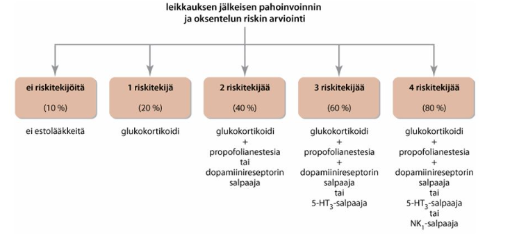
  

## Mikä ei ole valtimokanyylin indikaatio? 

Valitse yksi 

- a. pitää antaa paljon nesteitä ja lääkettä 
- b. epästabiili hemodynamiikka 
- c. valtimoverinäyte 
- d. joku

  <button class="solution-button" data-label="Vastaus" data-hide-label="Piilota vastaus">
    Vastaus
  </button>
  

    a

Valtimokanyyliin ei saa antaa lääkkeitä eikä infusoida mitään muuta kuin painepussin huuhtelunestettä!

Arteriakanyylia käytetään anestesiassa pääasiassa jatkuvaan kajoavaan verenpaineen seurantaan (ABP) ja verinäytteiden ottoon. Aiheita ABP:lle ovat (1) tarve ottaa toistuvia verinäytteitä; (2) leikkaukset, joissa äkillisiä, nopeita verenpainemuutoksia; (3) potilaan hemodynamiikka labiili. 
  

## Mikä on FAST

Ei vaihtoehtoja, mutta tulisi osata vastata ilman vinkkejä 

  <button class="solution-button" data-label="Vastaus" data-hide-label="Piilota vastaus">
    Vastaus
  </button>
  

    Traumaultra

FAST = Focused Assessment with Sonography for Trauma. Klassinen käyttöaihe on rintakehän tai vatsan alueen tylpän vamman ensiarvio. Perinteisesti tutkitaan sydänpussi, vatsaontelo ja keuhkopussi ja kysymyksenä on, että onko sydänpussissa/vatsaontelossa/keuhkopussissa vapaata nestettä. Nesteen lisäksi voidaan todeta tai sulkea pois ilmarinta (eFAST, extended FAST).

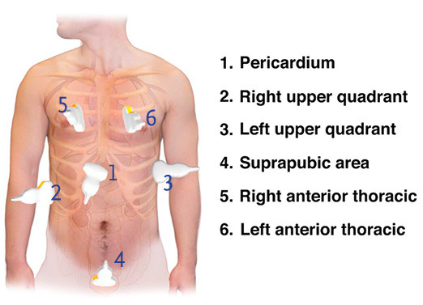
  

## Miten hoidetaan hyperosmolaliteettia, ei ketoasidoosia

Hieman vajavaisesti sanoitettu kysymys wikissä, mutta todennäköisesti on kysytty, miten hyperglykeeminen hyperosmolaarinen oireyhtymä (HHS) hoidetaan verrattuna diabeettiseen ketoasidoosiin (DKA) 

- Molempien hoito on aika samanlainen ja hoito kuuluu yleensä teho- tai valvontahoitoon
- Pääperiaatteita hoidossa ovat nesteytys, insuliini ja tarvittaessa kaliumkorvaus 

## Yleisanestesiassa

Valitse yksi

- a. Aina lihasrelaksantti 
- b. Aina intubaatio 
- c. Useita mahdollisia lääkeaineita, joilla kaikilla ei ole analgeettisia vaikutuksia 
- d. Joku (ei wikissä)

  <button class="solution-button" data-label="Vastaus" data-hide-label="Piilota vastaus">
    Vastaus
  </button>
  

    c

Esim. yleisimmällä hypnootilla eli propofolilla ei ole analgeettisia vaikutuksia. 

a: Lihasrelaksointia ei todellakaan tarvita aina. Sitä tarvitaan, kun lihasjäntevyys häiritsee kirurgisen toimenpiteen suorittamista, intubointi on tarpeen tai jos potilaan pienikin liikahdus tai yskähdys olisi katastrofi (esim. neurokirurgia)

b: Intubaatiota ei myöskään aina harrasteta. Usein potilaiden ilmatiet voidaan varmistaa hyvinkin supraglottisella välineellä tai olla varmistamatta tiet kokonaan. Hengitysteitä on _hallittava_ aina yleisanestesian aikana, mutta niitä ei aina edes tarvitse varmistaa larynxmaskilla tai intubaatiolla
  

## Mikä pitää paikkansa tramadolista

Valitse yksi

- a. Sopii SSRI/SNRI kanssa 
- b. Sopii Marevanin ja NOACien kanssa 
- c. Aiheuttaa pahoinvointia ja huimausta 
- d. On keskivahva opiaatti

  <button class="solution-button" data-label="Vastaus" data-hide-label="Piilota vastaus">
    Vastaus
  </button>
  

    c

Kaikki opioidit voivat aiheuttaa pahoinvointia ja se onkin yksi opioidien yleisimmistä haittavaikutuksista. 

a: Ei sovi SSRI/SNRI-lääkkeiden kanssa otettavaksi, koska tramadolilla itsessään on SNRI-kaltainen vaikutus 

b: Ei sovi AK-hoidon kanssa otettavaksi, koska SNRI-vaikutuksen myötä tramadoli altistaa verenvuodoille (serotoniin takaisinotonesto -> vuotoalttius)

d: On heikko opioidi 
  

## Keskuslaskimokanyylit, mikä ei ole totta 

Valitse yksi

- a. Asennettaessa Trendelenburgin asento, jotta ei ilmaemboliaa 
- b. Infektioriski lisääntyy kanyylin lumenin kerrosten lisääntyessä 
- c. Yleisin käytettävä malli on keuhkovaltimokanyyli Swan-Ganz 

  <button class="solution-button" data-label="Vastaus" data-hide-label="Piilota vastaus">
    Vastaus
  </button>
  

    c

a: Kun keskuslaskimokanyyli asetetaan kaulan alueen suonista, niin potilas asetetaan ennen pistoa Trendelenburgin asentoon (henkilö makaa kallistetulla alustalla niin, että pää on lantion tason alapuolella). Nostaa laskimonsisäistä painetta pään ja kaulan alueella ja vähentää näin ilmaembolian riskiä piston aikana. Trendelenburgin asentoa ei tarvita, jos asetetaan perifeerisesti (esim. PICC-katetri) 

b: Keskuslaskimokatetrien (CVK) luumenien määrä vaihtelee 1-5 luumenin välillä. Katetrissa voi olla yksi tai useampia erillisiä tiehyitä (luumeneita) käyttötarkoituksen mukaan. Tällöin voidaan yhden tiehyen avulla mitata jatkuvasti keskuslaskimopainetta ja toisista tiehyistä voidaan infusoida nesteitä, ravintoliuoksia ja lääkkeitä niiden sekoittumatta toisiinsa. Mitä enemmän luumeneita, sitä suurempi infektioriski -> tulee valita vain sellainen määrä luumenia kuin potilaan hoidossa on välttämätöntä. 

c: Keuhkovaltimokanyylistä käytetään myös eponyymiä Swan-Ganz-katetri. Katetri ujutetaan keskuslaskimokanyylin kautta oikeaan kammioon ja vielä keuhkovaltimoon. Täällä katetrin päässä oleva ballonki täytetään ja se saa verenkierron sen valtimon alueella pysähtymään. Ballongin sensori arvioi painetta ballongin takana
-> toimii korvikkeena vasemman eteisen paineen suoralle mittaamiselle (Vasemman puolen täyttöpainetta voidaan valvoa suoraan vain vasempaan eteiseen kirurgisesti asetetun katetrin avulla. Tämä rajoittaa menetelmän käytön avosydänleikkauksiin). 
  

## Miten nopeasti K-vitamiini vähentää/kumoaa varfariinin vaikutusta?

Valitse yksi

- a. Välittömästi
- b. 2 tunnissa
- c. Päivissä

  <button class="solution-button" data-label="Vastaus" data-hide-label="Piilota vastaus">
    Vastaus
  </button>
  

    b

Huonohkot vaihtoehdot, mutta korkea-annoksinen K-vitamiini alkaa redusoimaan INR-arvoa aikaisintaan n. 2 tunnin jälkeen. Vaihtoehdot ovat huonot, koska 2 tunnin kuluttua ei vaikutus vielä ole merkittävä ja päivissä on jokseenkin väärä, koska yleensä täysi vaikutus on ensimmäisen 24h jälkeen -> onko kyse vuorokausista, jos 2. päivänä on jo täysi vaikutus. 

Akuuttitilanteessa varfariinivaikutuksen kumoamiseen tulee aina liittää K-vitamiinin anto, joka normaalistaa K-vitamiinista riippuvat hyytymistekijät 18–24 tunnin kuluessa, mikäli maksasynteesille on normaalit edellytykset. Vaikutus alkaa kumoutumaan tyypillisesti n. 6-12 tunnissa ja täysi vaikutus vasta 24h kohdalla/jälkeen. Nopeasti vaikutus kuitenkin kumotaan plasmavalmisteilla (protrombiinikompleksikonsentraatti, PCC). 

Varfariinivaikutus voidaan kiireettömissä tilanteissa kumota kustannustehokkaasti tauottamalla varfariini 3–5 päivää ennen suunniteltua toimenpidettä tai antamalla K-vitamiinia (Konakion) noin 24–36 tuntia aiemmin.

  

## Stabiili, toipuva vuodeosastopotilas, millä happihoito toteutetaan? 

Valitse yksi

- a. BiPAP,
- b. Venturimaski
- c. Happiviikset

  <button class="solution-button" data-label="Vastaus" data-hide-label="Piilota vastaus">
    Vastaus
  </button>
  

    c

a: Jos potilas on stabiili, niin ventilaatiotukea (bipap) ei tarvita.

b: Venturimaski on epämukavampi eikä sen mahdollistamia korkeita virtauksia tarvita. 
  

## Ei-hyperglykeminen hyperosmolaliteetti: 

Valitse yksi 

- a. P-gluk alle 18
- b. pH alhaisempi kuin hyperglykeemisessä
- c. Heti insuliinihoito ennen nestehoitoa
- d. Joku

  <button class="solution-button" data-label="Vastaus" data-hide-label="Piilota vastaus">
    Vastaus
  </button>
  

    a

Hyvin harvinaisesti kuultu termi, mutta tällä tarkoitetaan vain, että kyseessä ei ole HHS (hyperosmolaarinen hyperglykeeminen tila) vaan jokin muu hyperosmolaliteettia aiheuttava tila (esim. pelkkä hypernatremia). HHS:ssä on merkittävä hyperglykemia, joten jos P-Gluk on alle 18, niin kyseessä ei ole HHS. 

b: HHS:ssä pH on normaali (vrt. diabeettinen ketoasidoosi); samoin näin voi olla muissakin hyperosmolaliteettisissa tiloissa, kuten vakavassa kuivumisessa ja siten hypernatremiassa. 

c: Jos tila on ei-hyperglykeeminen, niin ei tietystikään tarvita insuliinihoitoa. Nestehoito kuitenkin on useimmiten paikallaan todennäköisesti kuivumisen korjaamiseksi. 
  

## sepsis, mikä EI ole oire? 

Valitse yksi 

- a. Relatiivinen hypervolemia
- b. Hyperdynaaminen verenkierto,
- c. Sydänlama
- d. Kapillaarien lisääntynyt permeabiliteetti

  <button class="solution-button" data-label="Vastaus" data-hide-label="Piilota vastaus">
    Vastaus
  </button>
  

    a

Sepsiksessä on päinvastoin relatiivinen hypovolemia (verisuonten totaalikapasiteetti on suurentunut systeemisen vasodilataation takia, mutta verivolyymi ei ole muuttunut tai on kadonnut interstitiaalitilaan)

b: Sepsiksessä tyypillinen alkuvaiheen oire on kompensatorinen takykardia -> korkea sydämen minuuttitilavuus ja alkuvaiheessa verenpaineen ylläpito normaalina

c: Voi tapahtua myöhäisessä vaiheessa 

d: Systeeminen tulehdusreaktio johtaa vasodilataatioon ja kapillaaripermeabiliteetin lisääntymiseen -> nestettä valuu enemmän ekstrasellulaaritilaan
  

## Tehohoitoon voidaan ottaa potilas, joka: 

Valitse yksi 

- a. Ei voi kommunikoida, mutta kuolee ilman hoitoa 
- b. Kieltäytyy, mutta kuolee ilman hoitoa 
- c-d. Jotkut (ei wikissä)

  <button class="solution-button" data-label="Vastaus" data-hide-label="Piilota vastaus">
    Vastaus
  </button>
  

    a

b: Potilas voi kieltää erinäköisiä hoitoja mikäli hänellä ei ole mahdollisuuksia toipua ihmisarvoiseen elämään. Potilaslain mukaan potilasta on hoidettava hänen tahtonsa mukaan tai yhteisymmärryksessä hänen omaistensa kanssa. On tilanteita, joissa nämä periaatteet ovat ristiriitaisia, ja lääkäri joutuu 
valitsemaan ja perustelemaan kulloinkin valittavan menettelytavan. Valviran kanta on, että lääkäri päättää potilaan hoidosta viime kädessä kulloisenkin tilanteen mukaan ja annettujen resurssien puitteissa.
  

