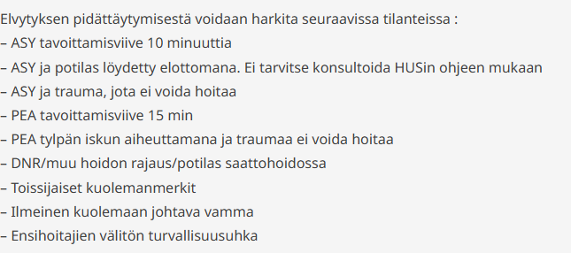

# 2025 

Paljon aikaisempia tärppejä, tässä vain uusia tai muokattuja. 

## Potilastapaus

78v mies ollut polviproteesileikkauksessa ja nyt vuodeosastolla. Nähty lounaalla ja nyt kello 14 hoitaja löytää potilaan viileänä ja elottomana, elvytetäänkö? 

  <button class="solution-button" data-label="Vastaus" data-hide-label="Piilota vastaus">
    Vastaus
  </button>
  

    Ei elvytetä

Potilaalla havaittavissa sekundaarisia eli toissijaisia kuolemanmerkkejä (viileys; muita olisi lautumat, kuolonkankeus, kuivuminen, hajoaminen sekä mätäneminen), koska hän on ollut jo hetken kuollut. Mikäli sekundaarisia kuolemanmerkkejä on havaittavissa, on kuolema pysyvää, eikä elvytystä tarvitse enää harkita. Tietysti voidaan tarkistaa pulssi ja jopa mitata rytmi, mutta jos näissä todetaan asystole, niin potilasta ei elvytetä. 

  

## Potilasta elvytetty neljän rytmintarkistuksen verran, mitkä elvytyslääkkeet annettu jos toimittu hoitoelvytyskaavion mukaan?

Ei vaihtoehtoja, mutta pitäisi osata vastata ilman vinkkejä

  <button class="solution-button" data-label="Vastaus" data-hide-label="Piilota vastaus">
    Vastaus
  </button>
  

    Riippuu rytmistä
    
Jos defibrilloitava rytmi, niin on kulunut 300mg amiodaronia ja adrenaliinia 1mg 

Jos ei-defibrilloitava rytmi, niin on kulunut 2mg adrenaliinia (jos suoniyhteys saatiin nopeasti; ei-defibrilloitavassa rytmissä adrenaliinia pyritään annostelemaan mahdollisimman nopeasti)

  

## Ensimmäisen rytmintarkistuksen jälkeen sinustakykardia. Mitä teet? 

Valitse yksi: 

- a. Jatkan painelua ja defibrilloin ensi tarkistuksessa
- b. Defibrilloin heti
- c. Lopetan painelun ja seuraan vointia
- d. Joku (ei wikissä)

  <button class="solution-button" data-label="Vastaus" data-hide-label="Piilota vastaus">
    Vastaus
  </button>
  

    d 
    
Jos toteat elvytyksen rytmintarkistustauolla rytmin, joka voisi kuljettaa verta, niin palpoi pulssit ja jos niitä ei ole tunnettavissa tai elonmerkkejä havaittavissa, on kyseessä PEA (pulseless electrical acitivity; voi näyttää sinukselta), joka on ei-defibrilloitava rytmi ja elvytystä tulee jatkaa ei-defibrilloitavan rytmin hoitokaavion mukaisesti. 

a ja b: Ei siis defibrilloida, koska ei ole kyseessä defibrilloitava rytmi (VT tai VF) 

c: Seuraan vointia on huono ohje, pulssit tulisi palpoida eikä vain tuijottaa potilasta 

d: Ehkä vaihtoehdoissa ollut pulssien palpoiminen, jolloin se olisi oikea vastaus. Muutoin c voi myös olla oikea, jos d olisikin selvästi väärin. 

  

## Mikä näistä ei pidä paikkaansa hyponatremiaan liittyen?

Valitse toinen 

- a. Hyponatremia täytyy korjata mahdollisimman nopeasti ja jotain muuta
b. 3 muuta vaihtoehtoa

  <button class="solution-button" data-label="Vastaus" data-hide-label="Piilota vastaus">
    Vastaus
  </button>
  

    a
    
Hyponatremian hoidossa on tärkeää, että tasoja ei nosteta liian nopeasti, koska se altistaa ponsin myelinolyysille. 
  

## Opioidien metabolia

Valitse toinen 

- a. Kodeiini metaboloituu sytokromientsyymin kautta
- b. Oksikodoni metaboloituu CYP2D6 kautta

  <button class="solution-button" data-label="Vastaus" data-hide-label="Piilota vastaus">
    Vastaus
  </button>
  

    Molemmat sinänsä totta
    
a: Kodeiini metaboloituu CYP2D6 kautta ja CYP-entsyymit ovat siis sytokromi-P450-entsyymejä 

b: Oksikodoni metaboloituu maksassa CYP3A4- ja CYP2D6-välitteisesti noroksikodoniksi, oksimorfoniksi ja noroksimorfoniksi, jotka taas glukuronidoituvat. Metaboliittien vaikutuksella yleiseen farmakodynaamiseen vaikutukseen ei ole oleellista merkitystä.

Jos vain toinen tulisi valita, niin a on enemmän oikein. 
  

## Tulehduskipulääkkeiden haittavaikutukset

Valitse yksi 

- a. Munuaisten vajaatoimintaa
- b. GI-kanavan haavaumia
- c. Jotain hyytymisjuttuja
- d. Kaikki yllä olevat

  <button class="solution-button" data-label="Vastaus" data-hide-label="Piilota vastaus">
    Vastaus
  </button>
  

    d

Kaikki ovat tunnettuja NSAIDien haittavaikutuksia. 

a: Estävät afferentin arteriolin dilataatiota ja sitä kautta heikentävät glomeruluksen perfuusiota 

b: Estävät mukoosaa suojaavien prostaglandiinien tuotantoa ja siten altistavat ulkuksille. 

c: NSAIDeilla on sekä vuotoalttiutta että tromboosialttiutta (varsinkin sydänpotilailla sepelvaltimoissa) aiheuttava vaikutus. 
  

## Elvytyksen nestehoito

Valitse yksi

- a. Isotoninen, glukoositon kristalloidi
- b. Isotoninen, glukoosillinen kristalloidi
- c. Muita vaihtoehtoja

  <button class="solution-button" data-label="Vastaus" data-hide-label="Piilota vastaus">
    Vastaus
  </button>
  

    a

Useimmiten käytetään Ringeriä, sokeria ei tarvita, ellei potilaalla ole hypoglykemiaa sydänpysähdyksen taustalla. 

Huom. varsinaista nestehoitoa tai nesteytystä ei elvytystilanteessa tarvita, ellei sydänpysähdyksen syynä epäillä hypovolemiaa, mutta lääkkeet tulee huuhtoa pienellä nestemäärällä keskeiseen verenkiertoon  
  

## K-vitamiini

Valitse yksi

- a. Voidaan käyttää siltahoitona jos INR on vaarallisen matala
- b. K-vitamiini kumoaa varfariinin vaikutuksen hyytymisjärjestelmään
- c. K-vitamiinilla voidaan kumota NOAC vaikutus

  <button class="solution-button" data-label="Vastaus" data-hide-label="Piilota vastaus">
    Vastaus
  </button>
  

    b

Varfariini on AK-lääke, joka häiritsee K-vitamiiniriippuvaisten hyytymistekijöiden (2,7,9,10) gammakarboksylaatiota. Varfariini estää estää maksan mikrosomeissa K-vitamiiniepoksidireduktaasia ja tämän seurauksena pelkistyneen K-vitamiinin määrä vähenee, γ-karboksylaatio estyy ja K-vitamiinista riippuvien hyytymistekijöiden II, VII, IX ja X toiminta häiriintyy. 

Ravinnon suuri K-vitamiinipitoisuus ja K-vitamiinivalmisteiden käyttö vähentävät varfariinin vaikutusta. Tätä vaikutusta voidaan hyödyntää varfariinin vaikutuksen kumoamisessa tarkoituksellisesti, kun potilaalle annetaan K-vitamiinia.
  

## Rabdomyolyysistä jotain vaihtoehtoja ja valitse mikä väärin. 

Väärin oli ilmeisesti joku vaikeutta arvioidaan ISBAR-luokituksella 

- ISBAR on siis kommunikaatioframework eikä ole rabdomyolyysin vaikeusasteen arvioimiseen tarkoitettu työkalu

## Annettu vitaaleja ja kysytty ylittyykö MET- kriteerit

Ei arvoja tärpeissä, mutta tässä NEWS-pisteytystaulukko. Jos NEWS on 7 tai yli, niin MET-hälytys tehdään 

Ilman taulukon ulkoa muistamistakin voi vitaaleista päätellä, että onko potilas stabiili vai ei, ja jos vaikuttaa epästabiililta tai muuten herää merkittävä huoli potilaasta, niin tehdään MET-hälytys. 

